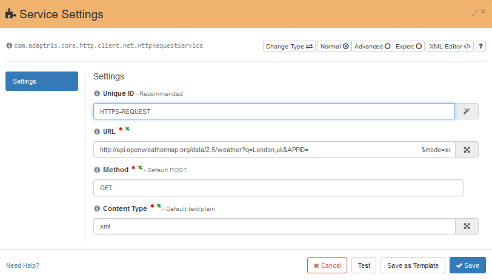
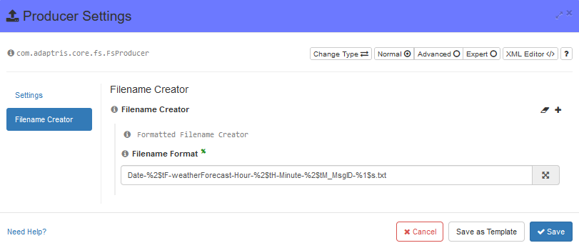

> **Summary:** This page describes how to use the expressions available for metadata lookup

The expression resolver allows for metadata values, as well as a limited
amount of other message information to be inserted into configuration
to create dynamic values. The screenshot below shows a simple example
where a new payload will be added (to a multi-payload message), where
the new payload ID will be the metadata value associated with
metadata-key.


## Standard Messages

The standard Adaptris Message type has four different expressions for
looking up data.

### Message Unique ID

This will resolve the current message unique ID.

    %message{​%uniqueId}

### Message Payload Size

This will resolve the current payload size, in bytes.

    %message{​%size}

### Message Payload

This will resolve the current payload in its entirety.

    %message{​%payload}

### Metadata Keys

If the expression within `%message` does not start with `%` then it is
treated as a metadata key, and will resolve the associated value. For
instance, if you have a metadata key/value pair `day=Monday` then
`%message{day}` would resolve to `Monday`.

    %message{…}

## Multi-Payload Messages

The following expressions is for referencing any given payload within a
multi-payload message. This can be particularly useful if you want to
keep a history of payload changes; a before and after each service type
of thing.

    %payload{id:…}

## External Resolvers

### Environment

This resolves values based on the associated environment variable. For
example `%env{HOSTNAME}` will return the value of the environment
variable `HOSTNAME`. If the variable not defined then the
variable will be returned as is.

    %env{…}

### System Properties

This resolver will resolve values based on the associated system
property; for example `%sysprop{my.sysprop}` will return the value of
the system property `my.sysprop`. If the property is not defined then
the property name will be returned as is.

    %sysprop{…}

### XPath

The XPath resolver allows for part of an XML payload to be extracted
using an XPath expression.

    %payload{xpath:…}

#### Example

##### XML Payload

```xml
<?xml version="1.0" encoding="utf-8"?>
<Wikimedia>
  <projects>
      <project name="Wikipedia" launch="2001-01-05">
        <editions>
        <edition language="English">en.wikipedia.org</edition>
        <edition language="German">de.wikipedia.org</edition>
        <edition language="French">fr.wikipedia.org</edition>
        <edition language="Polish">pl.wikipedia.org</edition>
        <edition language="Spanish">es.wikipedia.org</edition>
      </editions>
    </project>
    <project name="Wiktionary" launch="2002-12-12">
      <editions>
        <edition language="English">en.wiktionary.org</edition>
        <edition language="French">fr.wiktionary.org</edition>
        <edition language="Vietnamese">vi.wiktionary.org</edition>
        <edition language="Turkish">tr.wiktionary.org</edition>
        <edition language="Spanish">es.wiktionary.org</edition>
      </editions>
    </project>
  </projects>
</Wikimedia>
```

##### Expression

    %payload{xpath:/Wikimedia/projects/project/@name}

##### Resolved Value

    Wikipedia,Wiktionary

### Detailed Weather Forecast Report Example with Adapter config and use of Xpath as a Data Input Parameter: 
<br />
This example will demonstrate the use of xpath expression resolution as a data input parameter. Below is a simple adapter that checks parts of a weather forecast based on a polling interval consumer it then outputs the calls made into simple text file into your adapters subdirectory. For this run you will need to go to [openweathermap](https://openweathermap.org) and [sign-up](https://home.openweathermap.org/users/sign_up) with a free account to recieve an API key that will allow you to succesfully make calls to their API. The next step is to configure a fresh adapter and in the interest of making it easier below is the XML config you will need to copy and paste over whats in your fresh adapter.xml file need in order to make this work:
<br />
<br />

```xml
  <adapter>
  <unique-id>WeatherForecastAdapter</unique-id>
  <start-up-event-imp>com.adaptris.core.event.StandardAdapterStartUpEvent</start-up-event-imp>
  <heartbeat-event-imp>com.adaptris.core.HeartbeatEvent</heartbeat-event-imp>
  <shared-components>
    <connections/>
    <services/>
  </shared-components>
  <event-handler class="default-event-handler">
    <unique-id>DefaultEventHandler</unique-id>
    <connection class="null-connection">
      <unique-id>NullConnectionEventHandler</unique-id>
    </connection>
    <producer class="null-message-producer">
      <unique-id>NullMessageProducerEventHandler</unique-id>
    </producer>
  </event-handler>
  <heartbeat-event-interval>
    <unit>MINUTES</unit>
    <interval>60</interval>
  </heartbeat-event-interval>
  <message-error-handler class="null-processing-exception-handler">
    <unique-id>NullProcessingExceptionHandler</unique-id>
  </message-error-handler>
  <failed-message-retrier class="no-retries">
    <unique-id>NoRetries</unique-id>
  </failed-message-retrier>
  <channel-list>
    <channel>
      <consume-connection class="null-connection">
        <unique-id>null-connection</unique-id>
      </consume-connection>
      <produce-connection class="null-connection">
        <unique-id>null-connection</unique-id>
      </produce-connection>
      <workflow-list>
        <standard-workflow>
          <consumer class="polling-trigger">
            <message-factory class="multi-payload-message-factory">
              <default-char-encoding>UTF-8</default-char-encoding>
              <default-payload-id>default-payload</default-payload-id>
            </message-factory>
            <unique-id>FixedPoller</unique-id>
            <poller class="fixed-interval-poller">
              <poll-interval>
                <unit>HOURS</unit>
                <interval>2</interval>
              </poll-interval>
            </poller>
          </consumer>
          <service-collection class="service-list">
            <unique-id>service-list</unique-id>
            <services>
              <http-request-service>
                <unique-id>HTTPS-REQUEST</unique-id>
                <url>http://api.openweathermap.org/data/2.5/weather?q=London,uk&_APPID{API KEY HERE}_&mode=xml</url>
                <content-type>xml</content-type>
                <method>GET</method>
                <response-header-handler class="http-discard-response-headers"/>
                <request-header-provider class="http-no-request-headers"/>
                <authenticator class="http-no-authentication"/>
              </http-request-service>
              <add-payload-service>
                <unique-id>Forecast</unique-id>
                <new-payload-id>WeatherForecast</new-payload-id>
                <new-payload class="constant-data-input-parameter">
                  <value>                    City: %payload{xpath:current/city/@name}
                    Country: %payload{xpath:current/city/country/text()}
      
                    Wind Level: %payload{xpath:current/wind/speed/@name}
                    Wind Direction: %payload{xpath:current/wind/direction/@name} 
                    Cloud frequency: %payload{xpath:current/clouds/@name}
      
                    Temperature: %payload{xpath:current/temperature/@value} %payload{xpath:current/temperature/@unit}
                    Humidity: %payload{xpath:current/humidity/@value}%payload{xpath:current/humidity/@unit}
                    Raining: %payload{xpath:current/precipitation/@mode}
                  </value>
                </new-payload>
              </add-payload-service>
            </services>
          </service-collection>
          <producer class="fs-producer">
            <message-factory class="default-message-factory">
              <default-char-encoding>UTF-8</default-char-encoding>
            </message-factory>
            <unique-id>Output File</unique-id>
            <create-dirs>true</create-dirs>
            <fs-worker class="fs-nio-worker"/>
            <filename-creator class="formatted-filename-creator">
              <filename-format>Date-%2$tF-weatherForecast-Hour-%2$tH-Minute-%2$tM_MsgID-%1$s.txt</filename-format>
            </filename-creator>
            <base-directory-url>./weatherForecastOutput</base-directory-url>
          </producer>
          <send-events>true</send-events>
          <produce-exception-handler class="null-produce-exception-handler"/>
          <unique-id>Workflow-1</unique-id>
          <message-metrics-interceptor>
            <unique-id>Workflow-1-MessageMetrics</unique-id>
            <timeslice-duration>
              <unit>MINUTES</unit>
              <interval>5</interval>
            </timeslice-duration>
            <timeslice-history-count>12</timeslice-history-count>
          </message-metrics-interceptor>
          <in-flight-workflow-interceptor>
            <unique-id>Workflow-1-InFlight</unique-id>
          </in-flight-workflow-interceptor>
          <message-logger class="message-logging-full"/>
        </standard-workflow>
      </workflow-list>
      <unique-id>Channel-1</unique-id>
    </channel>
  </channel-list>
  <message-error-digester class="standard-message-error-digester">
    <unique-id>ErrorDigest</unique-id>
    <digest-max-size>100</digest-max-size>
  </message-error-digester>
</adapter>
```

<br />

Once your adapter is started what you should get is the following on the config page:

#### The Adapter


#### The polling consumer: *Set at 2 hour intervals*


#### The simple HTTP Get request: Pointing to the correct address *(dont forget to update the API Key to your own)*



```
http://api.openweathermap.org/data/2.5/weather?q=London,uk&_APPID{INSERT API KEY HERE}_&mode=xml
```

#### The 'Add Payload Service': *The Xpath expressions inputting the information we want extracted from the API*


##### The xpath queries: 

```xml
City: %payload{xpath:current/city/@name}
Country: %payload{xpath:current/city/country/text()}

Wind Level: %payload{xpath:current/wind/speed/@name}
Wind Direction: %payload{xpath:current/wind/direction/@name} 
Cloud frequency: %payload{xpath:current/clouds/@name}

Temperature: %payload{xpath:current/temperature/@value} %payload{xpath:current/temperature/@unit}
Humidity: %payload{xpath:current/humidity/@value}%payload{xpath:current/humidity/@unit}
Raining: %payload{xpath:current/precipitation/@mode}
```

#### The Producer: *creating the directory you will the weather forecast report in and also the report itself*




All this should culminate in a text file being created every 2 hours in the `weatherForecastOutput` directory with the file name containing the message ID, date, time and title and looking similar to this: `Date-2020-09-08-weatherForecast-Hour-09-Minute-34_MsgID-00000000-0000-0000-0000-000000000000` and containing this:

```text
                    City: London
                    Country: GB

                    Wind Level: Gentle Breeze
                    Wind Direction: West-southwest
                    Cloud frequency: overcast clouds

                    Temperature: 297.27 kelvin
                    Humidity: 61%
                    Raining: no
```
<br />

### JSON

There is a JSONPath resolver within the `interlok-json` package, which
allows JSON data to be extracted from a message payload.

    %payload{jsonpath:…}

#### Example

##### JSON Payload

```json
{
  "store":
  {
    "book":
    [
      {
        "category": "reference",
        "author": "Nigel Rees",
        "title": "Sayings of the Century",
        "price": 8.95
      },
      {
        "category": "fiction",
        "author": "Evelyn Waugh",
        "title": "Sword of Honour",
        "price": 12.99
      },
      {
        "category": "fiction",
        "author": "Herman Melville",
        "title": "Moby Dick",
        "isbn": "0-553-21311-3",
        "price": 8.99
      },
      {
        "category": "fiction",
        "author": "J. R. R. Tolkien",
        "title": "The Lord of the Rings",
        "isbn": "0-395-19395-8",
        "price": 22.99
      }
    ],
    "bicycle":
    {
      "color": "red",
      "price": 19.95
    }
  },
  "expensive": 10
}
```

##### Expression

    %payload{jsonpath:$.store.book[*].author}

##### Resolved Value

```json
    [ "Nigel Rees", "Evelyn Waugh", "Herman Melville", "J. R. R. Tolkien" ]
```
