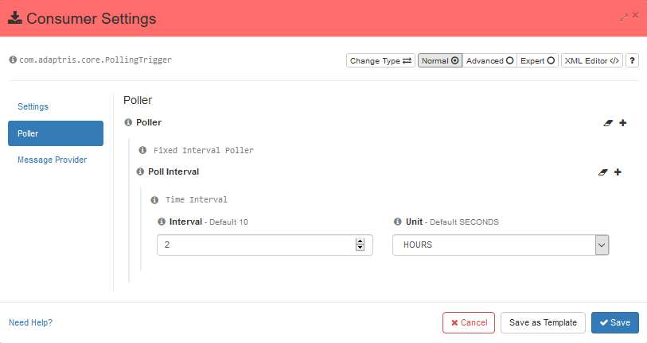
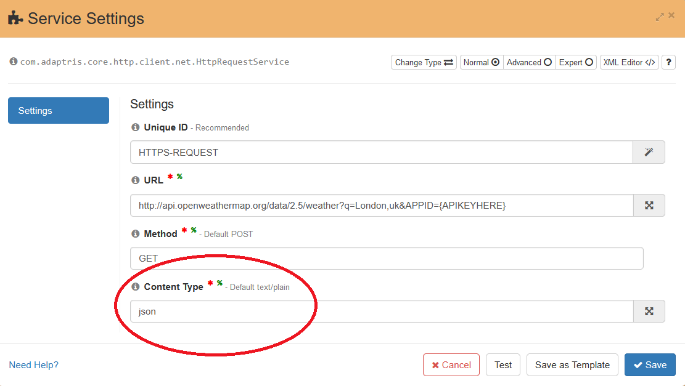
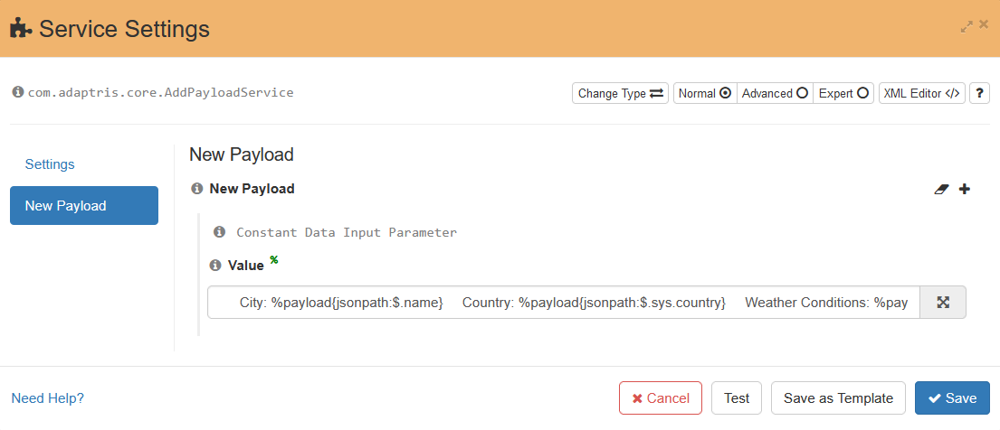
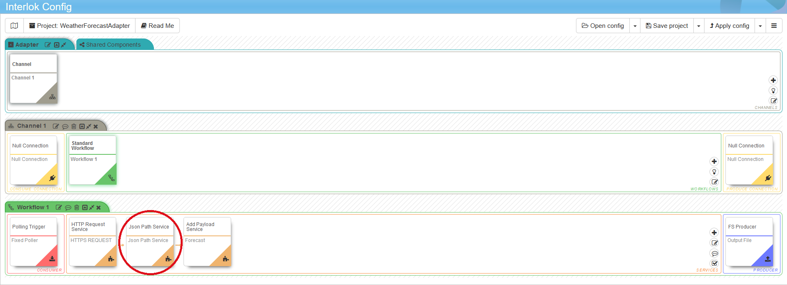
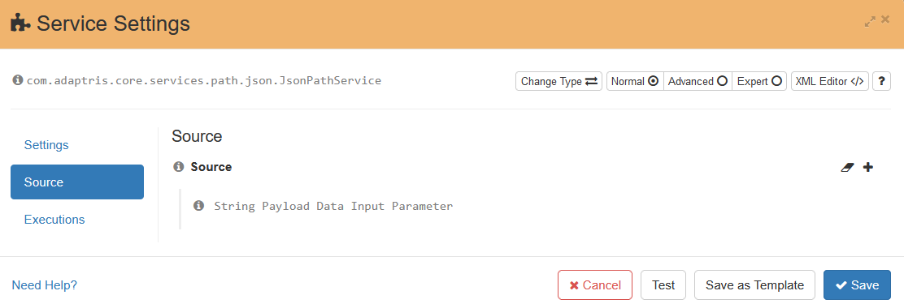
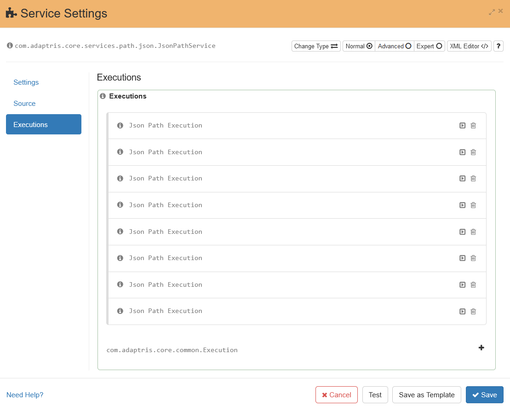
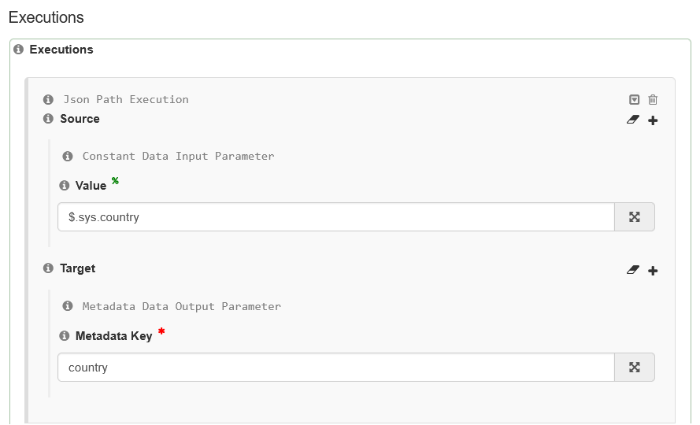
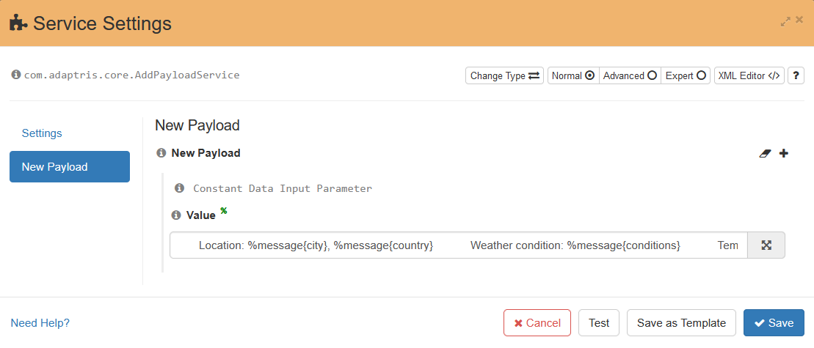

> **Summary:** This page describes how to use the expressions available for metadata lookup

The expression resolver allows for metadata values, as well as a limited
amount of other message information to be inserted into configuration
to create dynamic values. The screenshot below shows a simple example
where a new payload will be added (to a multi-payload message), where
the new payload ID will be the metadata value associated with
metadata-key.


## Standard Messages

The standard Adaptris Message type has four different expressions for
looking up data.

### Message Unique ID

This will resolve the current message unique ID.

    %message{​%uniqueId}

### Message Payload Size

This will resolve the current payload size, in bytes.

    %message{​%size}

### Message Payload

This will resolve the current payload in its entirety.

    %message{​%payload}

### Metadata Keys

If the expression within `%message` does not start with `%` then it is
treated as a metadata key, and will resolve the associated value. For
instance, if you have a metadata key/value pair `day=Monday` then
`%message{day}` would resolve to `Monday`.

    %message{…}

## Multi-Payload Messages

The following expressions is for referencing any given payload within a
multi-payload message. This can be particularly useful if you want to
keep a history of payload changes; a before and after each service type
of thing.

    %payload{id:…}

## Safer Document Type

Sometimes it may be necessary to resolved data verbatim and as such it
may need escaping in some way. Such as using &lt; or &gt; and embedding
the resolved string into an XML document, or including a string with
various &quot; or &apos; inside a JSON document. To do this safely,
there exists the following:

    %asCDATA{…}

    %asJSONSting{…}

## External Resolvers

### Environment

This resolves values based on the associated environment variable. For
example `%env{HOSTNAME}` will return the value of the environment
variable `HOSTNAME`. If the variable not defined then the
variable will be returned as is.

    %env{…}

### System Properties

This resolver will resolve values based on the associated system
property; for example `%sysprop{my.sysprop}` will return the value of
the system property `my.sysprop`. If the property is not defined then
the property name will be returned as is.

    %sysprop{…}

### XPath

The XPath resolver allows for part of an XML payload to be extracted
using an XPath expression.

    %payload{xpath:…}

#### Example

##### XML Payload

```xml
<?xml version="1.0" encoding="utf-8"?>
<Wikimedia>
  <projects>
      <project name="Wikipedia" launch="2001-01-05">
        <editions>
        <edition language="English">en.wikipedia.org</edition>
        <edition language="German">de.wikipedia.org</edition>
        <edition language="French">fr.wikipedia.org</edition>
        <edition language="Polish">pl.wikipedia.org</edition>
        <edition language="Spanish">es.wikipedia.org</edition>
      </editions>
    </project>
    <project name="Wiktionary" launch="2002-12-12">
      <editions>
        <edition language="English">en.wiktionary.org</edition>
        <edition language="French">fr.wiktionary.org</edition>
        <edition language="Vietnamese">vi.wiktionary.org</edition>
        <edition language="Turkish">tr.wiktionary.org</edition>
        <edition language="Spanish">es.wiktionary.org</edition>
      </editions>
    </project>
  </projects>
</Wikimedia>
```

##### Expression

    %payload{xpath:/Wikimedia/projects/project/@name}

##### Resolved Value

    Wikipedia,Wiktionary

## Xpath as a Data Input Parameter: Weather Forecast Report Example

<br />

Before we start it's important to note that, *__`exctracting the XML in such a manner best avoided unless working with small files and small queries as doing so will be to the detriment of performance.`__* This is the result of parsing the payload and recreating the entire Document Object Model (DOM) for each attempt in resolving a query. `A more appropriate solution for bigger files and queries can be found here:` [Xpath Service Example](#the-jsonpath-and-xpath-service-weather-forecast-report-example)

<br />

This example will demonstrate the use of Xpath expression resolution as a data input parameter.
Below is a simple adapter that checks parts of a weather forecast based on a polling interval consumer.
It then outputs the calls made into a simple text file in your adapter's subdirectory.
For this to run you will need to go to [openweathermap](https://openweathermap.org) and [sign-up](https://home.openweathermap.org/users/sign_up) for a free account to recieve an API key that will allow you to succesfully make calls to their API.
The next step is to configure a fresh adapter and in the interest of making it easier, below is the XML config you will need.
Copy it and replace what's currently in your adapter.xml file:

### Adapter Config XML

```xml
  <adapter>
  <unique-id>WeatherForecastAdapter</unique-id>
  <start-up-event-imp>com.adaptris.core.event.StandardAdapterStartUpEvent</start-up-event-imp>
  <heartbeat-event-imp>com.adaptris.core.HeartbeatEvent</heartbeat-event-imp>
  <shared-components>
    <connections/>
    <services/>
  </shared-components>
  <event-handler class="default-event-handler">
    <unique-id>DefaultEventHandler</unique-id>
    <connection class="null-connection">
      <unique-id>NullConnectionEventHandler</unique-id>
    </connection>
    <producer class="null-message-producer">
      <unique-id>NullMessageProducerEventHandler</unique-id>
    </producer>
  </event-handler>
  <heartbeat-event-interval>
    <unit>MINUTES</unit>
    <interval>60</interval>
  </heartbeat-event-interval>
  <message-error-handler class="null-processing-exception-handler">
    <unique-id>NullProcessingExceptionHandler</unique-id>
  </message-error-handler>
  <failed-message-retrier class="no-retries">
    <unique-id>NoRetries</unique-id>
  </failed-message-retrier>
  <channel-list>
    <channel>
      <consume-connection class="null-connection">
        <unique-id>null-connection</unique-id>
      </consume-connection>
      <produce-connection class="null-connection">
        <unique-id>null-connection</unique-id>
      </produce-connection>
      <workflow-list>
        <standard-workflow>
          <consumer class="polling-trigger">
            <message-factory class="multi-payload-message-factory">
              <default-char-encoding>UTF-8</default-char-encoding>
              <default-payload-id>default-payload</default-payload-id>
            </message-factory>
            <unique-id>FixedPoller</unique-id>
            <poller class="fixed-interval-poller">
              <poll-interval>
                <unit>HOURS</unit>
                <interval>2</interval>
              </poll-interval>
            </poller>
          </consumer>
          <service-collection class="service-list">
            <unique-id>service-list</unique-id>
            <services>
              <http-request-service>
                <unique-id>HTTPS-REQUEST</unique-id>
                <url>http://api.openweathermap.org/data/2.5/weather?q=London,uk&_APPID{API KEY HERE}_&mode=xml</url>
                <content-type>xml</content-type>
                <method>GET</method>
                <response-header-handler class="http-discard-response-headers"/>
                <request-header-provider class="http-no-request-headers"/>
                <authenticator class="http-no-authentication"/>
              </http-request-service>
              <add-payload-service>
                <unique-id>Forecast</unique-id>
                <new-payload-id>WeatherForecast</new-payload-id>
                <new-payload class="constant-data-input-parameter">
                  <value>                    City: %payload{xpath:current/city/@name}
                    Country: %payload{xpath:current/city/country/text()}

                    Wind Level: %payload{xpath:current/wind/speed/@name}
                    Wind Direction: %payload{xpath:current/wind/direction/@name}
                    Cloud frequency: %payload{xpath:current/clouds/@name}

                    Temperature: %payload{xpath:current/temperature/@value} %payload{xpath:current/temperature/@unit}
                    Humidity: %payload{xpath:current/humidity/@value}%payload{xpath:current/humidity/@unit}
                    Raining: %payload{xpath:current/precipitation/@mode}
                  </value>
                </new-payload>
              </add-payload-service>
            </services>
          </service-collection>
          <producer class="fs-producer">
            <message-factory class="default-message-factory">
              <default-char-encoding>UTF-8</default-char-encoding>
            </message-factory>
            <unique-id>Output File</unique-id>
            <create-dirs>true</create-dirs>
            <fs-worker class="fs-nio-worker"/>
            <filename-creator class="formatted-filename-creator">
              <filename-format>Date-%2$tF-weatherForecast-Hour-%2$tH-Minute-%2$tM_MsgID-%1$s.txt</filename-format>
            </filename-creator>
            <base-directory-url>./weatherForecastOutput</base-directory-url>
          </producer>
          <send-events>true</send-events>
          <produce-exception-handler class="null-produce-exception-handler"/>
          <unique-id>Workflow-1</unique-id>
          <message-metrics-interceptor>
            <unique-id>Workflow-1-MessageMetrics</unique-id>
            <timeslice-duration>
              <unit>MINUTES</unit>
              <interval>5</interval>
            </timeslice-duration>
            <timeslice-history-count>12</timeslice-history-count>
          </message-metrics-interceptor>
          <in-flight-workflow-interceptor>
            <unique-id>Workflow-1-InFlight</unique-id>
          </in-flight-workflow-interceptor>
          <message-logger class="message-logging-full"/>
        </standard-workflow>
      </workflow-list>
      <unique-id>Channel-1</unique-id>
    </channel>
  </channel-list>
  <message-error-digester class="standard-message-error-digester">
    <unique-id>ErrorDigest</unique-id>
    <digest-max-size>100</digest-max-size>
  </message-error-digester>
</adapter>
```

<br />

Once the adapter is started navigate to the config page it should look like the below:

### The Xpath Adapter


### The polling consumer
*Set to 2 hour intervals*



### The HTTP GET request
Pointing to the correct address

- *(dont forget to update the API Key to your own)*
- In the below draw attention to the content type. In this case as we are expecting to receive xml from the GET request, therefore we that is what we set the content type to.


```
http://api.openweathermap.org/data/2.5/weather?q=London,uk&_APPID{INSERT API KEY HERE}_&mode=xml
```

### The 'Add Payload Service'
*The Xpath expressions inputing the information we want extracted from the API*


#### The xpath queries

```xml
City: %payload{xpath:current/city/@name}
Country: %payload{xpath:current/city/country/text()}

Wind Level: %payload{xpath:current/wind/speed/@name}
Wind Direction: %payload{xpath:current/wind/direction/@name}
Cloud frequency: %payload{xpath:current/clouds/@name}

Temperature: %payload{xpath:current/temperature/@value} %payload{xpath:current/temperature/@unit}
Humidity: %payload{xpath:current/humidity/@value}%payload{xpath:current/humidity/@unit}
Raining: %payload{xpath:current/precipitation/@mode}
```

### The Producer
*creating the weather forecast directory and the report itself*


All this should culminate in a text file being created every 2 hours in the `weatherForecastOutput` directory with the file name containing the message ID, date, time and title and looking similar to this: `Date-2020-09-08-weatherForecast-Hour-09-Minute-34_MsgID-00000000-0000-0000-0000-000000000000` and containing this:

```text
                    City: London
                    Country: GB

                    Wind Level: Gentle Breeze
                    Wind Direction: West-southwest
                    Cloud frequency: overcast clouds

                    Temperature: 297.27 kelvin
                    Humidity: 61%
                    Raining: no
```

<br />

### JSON

There is a JSONPath resolver within the `interlok-json` package, which
allows JSON data to be extracted from a message payload.

    %payload{jsonpath:…}

#### Example

##### JSON Payload

```json
{
  "store":
  {
    "book":
    [
      {
        "category": "reference",
        "author": "Nigel Rees",
        "title": "Sayings of the Century",
        "price": 8.95
      },
      {
        "category": "fiction",
        "author": "Evelyn Waugh",
        "title": "Sword of Honour",
        "price": 12.99
      },
      {
        "category": "fiction",
        "author": "Herman Melville",
        "title": "Moby Dick",
        "isbn": "0-553-21311-3",
        "price": 8.99
      },
      {
        "category": "fiction",
        "author": "J. R. R. Tolkien",
        "title": "The Lord of the Rings",
        "isbn": "0-395-19395-8",
        "price": 22.99
      }
    ],
    "bicycle":
    {
      "color": "red",
      "price": 19.95
    }
  },
  "expensive": 10
}
```

##### Expression

    %payload{jsonpath:$.store.book[*].author}

##### Resolved Value

```json
    [ "Nigel Rees", "Evelyn Waugh", "Herman Melville", "J. R. R. Tolkien" ]
```

## JsonPath as a Data Input Parameter: Weather Forecast Report Example

<br />

Before we start it's important to note that *__`exctracting Json in such a manner is best avoided unless working with small files and making small queries as doing so will be to the detriment of performance`__* this is because the payload is parsed again for each and every time we reference it.
`A more appropriate solution for bigger files and queries can be found here:` [Jsonpath Service Example](#the-jsonpath-and-xpath-service-weather-forecast-report-example)

<br />

The example will demonstrate the use of jsonpath expression resolution as a data input parameter.
We will create a simple adapter that checks parts of a weather forecast based on a polling interval consumer it then outputs the calls made into a simple text file in your adapter's subdirectory.
For this run you will need to go to [openweathermap](https://openweathermap.org) and [sign-up](https://home.openweathermap.org/users/sign_up) for a free account to recieve an API key that will allow you to succesfully make calls to their API.
The next step is to configure a fresh adapter. Below is part of the XML config you will need. Start by replacing the XML from the fresh adapter.xml with the config found in the [xpath example](#adapter-config-xml) then replace the 'HTTP Request Service' and the 'Add Payload Service' with the XML exerpt from below:

### The Jsonpath Adapter

```xml
   <http-request-service>
                <unique-id>HTTPS-REQUEST</unique-id>
                <url>http://api.openweathermap.org/data/2.5/weather?q=London,uk&_APPID{API KEY HERE}_</url>
                <content-type>json</content-type>
                <method>GET</method>
                <response-header-handler class="http-discard-response-headers"/>
                <request-header-provider class="http-no-request-headers"/>
                <authenticator class="http-no-authentication"/>
              </http-request-service>
              <add-payload-service>
                <unique-id>Forecast</unique-id>
                <new-payload-id>WeatherForecast</new-payload-id>
                <new-payload class="constant-data-input-parameter">
                  <value>
     City: %payload{jsonpath:$.name}
     Country: %payload{jsonpath:$.sys.country}
     Weather Conditions: %payload{jsonpath:$.weather[0].description}</value>
                </new-payload>
              </add-payload-service>
```

Once the adapter is started if you navigate to the config page it should look like the example found in the link below:

The adapter should look like [this](#the-xpath-adapter).

### The polling consumer

The consumer should look like [this](#the-polling-consumer).

### The Json adapter's HTTP GET request

- *(Remember to update the API Key to your own)*

- In the below draw attention to the content type. In this case as we are expecting to receive json from the GET request, that is what we set the content type to.



```
http://api.openweathermap.org/data/2.5/weather?q=London,uk&_APPID{INSERT API KEY HERE}_
```

### The Json adapter's 'Add Payload Service'
*The Jsonpath expressions inputing the information we want extracted from the API*



#### The jsonpath queries

```xml
City: %payload{jsonpath:$.name}
Country: %payload{jsonpath:$.sys.country}
Weather Conditions: %payload{jsonpath:$.weather[0].description}
```

### The Producer

<br />

The producer should look like [this](#the-producer).

All this should culminate in a text file being created every 2 hours in the `weatherForecastOutput` directory with the file name containing the message ID, date, time and title and looking similar to this: `Date-2020-09-08-weatherForecast-Hour-09-Minute-34_MsgID-00000000-0000-0000-0000-000000000000` and containing this:

```text
     City: London
     Country: GB
     Weather Conditions: scattered clouds
```

<br />

## The JsonPath and Xpath Service: Weather Forecast Report Example

<br />

The example below illustrates a better approach to extracting either Json or XML from either large files or where you will be making multiple or complex queries using the respective Jsonpath or Xpath service.
It demonstrates a simple adapter that checks parts of a weather forecast based on a polling interval consumer, set to run every 2 hours.
It then executes our queries assigning them to a metadata key.
The values are then subsequently added to a simple text file 'Add Payload Service'.
Again like the former examples for this to run you will need to go to [openweathermap](https://openweathermap.org) and [sign-up](https://home.openweathermap.org/users/sign_up) for a free account to recieve an API key that will allow you to succesfully make calls to their API.
The next step is to configure an adapter. Start by replacing the XML from adapter.xml  file in your config directory with the config found in the [xpath example](#adapter-config-xml). For both the **['Json Path Service'](#the-jsonpath-service-config)** and **['Xpath Service'](#the-xpath-service-config)** you will need to update the services with XML config exerpts from below:

### The Jsonpath Service config

```xml
 <http-request-service>
                <unique-id>HTTPS-REQUEST</unique-id>
                <url>http://api.openweathermap.org/data/2.5/weather?q=London,uk&units=metric&APPID={INSERT API KEY HERE}</url>
                <content-type>json</content-type>
                <method>GET</method>
                <response-header-handler class="http-discard-response-headers"/>
                <request-header-provider class="http-no-request-headers"/>
                <authenticator class="http-no-authentication"/>
              </http-request-service>
              <json-path-service>
                <unique-id>JsonPathService</unique-id>
                <source class="string-payload-data-input-parameter"/>
                <json-path-execution>
                  <source class="constant-data-input-parameter">
                    <value>$.sys.country</value>
                  </source>
                  <target class="metadata-data-output-parameter">
                    <metadata-key>country</metadata-key>
                  </target>
                </json-path-execution>
                <json-path-execution>
                  <source class="constant-data-input-parameter">
                    <value>$.name</value>
                  </source>
                  <target class="metadata-data-output-parameter">
                    <metadata-key>city</metadata-key>
                  </target>
                </json-path-execution>
                <json-path-execution>
                  <source class="constant-data-input-parameter">
                    <value>$.wind.speed</value>
                  </source>
                  <target class="metadata-data-output-parameter">
                    <metadata-key>windspeed</metadata-key>
                  </target>
                </json-path-execution>
                <json-path-execution>
                  <source class="constant-data-input-parameter">
                    <value>$.wind.deg</value>
                  </source>
                  <target class="metadata-data-output-parameter">
                    <metadata-key>winddirection</metadata-key>
                  </target>
                </json-path-execution>
                <json-path-execution>
                  <source class="constant-data-input-parameter">
                    <value>$.main.temp</value>
                  </source>
                  <target class="metadata-data-output-parameter">
                    <metadata-key>temp</metadata-key>
                  </target>
                </json-path-execution>
                <json-path-execution>
                  <source class="constant-data-input-parameter">
                    <value>$.main.feels_like</value>
                  </source>
                  <target class="metadata-data-output-parameter">
                    <metadata-key>feelslike</metadata-key>
                  </target>
                </json-path-execution>
                <json-path-execution>
                  <source class="constant-data-input-parameter">
                    <value>$.main.humidity</value>
                  </source>
                  <target class="metadata-data-output-parameter">
                    <metadata-key>humidity</metadata-key>
                  </target>
                </json-path-execution>
                <json-path-execution>
                  <source class="constant-data-input-parameter">
                    <value>$.weather[0].description</value>
                  </source>
                  <target class="metadata-data-output-parameter">
                    <metadata-key>conditions</metadata-key>
                  </target>
                </json-path-execution>
              </json-path-service>
              <add-payload-service>
                <unique-id>Forecast</unique-id>
                <new-payload-id>WeatherForecast</new-payload-id>
                <new-payload class="constant-data-input-parameter">
                  <value>
      Location: %message{city}, %message{country}

      Weather condition: %message{conditions}

      Temperature: %message{temp}°C
      Feels like:  %message{feelslike}°C

      Wind Speed: %message{windspeed} metres/sec
      Wind Direction: %message{winddirection}°

      Humidity: %message{humidity}%    </value>
                </new-payload>
              </add-payload-service>
```

### The Xpath service config

 ```xml
  <http-request-service>
          <unique-id>HTTPS-REQUEST</unique-id>
          <url>http://api.openweathermap.org/data/2.5/weather?q=London,uk&units=metric&APPID={INSERT API KEY HERE}&mode=xml</url>
          <content-type>xml</content-type>
          <method>GET</method>
          <response-header-handler class="http-discard-response-headers"/>
          <request-header-provider class="http-no-request-headers"/>
          <authenticator class="http-no-authentication"/>
        </http-request-service>
        <xpath-service>
          <unique-id>Xpath Service</unique-id>
          <xml-source class="string-payload-data-input-parameter"/>
          <xpath-execution>
            <source class="constant-data-input-parameter">
              <value>current/city/@name</value>
            </source>
            <target class="metadata-data-output-parameter">
              <metadata-key>city</metadata-key>
            </target>
          </xpath-execution>
          <xpath-execution>
            <source class="constant-data-input-parameter">
              <value>/current/city/country/text()</value>
            </source>
            <target class="metadata-data-output-parameter">
              <metadata-key>country</metadata-key>
            </target>
          </xpath-execution>
          <xpath-execution>
            <source class="constant-data-input-parameter">
              <value>/current/wind/speed/@value</value>
            </source>
            <target class="metadata-data-output-parameter">
              <metadata-key>windspeed</metadata-key>
            </target>
          </xpath-execution>
          <xpath-execution>
            <source class="constant-data-input-parameter">
              <value>/current/wind/direction/@value</value>
            </source>
            <target class="metadata-data-output-parameter">
              <metadata-key>winddirection</metadata-key>
            </target>
          </xpath-execution>
          <xpath-execution>
            <source class="constant-data-input-parameter">
              <value>/current/weather/@value</value>
            </source>
            <target class="metadata-data-output-parameter">
              <metadata-key>conditions</metadata-key>
            </target>
          </xpath-execution>
          <xpath-execution>
            <source class="constant-data-input-parameter">
              <value>/current/temperature/@value</value>
            </source>
            <target class="metadata-data-output-parameter">
              <metadata-key>temp</metadata-key>
            </target>
          </xpath-execution>
          <xpath-execution>
            <source class="constant-data-input-parameter">
              <value>/current/feels_like/@value</value>
            </source>
            <target class="metadata-data-output-parameter">
              <metadata-key>feelslike</metadata-key>
            </target>
          </xpath-execution>
          <xpath-execution>
            <source class="constant-data-input-parameter">
              <value>/current/humidity/@value</value>
            </source>
            <target class="metadata-data-output-parameter">
              <metadata-key>humidity</metadata-key>
            </target>
          </xpath-execution>
        </xpath-service>
        <add-payload-service>
          <unique-id>Forecast</unique-id>
          <new-payload-id>WeatherForecast</new-payload-id>
          <new-payload class="constant-data-input-parameter">
            <value>
        Location: %message{city}, %message{country}

        Weather condition: %message{conditions}

        Temperature: %message{temp}°C
        Feels like:  %message{feelslike}°C

        Wind Speed: %message{windspeed} metres/sec
        Wind Direction: %message{winddirection}°

        Humidity: %message{humidity}%    </value>
          </new-payload>
        </add-payload-service>
 ```

<br />

Start the adapter and navigate to the config page. It should look like the image below for the Jsonpath example. If you are following the Xpath example it should have an Xpath service in lieu of the Json Path Service circled in the image.



### The Consumer and Producer

Both the consumer and producer should look like those of the previous examples on this page, with the consumer looking like [this](#the-polling-consumer) and the producer looking like [this](#the-producer).

All this should culminate in a text file being created every 2 hours in the `weatherForecastOutput` directory with the file name containing the message ID, date, time and title and looking similar to this: `Date-2020-09-08-weatherForecast-Hour-09-Minute-34_MsgID-00000000-0000-0000-0000-000000000000`

### Xpath and Jsonpath services HTTP GET request

Again these should look like those from the examples provided in the [Xpath's HTTP GET request](#the-http-get-request) or the [Json's HTTP GET request](#the-json-adapters-http-get-request).

- Remember to change the content type based on the data you are working with

- *(Remember to update the API Key to your own)*

```
http://api.openweathermap.org/data/2.5/weather?q=London,uk&_APPID{INSERT API KEY HERE}_
```

### The Jsonpath and Xpath Services

<br />

In the Xpath and Json Path service settings modal you will see that the values have been left default other than a unique ID change to make it easier to identify the services.

#### The 'Source' tab

In the Json source tab we have set the source to 'String Payload Data Input Parameter' as shown below.



#### The 'Executions' tab

This is where you'll find the point at which we make all of our queries. You should see a list of executions and they in turn can be expanded to show each query we make. In the 'Json Path Service' those executions should be set to 'Json Path Execution', their **Source** should be set to _'Constant Data Input Parameter'_ and the **Target** should be set to _'Metadata Data Output Parameter'_





### The JsonPath 'Add Payload Service'



#### The Metadata queries

In the executions what we do is pair the value we want with a corresponding metadata key. For example the **value** `$.sys.country` now has the **key** `country` so when we call `%message{country}` in the 'Add Payload Service' we expect in this instance for the value 'GB' to be returned.

```text
  Location: %message{city}, %message{country}

  Weather condition: %message{conditions}

  Temperature: %message{temp}°C
  Feels like:  %message{feelslike}°C

  Wind Speed: %message{windspeed} metres/sec
  Wind Direction: %message{winddirection}°

  Humidity: %message{humidity}%
```

The result is a weather forecast output to a text file which should look like this:

```text
  Location: London, GB

  Weather condition: light rain

  Temperature: 12.51°C
  Feels like:  5.74°C

  Wind Speed: 10.3 metres/sec
  Wind Direction: 100°

  Humidity: 93%
```
