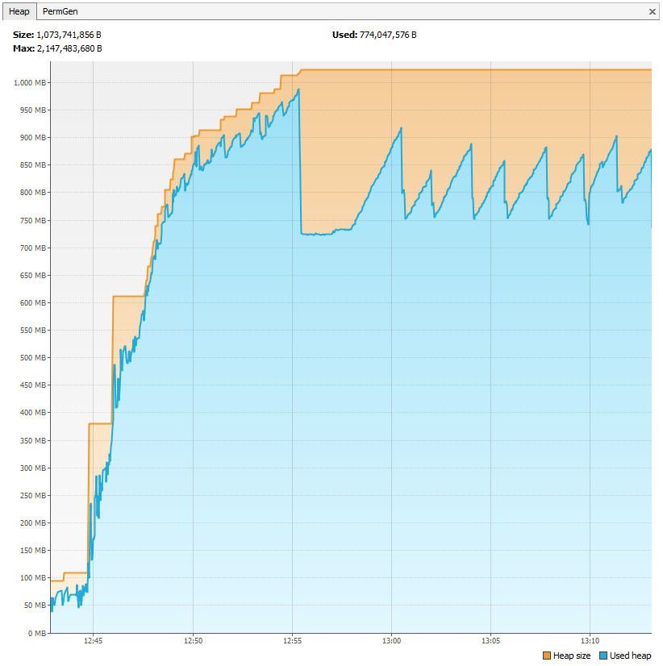
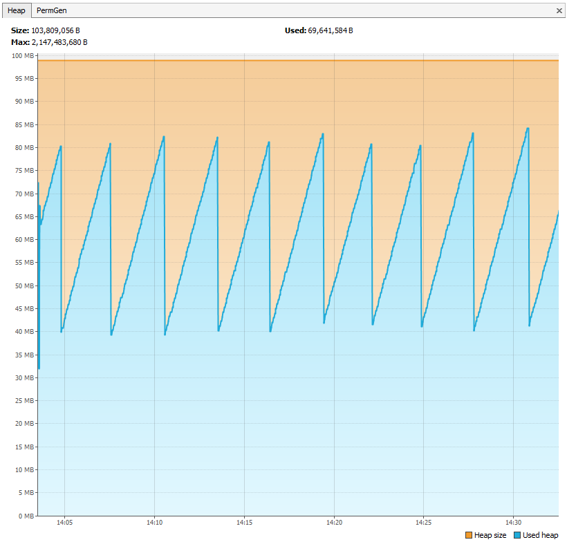
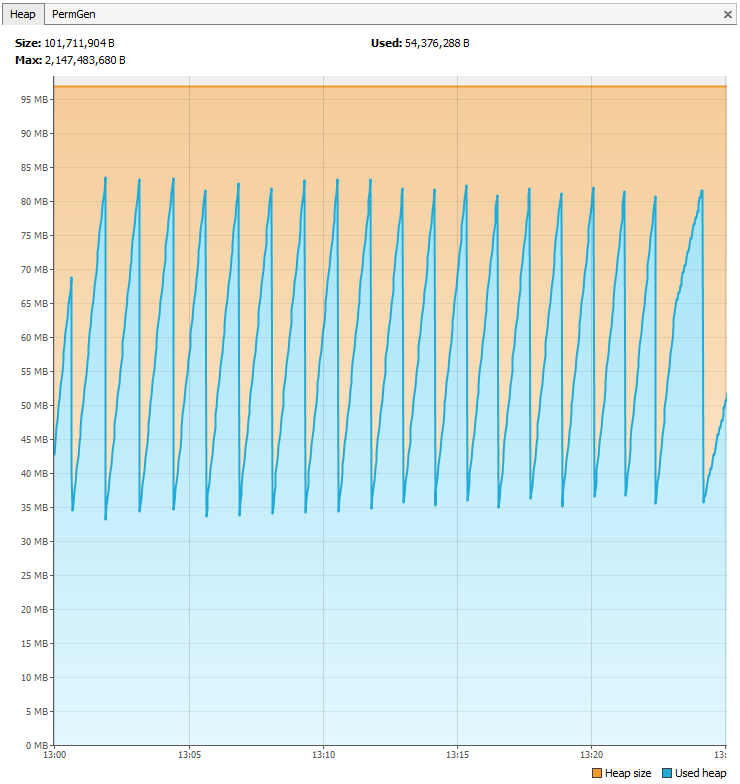
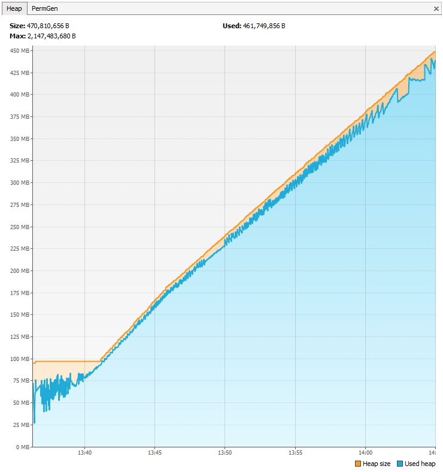

> **Summary:** This document will describe Interlok's memory requirements and how various components can have an effect on those requirements. Finally, we will show some sample memory usage statistics using a few different Interlok configurations.

Because Interlok is a component based framework additional components can be added to a base Interlok installation. Many additional components can be found in the _optional_ directory, found in the root of your Interlok install. Depending on the components you need to solve your integration requirements, each can drastically affect the required system memory to effectively run your Interlok installation(s). As well as the chosen components, their individual configuration may also have a great effect on the memory requirements.  Imagine a caching mechanism that holds cached items in memory.  You will most likely be able to specify the size of the memory cache which will require available memory to hold those cached items.

## Java Memory Usage ##

Interlok is a pure java application.  Therefore you can customize the amount of system memory that will be allocated to Interlok through JVM properties. Although this document will not discuss in detail the various Java memory spaces and management, we will give a brief explanation.

Within Java there exist 2 major memory spaces;

- Heap
- Non-heap

If everything is operating correctly, non-heap will stay a fairly consistent level throughout the entire running life-cycle of Interlok. We should also point out that in the vast majority of cases customizing the non-heap memory allocation for Interlok is not required.  The default JVM values for the non-heap memory space is more than sufficient. The heap space however will grow and shrink to suit the memory needs of Interlok during execution.  It is the heap memory space that is greatly affected depending on the components configured for your Interlok installation(s).

### The Java Heap ###

An incorrectly sized Java heap can lead to OutOfMemoryError exceptions or to a reduction in the performance of Interlok. If the Java heap is smaller than the memory requirements of Interlok, OutOfMemoryError exceptions are generated due to Java heap exhaustion. If the Java heap is slightly larger than the requirements of the application, garbage collection runs very frequently and will also affect the performance of Interlok.
You must correctly size the Java heap based on the real memory usage of Interlok.

Firstly, to customize the amount of system memory allocated to Interlok, you will use the following java system properties, which can be set in your customized Interlok start script or added to the Interlok lax file;

- `-Xms` (minimum amount of memory to allocate to the heap)
- `-Xmx` (maximum amount of memory to allocate to the heap)

It is highly recommended to set the minimum memory so that the Java heap is 40% occupied at Interloks lowest memory usage and to set the maximum to a value that allows Interlok to run with 70% occupancy of the Java heap.

## Memory usage samples ##

The following examples describe the configuration, any components (external/internal) used and shows the memory requirements required to run those configurations. For each test Interlok will be running for 30 minutes.  Using a generic message loader Interlok will process around 3500 messages with the message loader configured for a half second delay on each message. Each Interlok instance has been configured to have a maximum memory allocation of 1Gb (-Xmx1024m). The memory usage charts were created using the standard java tool jvisualvm.

### Standard Interlok Sample ###

#### Configuration ####

A fresh installation of Interlok will be pre-configured to run a sample configuration file which includes multiple channels and workflows. Each workflow consumes and produces messages that are dynamically created. This sample configuration file is simply named `adapter.xml` and can be found in the _./config_ directory in the root of your Interlok installation.

#### Components Used ####

Although there are no external components used for this sample, there are some standard components which do have an effect on the required system memory. One of these components allows us to have jruby scripts inline of the Interlok configuration and is in this case used to dynamically create messages which drives the workflows.  The Jruby component although a standard component of Interlok, will only be loaded if you choose to configure its usage, in which case requires a fair amount of memory to run, as you will see and compare with the other samples in this document.

#### Memory Usage ####

After running Interlok for 30 minutes we can see the heap usage climbs and then stables out between 750Mb to 900Mb.



### Very Basic Configuration ###

#### Configuration ####

The most basic of all configurations would consist of a file system consumer and file system producer, without any services.  The effect of this configuration will simply move files from the consuming directory to the configured producer directory. We could reduce the memory usage even further here by disabling Interloks embedded Jetty service which powers Interloks Web UI.  However, for these examples we assume a factory install of Interlok and to show real comparisons between these examples only the specified configuration will be modified beyond that factory install.

```xml
<adapter>
  <unique-id>FS-FS-Adapter</unique-id>
  <channel-list>
    <channel>
      <unique-id>FS-FS-Channel</unique-id>
      <consume-connection class="null-connection"/>
      <produce-connection class="null-connection"/>
      <workflow-list>
        <standard-workflow>
          <unique-id>FS-FS-Workflow</unique-id>
          <consumer class="fs-consumer">
            <unique-id>FS-Consumer</unique-id>
            <base-directory-url>messages_in</base-directory-url>
            <poller class="fixed-interval-poller">
              <poll-interval>
                <unit>SECONDS</unit>
                <interval>10</interval>
              </poll-interval>
            </poller>
            <create-dirs>true</create-dirs>
          </consumer>
          <service-collection class="service-list">
            <unique-id>Service-List</unique-id>
            <services>
              <add-metadata-service>
                <unique-id>Add-Meta-Service</unique-id>
                <metadata-element>
                  <key>key1</key>
                  <value>val1</value>
                </metadata-element>
              </add-metadata-service>
            </services>
          </service-collection>
          <producer class="fs-producer">
            <unique-id>FS-Producer</unique-id>
            <base-directory-url>messages_out</base-directory-url>
            <create-dirs>true</create-dirs>
          </producer>
        </standard-workflow>
      </workflow-list>
    </channel>
  </channel-list>
</adapter>
```

#### Components Used ####

For this example there are no external components used.

#### Memory Usage ####

After running Interlok for 30 minutes we can see the heap usage climbs and then stables out between 40Mb to 85Mb.



### Basic Two Channel JMS ###

#### Configuration ####

A basic JMS configuration, that includes 2 channels.  The first channel simply listens for messages on a configured topic and then forwards these messages to another topic.  The 2nd channel does exactly the same thing, only this time is listening to the same endpoint we sent to in the first channel and then produces the messages to a third topic.

```xml
<adapter>
  <unique-id>JMSAdapterTest</unique-id>
  <channel-list>
    <channel>
      <unique-id>ToJMS</unique-id>
      <consume-connection class="jms-connection">
        <connection-error-handler class="jms-connection-error-handler"/>
        <connection-retry-interval>
          <unit>SECONDS</unit>
          <interval>12</interval>
        </connection-retry-interval>
        <user-name>Administrator</user-name>
        <password>Administrator</password>
        <vendor-implementation class="basic-sonic-mq-implementation">
          <broker-url>tcp://localhost:2506</broker-url>
          <connection-urls>tcp://localhost:2506</connection-urls>
        </vendor-implementation>
      </consume-connection>
      <produce-connection class="jms-connection">
        <connection-retry-interval>
          <unit>SECONDS</unit>
          <interval>12</interval>
        </connection-retry-interval>
        <user-name>Administrator</user-name>
        <password>Administrator</password>
        <vendor-implementation class="basic-sonic-mq-implementation">
          <broker-url>tcp://localhost:2506</broker-url>
          <connection-urls>tcp://localhost:2506</connection-urls>
        </vendor-implementation>
      </produce-connection>
      <workflow-list>
        <standard-workflow>
          <unique-id>ToJMSWorkflow1</unique-id>
          <consumer class="jms-topic-consumer">
            <message-factory class="default-message-factory"/>
            <topic>SampleTopic1</endpoint>
            <acknowledge-mode>CLIENT_ACKNOWLEDGE</acknowledge-mode>
            <message-translator class="auto-convert-message-translator">
              <jms-output-type>Text</jms-output-type>
            </message-translator>
            <correlation-id-source class="null-correlation-id-source"/>
          </consumer>
          <producer class="jms-topic-producer">
            <message-factory class="default-message-factory"/>
            <topic>SampleTopic2</topic>
            <acknowledge-mode>CLIENT_ACKNOWLEDGE</acknowledge-mode>
            <message-translator class="text-message-translator"/>
            <correlation-id-source class="null-correlation-id-source"/>
            <delivery-mode>PERSISTENT</delivery-mode>
            <priority>4</priority>
            <ttl>0</ttl>
            <per-message-properties>false</per-message-properties>
          </producer>
          <send-events>true</send-events>
          <log-payload>false</log-payload>
        </standard-workflow>
      </workflow-list>
    </channel>
    <channel>
      <unique-id>FromJMS</unique-id>
      <consume-connection class="jms-connection">
        <connection-error-handler class="jms-connection-error-handler"/>
        <connection-retry-interval>
          <unit>SECONDS</unit>
          <interval>12</interval>
        </connection-retry-interval>
        <user-name>Administrator</user-name>
        <password>Administrator</password>
        <vendor-implementation class="basic-sonic-mq-implementation">
          <broker-url>tcp://localhost:2506</broker-url>
          <connection-urls>tcp://localhost:2506</connection-urls>
        </vendor-implementation>
      </consume-connection>
      <produce-connection class="jms-connection">
        <connection-retry-interval>
          <unit>SECONDS</unit>
          <interval>12</interval>
        </connection-retry-interval>
        <user-name>Administrator</user-name>
        <password>Administrator</password>
        <vendor-implementation class="basic-sonic-mq-implementation">
          <broker-url>tcp://localhost:2506</broker-url>
          <connection-urls>tcp://localhost:2506</connection-urls>
        </vendor-implementation>
      </produce-connection>
      <workflow-list>
        <standard-workflow>
          <unique-id>ToJMSWorkflow2</unique-id>
          <consumer class="jms-topic-consumer">
            <message-factory class="default-message-factory"/>
            <topic>SampleTopic2</topic>
            <acknowledge-mode>CLIENT_ACKNOWLEDGE</acknowledge-mode>
            <message-translator class="auto-convert-message-translator">
              <jms-output-type>Text</jms-output-type>
            </message-translator>
            <correlation-id-source class="null-correlation-id-source"/>
          </consumer>
          <producer class="jms-topic-producer">
            <message-factory class="default-message-factory"/>
            <topic>SampleTopic3</topic>
            <acknowledge-mode>CLIENT_ACKNOWLEDGE</acknowledge-mode>
            <message-translator class="text-message-translator"/>
            <correlation-id-source class="null-correlation-id-source"/>
            <delivery-mode>PERSISTENT</delivery-mode>
            <priority>4</priority>
            <ttl>0</ttl>
            <per-message-properties>false</per-message-properties>
          </producer>
          <send-events>true</send-events>
          <log-payload>false</log-payload>
        </standard-workflow>
      </workflow-list>
    </channel>
  </channel-list>
</adapter>
```

#### Components Used ####

For this example there are no external components used.

#### Memory Usage ####

After running Interlok for 30 minutes we can see the heap usage climbs and then stables out between 35Mb to 85Mb.



### Basic Two Channel JMS with EhCache Services ###

#### Configuration ####

This configuration is identical to the 2 channel JMS configuration used above with the addition of adding the payload of the message to an ehcache cache implementation in the first and second channels.

To demonstrate how configuration can affect memory usage, we have purposefully not set a limit on the number of cache items.  Therefore for every message received we are adding the payload (50k of data) to an in memory cache.  This effectively happens twice for every message, with our AddToCacheService configured for both channels.

```xml
<adapter>
  <unique-id>JMSAdapterTest</unique-id>
  <channel-list>
    <channel>
      <unique-id>ToJMS</unique-id>
      <consume-connection class="jms-connection">
        <connection-error-handler class="jms-connection-error-handler"/>
        <connection-retry-interval>
          <unit>SECONDS</unit>
          <interval>12</interval>
        </connection-retry-interval>
        <user-name>Administrator</user-name>
        <password>Administrator</password>
        <vendor-implementation class="basic-sonic-mq-implementation">
          <broker-url>tcp://localhost:2506</broker-url>
          <connection-urls>tcp://localhost:2506</connection-urls>
        </vendor-implementation>
      </consume-connection>
      <produce-connection class="jms-connection">
        <connection-retry-interval>
          <unit>SECONDS</unit>
          <interval>12</interval>
        </connection-retry-interval>
        <user-name>Administrator</user-name>
        <password>Administrator</password>
        <vendor-implementation class="basic-sonic-mq-implementation">
          <broker-url>tcp://localhost:2506</broker-url>
          <connection-urls>tcp://localhost:2506</connection-urls>
        </vendor-implementation>
      </produce-connection>
      <workflow-list>
        <standard-workflow>
          <unique-id>ToJMSWorkflow1</unique-id>
          <consumer class="jms-topic-consumer">
            <message-factory class="default-message-factory"/>
            <topic>SampleTopic1</topic>
            <acknowledge-mode>CLIENT_ACKNOWLEDGE</acknowledge-mode>
            <message-translator class="auto-convert-message-translator">
              <jms-output-type>Text</jms-output-type>
            </message-translator>
            <correlation-id-source class="null-correlation-id-source"/>
          </consumer>
          <service-collection class="service-list">
                  <services>
              <add-metadata-service>
                <unique-id>AddToMetaService</unique-id>
                <metadata-element>
                  <key>X-AdaptrisMessageID</key>
                  <value>$UNIQUE_ID$</value>
                </metadata-element>
              </add-metadata-service>
              <add-to-cache>
                <unique-id>AddToCacheService</unique-id>
                <cache class="default-ehcache">
                  <cache-name>PayloadCache</cache-name>
                  <eviction-policy>LRU</eviction-policy>
                </cache>
                <cache-entry-evaluator>
                  <key-translator class="metadata-cache-value-translator">
                    <metadata-key>X-AdaptrisMessageID</metadata-key>
                  </key-translator>
                  <value-translator class="string-payload-cache-translator"/>
                </cache-entry-evaluator>
              </add-to-cache>
            </services>
                </service-collection>
          <producer class="jms-topic-producer">
            <message-factory class="default-message-factory"/>
            <topic>SampleTopic2</topic>
            <acknowledge-mode>CLIENT_ACKNOWLEDGE</acknowledge-mode>
            <message-translator class="text-message-translator"/>
            <correlation-id-source class="null-correlation-id-source"/>
            <delivery-mode>PERSISTENT</delivery-mode>
            <priority>4</priority>
            <ttl>0</ttl>
            <per-message-properties>false</per-message-properties>
          </producer>
          <send-events>true</send-events>
          <log-payload>false</log-payload>
        </standard-workflow>
      </workflow-list>
    </channel>
    <channel>
      <unique-id>FromJMS</unique-id>
      <consume-connection class="jms-connection">
        <connection-error-handler class="jms-connection-error-handler"/>
        <connection-retry-interval>
          <unit>SECONDS</unit>
          <interval>12</interval>
        </connection-retry-interval>
        <user-name>Administrator</user-name>
        <password>Administrator</password>
        <vendor-implementation class="basic-sonic-mq-implementation">
          <broker-url>tcp://localhost:2506</broker-url>
          <connection-urls>tcp://localhost:2506</connection-urls>
        </vendor-implementation>
      </consume-connection>
      <produce-connection class="jms-connection">
        <connection-retry-interval>
          <unit>SECONDS</unit>
          <interval>12</interval>
        </connection-retry-interval>
        <user-name>Administrator</user-name>
        <password>Administrator</password>
        <vendor-implementation class="basic-sonic-mq-implementation">
          <broker-url>tcp://localhost:2506</broker-url>
          <connection-urls>tcp://localhost:2506</connection-urls>
        </vendor-implementation>
      </produce-connection>
      <workflow-list>
        <standard-workflow>
          <unique-id>ToJMSWorkflow2</unique-id>
          <consumer class="jms-topic-consumer">
            <message-factory class="default-message-factory"/>
            <topic>SampleTopic2</topic>
            <acknowledge-mode>CLIENT_ACKNOWLEDGE</acknowledge-mode>
            <message-translator class="auto-convert-message-translator">
              <jms-output-type>Text</jms-output-type>
            </message-translator>
            <correlation-id-source class="null-correlation-id-source"/>
          </consumer>
          <service-collection class="service-list">
                  <services>
              <add-metadata-service>
                <unique-id>AddToMetaService</unique-id>
                <metadata-element>
                  <key>X-AdaptrisMessageID</key>
                  <value>$UNIQUE_ID$</value>
                </metadata-element>
              </add-metadata-service>
              <add-to-cache>
                <unique-id>AddToCacheService</unique-id>
                <cache class="default-ehcache">
                  <cache-name>PayloadCache</cache-name>
                  <eviction-policy>LRU</eviction-policy>
                </cache>
                <cache-entry-evaluator>
                  <key-translator class="metadata-cache-value-translator">
                    <metadata-key>X-AdaptrisMessageID</metadata-key>
                  </key-translator>
                  <value-translator class="string-payload-cache-translator"/>
                </cache-entry-evaluator>
              </add-to-cache>
            </services>
                </service-collection>
          <producer class="jms-topic-producer">
            <message-factory class="default-message-factory"/>
            <topic>SampleTopic3</topic>
            <acknowledge-mode>CLIENT_ACKNOWLEDGE</acknowledge-mode>
            <message-translator class="text-message-translator"/>
            <correlation-id-source class="null-correlation-id-source"/>
            <delivery-mode>PERSISTENT</delivery-mode>
            <priority>4</priority>
            <ttl>0</ttl>
            <per-message-properties>false</per-message-properties>
          </producer>
          <send-events>true</send-events>
          <log-payload>false</log-payload>
        </standard-workflow>
      </workflow-list>
    </channel>
  </channel-list>
</adapter>
```

#### Components Used ####

For this example we have used the external component 'ehcache', which can be found in the "optional" directory in the root of your Interlok installation.

#### Memory Usage ####

After running Interlok for 30 minutes we can see the heap usage climbs and will never stable out.  The memory usage will continue to rise until eventually we will run out of memory.



## Conclusion and Recommendations ##

Configuring the memory allocation for your Interlok installation(s) will vary greatly based on the chosen components and the configuration of those components. It is recommended to run your Interlok installation over a period of time, which will include periods of high activity while monitoring the memory usage.  Upon request this procedure can be performed by the Adaptris Implementations team.

After your monitoring period we then recommend recording the upper and lower memory usage numbers. With these numbers you then configure your memory allocation based upon a lower limit such that the heap is 40% occupied at the lowest usage and an upper limit such that the heap is 70% occupied at the highest usage.

The final note on memory allocation is that in most cases you will not need to specify the minimum memory allocation, simply specifying the maximum will be sufficient.  If you do not specify the maximum, Interlok will be run with your platform/JRE default, which could cause performance issues or even produce errors during operation.

## Examples Based On Our Samples ##

### Sample Interlok Configuration ###

Using our memory monitoring figures for this configuration earlier in this document, we know that Interlok tops out at 900mb of memory.

In this case we want to allow an allocation of enough memory such that 900mb is about 70% of the maximum allowed memory.

```
((900 / 70) * 100) = 1285mb (1.28Gb)
```

To configure our maximum memory allocation on a customized start script we would add the following to the java command to start Interlok;

```
-Xmx1285m
```

### Basic File System Configuration ###

Using our memory monitoring figures for this configuration earlier in this document, we know that Interlok tops out at 85mb of memory.

In this case we want to allow an allocation of enough memory such that 85mb is about 70% of the maximum allowed memory.

```
((85 / 70) * 100) = 121mb
```

To configure our maximum memory allocation on a customized start script we would add the following to the java command to start Interlok;

```
-Xmx121m
```

### Basic Two Channel JMS ###

Using our memory monitoring figures for this configuration earlier in this document, we know that Interlok tops out at 85mb of memory.

In this case we want to allow an allocation of enough memory such that 85mb is about 70% of the maximum allowed memory.

```
((85 / 70) * 100) = 121mb
```

To configure our maximum memory allocation on a customized start script we would add the following to the java command to start Interlok;

```
-Xmx121m
```
