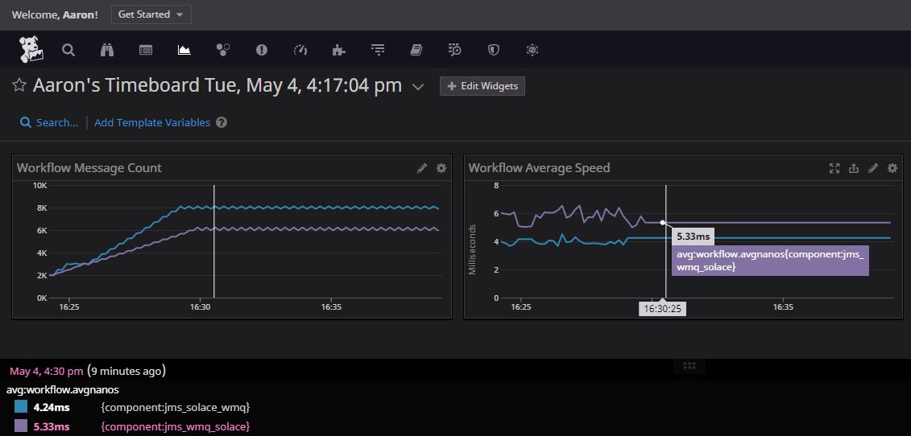

> **Summary:** This page describes how to profile Interlok and inject statistics into Datadog

!> **IMPORTANT** This document is for Interlok version 4.0+

## Installation ##

All Interlok metrics require the __interlok-profiler__ component and it's dependencies to be included in your installation.   For Datadog however we'll further require the addition of the following;
 - interlok-rest-metrics-profiler
 - interlok-rest-metrics-jvm (only if you require JVM metrics to be made available)
 - interlok-rest-provider-datadog

## Enabling the profiler ##

`com.adaptris:interlok-profiler` uses AOP to fire events when the appropriate methods of Workflow, Producer or Service are triggered. It requires `aspjectjweaver` as a java agent when starting the JVM. The recommendation is to not use the bundled wrapper executables, and to roll your own scripts which can provide the correct startup parameters to the JVM. The aspects themselves are stored in `META-INF/profiler-aop.xml` which means that you need to set the appropriate aspectj system property to enable the aspects. 

An example windows start script that starts Interlok with the javaagent and the AOP file settings.
```
setlocal ENABLEDELAYEDEXPANSION

set CLASSPATH=.
set ADAPTRIS_HOME=C:\Adaptris\Interlok4.0
set JAVA_HOME=C:\Java\Zulu\zulu11\bin

set CLASSPATH=%CLASSPATH%;%INTERLOK_HOME%\lib\*;%INTERLOK_HOME%\config

set ASPECT_OPTIONS=-Dorg.aspectj.weaver.loadtime.configuration=META-INF/profiler-aop.xml

%JAVA_HOME%\java -cp %CLASSPATH% -javaagent:lib/aspectjweaver.jar %ASPECT_OPTIONS% -jar ./lib/interlok-boot.jar
```

### Additional profiler detail ###
If you don't require more technical detail on how the profiler works, skip this section.

The profiler maintains an instance of a JMX MBean per Interlok component; for each and every service, producer and workflow.
Each of those MBeans contains 3 important metrics;
 - AverageNanoseconds - This is the average amount of time this component takes to process a message
 - MessageCount - The number of messages this component has processed
 - FailedMessageCount - The number of messages failed in this component.

You can find the MBeans with the following JMX query;
__com.adaptris:type=Profiler,*__

You can further narrow the results per component type like this for workflows, services or producers;
__com.adaptris:type=Profiler,componentType=workflow,*__
__com.adaptris:type=Profiler,componentType=service,*__
__com.adaptris:type=Profiler,componentType=producer,*__

A further narrowing allows us to specify the unique-id of the component.  Take this example query for a specific workflow;
__com.adaptris:type=Profiler,componentType=producer,id=my-workflow-id__

## Enabling Datadog ##

First make sure you have the correct managementComponents enabled;

```
managementComponents=jmx:jetty:metrics-interlok:metrics-jvm:metrics-provider-datadog
```

This will enable the 3 extra components;
 - metrics-interlok  Enable Interlok to generate performance metrics for services, producers and workflows
 - metrics-jvm  Enable Interlok to also generate Java process metrics.
 - metrics-provider-datadog  Organise and format the metrics specifically for DataDog.

Then again modify your Interlok bootstrap.properties with the following properties;
```
datadogApiKey=my-datadog-api-key
datadogUrlKey=https://app.datadoghq.eu
datadogPushTimerSeconds=10
```

The first property; __datadogApiKey__ is mandatory, the value of which we be your personalized Datadog API key.  The second property; __datadogUrlKey__ will default to "https://api.datadoghq.com" if you do not specify this property.  If you're connecting to the EU Datadog hub you may want to specify the value in the example above.  The final property is the delay between Datadog metric push updates, the defauljt value is 10 seconds unless you override the value in the bootstrap.propertfies. 

It's that simple, now query for your metrics with the Datadog UI.

## The Metrics ##

The following metric names can be queried;
For workflows:
 - workflow.count
 - workflow.fail.count
 - workflow.avgnanos

For Producers:
 - producer.count
 - producer.fail.count
 - producer.avgnanos

For Services:
 - service.count
 - service.fail.count
 - service.avgnanos

For each Interlok component the metric will contain a "component" tag, the value of which will be the Interlok components unique-id.



