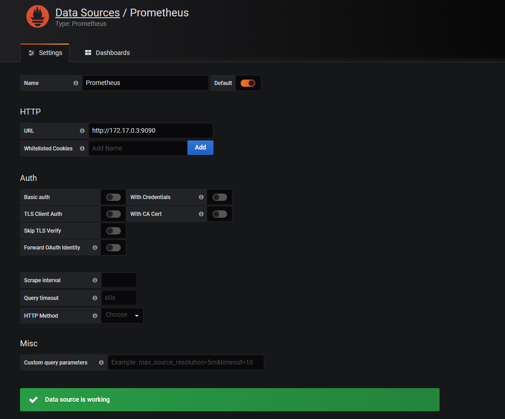
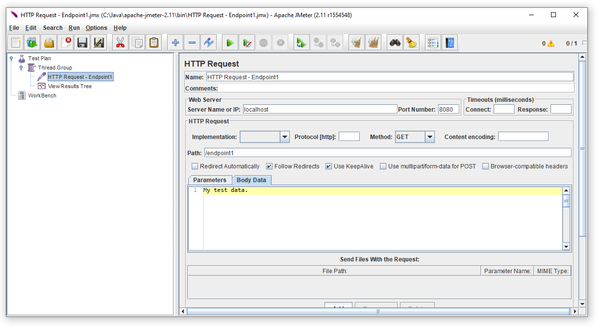
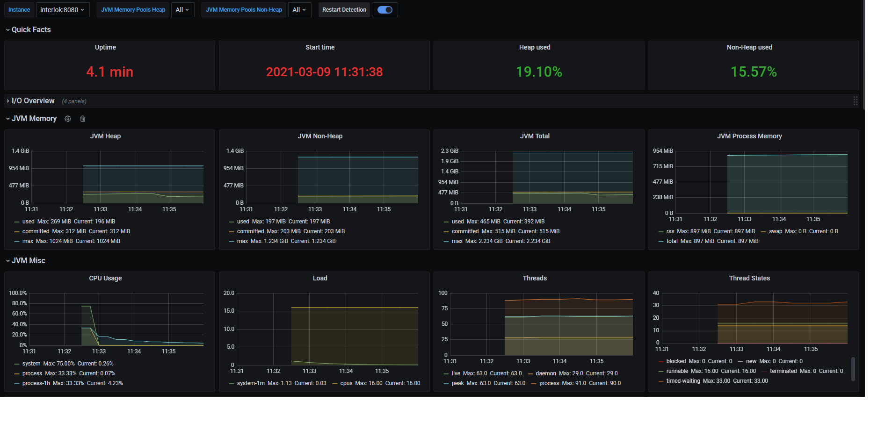
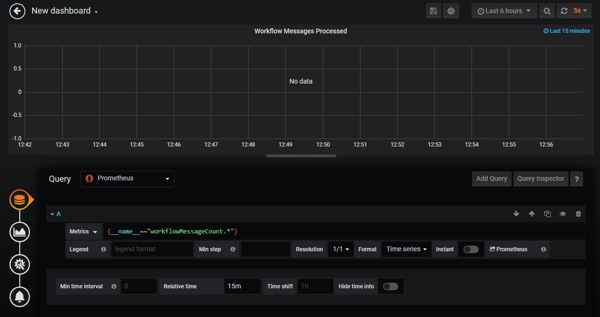
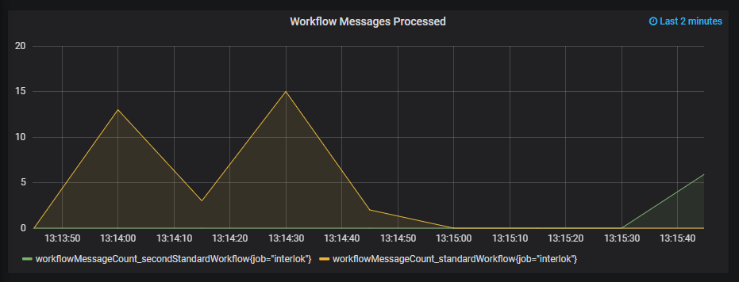
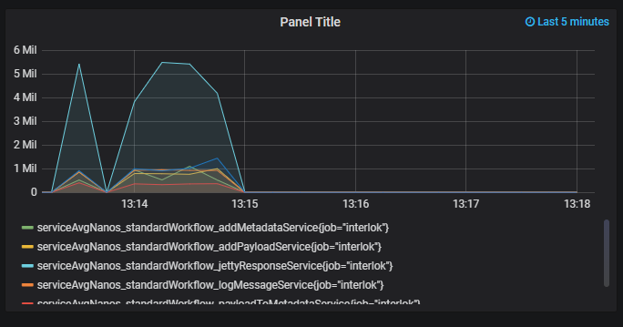

> **Summary:** Using Prometheus and Grafana to view Interlok metrics.

**Since 4.0+**

This document will walk you through the setup and configuration to have Interlok post profiling data directly into Prometheus.  You'll then be shown some of the basics of Prometheus and Grafana to view your Interlok metrics.

## Prerequisites.

For ease of installation you will need access to a docker engine, your favourite tool for posting HTTP requests and a full Interlok 4.0+ installation.  This guide uses the following;

- Windows Docker Desktop
- Interlok 4.0
- Apache JMeter

Additionally, you will also need a few jar files to drop into your Interlok installations "lib" directory.
See our guide on creating a new installation using gradle [here](https://interlok.adaptris.net/interlok-docs/#/pages/overview/adapter-gradle).
Specifically, you will need the Interlok jar files and dependent jar files from these Interlok components;

 - [interlok-profiler](https://github.com/adaptris/interlok-profiler)
 - [interlok-monitor-agent](https://github.com/adaptris/interlok-monitor-agent)
 - [interlok-rest-metrics-profiler](https://github.com/adaptris/interlok-workflow-rest-services/tree/develop/interlok-rest-metrics-profiler)
 - [interlok-rest-metrics-jvm](https://github.com/adaptris/interlok-workflow-rest-services/tree/develop/interlok-rest-metrics-jvm)
 - [interlok-rest-provider-prometheus](https://github.com/adaptris/interlok-workflow-rest-services/tree/develop/interlok-rest-provider-prometheus)

## Docker Configuration

Prometheus can be configured to periodically scrape a number of endpoints to collect and store metric data, therefore we'll be exposing a service to provide that endpoint and data.  For this you'll need to make sure you're running Interlok's Jetty to be the source of the HTTP endpoint.

We'll use Docker to install both the Prometheus engine and Grafana.  Following the steps below for each.

### Prometheus Engine

Before the engine can be installed into Docker we need to provide our own custom yml configuration file that specifies how the Prometheus engine will scrape metrics from either the pushgateway or directly from Interlok.  

Create a new file named prometheus.yml with the following content;

```yml
global:
  scrape_interval: 15s

scrape_configs:
  - job_name: 'prometheus'
    scrape_interval: 5s
    static_configs:
      - targets: ['localhost:9090']

  - job_name: 'interlok'
    honor_labels: true
    scrape_interval: 5s
    metrics_path: 'prometheus/metrics'
    static_configs:
      - targets: ['host.docker.internal:8082']
```
Now modify the target host and port name on the last line to point to your installation of Interlok.

Finally start Prometheus with the full path to your new configuration file like this;
```
docker run -d -v C:\prometheus.yml:/etc/prometheus/prometheus.yml -p 9090:9090 prom/prometheus
```

### Grafana
There are simply two stages to the Grafana setup, the first is to run it in Docker and then we simply setup the Prometheus data-source.  We'll be playing around with Grafana a little later in this guide, but for now start it up;
```
docker run -d -p 3000:3000 grafana/grafana
```

Now you can log into Grafana with your browser on [http://localhost:3000](http://localhost:3000) .

The default username and password is usually __admin__ for both.  You should then be prompted to create a new data source.  For this we'll need the Prometheus engines container IP address/host name.  Using the same two commands as shown in the previous section; __docker ps__ and __docker network inspect bridge__, find the IP address of the Prometheus engine, not the pushgateway.
Choose Prometheus as the data source type and enter the host with your IP address as shown below;



### Interlok

In this guide we will be using a fairly simple Interlok configuration with two workflows that accept HTTP requests, run some services and simply return the result to the caller.  You can absolutely use any Interlok configuration you wish, but if you wish to use the same one as this guide, you can find a full copy at the very bottom of this guide.  Simply copy the content into the file named __adapter.xml__ in your Interlok __config__ directory.

Assuming you have installed the required jar files as mentioned at the top of this document, we now need to configure the interlok-profiler and the specify the Prometheus metric population method.

When running the profiler it is always suggested to create your own scrip to launch the Interlok process.  Essentially we need to start the Java process with a javaagent, with the profiling configuration.  Here is a windows batch script (start-interlok-with-profiler.bat) that does the necessary;
```
setlocal ENABLEDELAYEDEXPANSION

set CLASSPATH=.
set INTERLOK_HOME=C:\Adaptris\4.0
set JAVA_HOME=C:\Java\Zulu\zulu-11\bin

set CLASSPATH=%CLASSPATH%;%INTERLOK_HOME%\lib\*;%INTERLOK_HOME%\config

set ASPECT_OPTIONS=-Dorg.aspectj.weaver.loadtime.configuration=META-INF/profiler-aop.xml

%JAVA_HOME%\java -cp %CLASSPATH% -javaagent:lib/aspectjweaver.jar %ASPECT_OPTIONS% -jar ./lib/interlok-boot.jar
```

If you drop this batch file into the root of your Interlok installation,  you should only need to change the __JAVA_HOME__ and the __INTERLOK_HOME__ properties to match your correct paths.  There is one more final thing to check however, the final line specifies a jar file named __aspectweaver.jar__ in the __lib__ directory of your Interlok installation.  Make sure your script has the same name of the actual aspectweaver jar in your lib directory, just in case the jar file is named something slightly different.

Now we need a new file in your __config__ directory of your Interlok installation named __interlok-profiler.properties__.  The content of this file should be the following;
```
com.adaptris.profiler.plugin.factory=com.adaptris.monitor.agent.InterlokMonitorPluginFactory
com.adaptris.monitor.agent.EventPropagator=JMX
```
#### Enabling the Prometheus endpoint for scraping

Simply modify Interlok's bootstrap.properties to include the following management components;

```
# What management components to enable.
managementComponents=jmx:jetty:metrics-interlok:metrics-provider-prometheus
```

If you want Interlok to publish JVM metrics as well as Interlok specific metrics then also add the following to the colon separated list; __metrics-jvm__

## The metrics

The following will become important later when we start querying for metrics in Grafana.

Currently Interlok pushes two types of metrics; the number of messages processed and the average amount of time a component takes to process a single message.

### Message counts

There are two metrics Interlok will produce for each workflow; simply the number of messages processed within a given time frame and the number of messaged that have been deemed as failures.  The metric names are as follows;
 - workflow_count
 - workflow_fail_count

To distinguish between workflows we have employed Prometheus tags.  Tags are simply name and value pairs added to a metric.  In our case you can target a particular workflow using the __workflow__ tag name with the value being the ID of the workflow (example below).

### Component performance

Interlok maintains a running average both in milliseconds and nanoseconds that each component needs to complete it's job.  The metric names are as follows;
 - service_avgnanos
 - service_avgmillis
 - producer_avgmillis
 - producer_avgnanos
 - workflow_avgnanos
 - workflow_avgmillis

You can further deduce the actual service or producer using the tag name __component__.  You can also use the __workflow__ tag to query for components related to a particular workflow (examples below).

## Loading messages into Interlok

If you're using the same configuration as this guide then use your HTTP posting tool to inject messages into Interlok.  Here we're use Apache JMeter, the basic configuration looks like the following.



Continually fire messages into Interlok for a few seconds or so and then move onto the next section to see the results of those metrics.

## Grafana

### JVM

If you have opted to use the Interlok __metrics-jvm__ management component, explained above, then you can install [this](https://grafana.com/grafana/dashboards/4701) dashboard directly into Grafana to see all of the JVM stats reported by your Interlok instance.



### Interlok

You should have created the Prometheus data source in Grafana in a previous section so now you will create a new dashboard which will allow you to create new queries.  This guide will not go into detail on how to use Grafana or the power of Prometheus's query language, but we can show a couple of potentially useful queries below.

__Note:__ The following queries may need to be changed to match your workflows unique id's, if you are not using this guides configuration.

Using the query;
```
workflow_count
```
In the following configuration window;



We end up with the following messages processed by workflow chart;



We can also see the time in nanoseconds that each service in the workflow named __standardWorkflow__ takes to process each message with the following query;

```
service_avgnanos{workflow="standardWorkflow"}
```



## Sample Configuration

```xml
<adapter>
  <unique-id>MyInterlokInstance</unique-id>
  <start-up-event-imp>com.adaptris.core.event.StandardAdapterStartUpEvent</start-up-event-imp>
  <heartbeat-event-imp>com.adaptris.core.HeartbeatEvent</heartbeat-event-imp>
  <shared-components>
    <connections/>
    <services/>
  </shared-components>
  <event-handler class="default-event-handler">
    <unique-id>DefaultEventHandler</unique-id>
    <connection class="null-connection">
      <unique-id>reverent-noyce</unique-id>
    </connection>
    <producer class="null-message-producer">
      <unique-id>gigantic-feynman</unique-id>
    </producer>
  </event-handler>
  <message-error-handler class="null-processing-exception-handler">
    <unique-id>tender-goodall</unique-id>
  </message-error-handler>
  <failed-message-retrier class="no-retries">
    <unique-id>pensive-boyd</unique-id>
  </failed-message-retrier>
  <channel-list>
    <channel>
      <consume-connection class="jetty-embedded-connection">
        <unique-id>embeddedJettyConnection</unique-id>
      </consume-connection>
      <produce-connection class="null-connection">
        <unique-id>cranky-nightingale</unique-id>
      </produce-connection>
      <workflow-list>
        <standard-workflow>
          <consumer class="jetty-message-consumer">
            <message-factory class="multi-payload-message-factory">
              <default-char-encoding>UTF-8</default-char-encoding>
              <default-payload-id>default-payload</default-payload-id>
            </message-factory>
            <unique-id>httpMessageConsumer</unique-id>
            <path>/endpoint1</path>
            <parameter-handler class="jetty-http-ignore-parameters"/>
            <header-handler class="jetty-http-ignore-headers"/>
          </consumer>
          <service-collection class="service-list">
            <unique-id>hopeful-mayer</unique-id>
            <services>
              <payload-to-metadata>
                <unique-id>payloadToMetadataService</unique-id>
                <key>payload</key>
                <metadata-target>Standard</metadata-target>
                <encoding>None</encoding>
              </payload-to-metadata>
              <add-payload-service>
                <unique-id>addPayloadService</unique-id>
                <new-payload-id>my-new-payload</new-payload-id>
                <new-payload class="metadata-data-input-parameter">
                  <metadata-key>payload</metadata-key>
                </new-payload>
              </add-payload-service>
              <switch-payload-service>
                <unique-id>switchPayloadService</unique-id>
                <new-payload-id>my-new-payload</new-payload-id>
              </switch-payload-service>
              <log-message-service>
                <unique-id>logMessageService</unique-id>
                <log-level>DEBUG</log-level>
              </log-message-service>
              <add-metadata-service>
                <unique-id>addMetadataService</unique-id>
                <metadata-element>
                  <key>myKey</key>
                  <value>myValue</value>
                </metadata-element>
              </add-metadata-service>
              <jetty-response-service>
                <unique-id>jettyResponseService</unique-id>
                <http-status>200</http-status>
                <content-type>text/plain</content-type>
                <response-header-provider class="jetty-no-response-headers"/>
              </jetty-response-service>
            </services>
          </service-collection>
          <producer class="null-message-producer">
            <unique-id>nullProducer</unique-id>
          </producer>
          <produce-exception-handler class="null-produce-exception-handler"/>
          <unique-id>standardWorkflow</unique-id>
          <message-metrics-interceptor>
            <unique-id>standardWorkflow-MessageMetrics</unique-id>
            <timeslice-duration>
              <unit>MINUTES</unit>
              <interval>5</interval>
            </timeslice-duration>
            <timeslice-history-count>12</timeslice-history-count>
          </message-metrics-interceptor>
          <in-flight-workflow-interceptor>
            <unique-id>standardWorkflow-InFlight</unique-id>
          </in-flight-workflow-interceptor>
        </standard-workflow>
        <standard-workflow>
          <consumer class="jetty-message-consumer">
            <message-factory class="multi-payload-message-factory">
              <default-char-encoding>UTF-8</default-char-encoding>
              <default-payload-id>default-payload</default-payload-id>
            </message-factory>
            <unique-id>secondHttpMessageConsumer</unique-id>
            <path>/endpoint2</path>
            <parameter-handler class="jetty-http-ignore-parameters"/>
            <header-handler class="jetty-http-ignore-headers"/>
          </consumer>
          <service-collection class="service-list">
            <unique-id>hopeful-mayer</unique-id>
            <services>
              <payload-to-metadata>
                <unique-id>secondPayloadToMetadataService</unique-id>
                <key>payload</key>
                <metadata-target>Standard</metadata-target>
                <encoding>None</encoding>
              </payload-to-metadata>
              <add-payload-service>
                <unique-id>secondAddPayloadService</unique-id>
                <new-payload-id>my-new-payload</new-payload-id>
                <new-payload class="metadata-data-input-parameter">
                  <metadata-key>payload</metadata-key>
                </new-payload>
              </add-payload-service>
              <switch-payload-service>
                <unique-id>secondSwitchPayloadService</unique-id>
                <new-payload-id>my-new-payload</new-payload-id>
              </switch-payload-service>
              <log-message-service>
                <unique-id>secondLogMessageService</unique-id>
                <log-level>DEBUG</log-level>
              </log-message-service>
              <add-metadata-service>
                <unique-id>secondAddMetadataService</unique-id>
                <metadata-element>
                  <key>myKey</key>
                  <value>myValue</value>
                </metadata-element>
              </add-metadata-service>
              <jetty-response-service>
                <unique-id>secondJettyResponseService</unique-id>
                <http-status>200</http-status>
                <content-type>text/plain</content-type>
                <response-header-provider class="jetty-no-response-headers"/>
              </jetty-response-service>
            </services>
          </service-collection>
          <producer class="null-message-producer">
            <unique-id>secondNullProducer</unique-id>
          </producer>
          <produce-exception-handler class="null-produce-exception-handler"/>
          <unique-id>secondStandardWorkflow</unique-id>
          <message-metrics-interceptor>
            <unique-id>standardWorkflow-MessageMetrics</unique-id>
            <timeslice-duration>
              <unit>MINUTES</unit>
              <interval>5</interval>
            </timeslice-duration>
            <timeslice-history-count>12</timeslice-history-count>
          </message-metrics-interceptor>
          <in-flight-workflow-interceptor>
            <unique-id>standardWorkflow-InFlight</unique-id>
          </in-flight-workflow-interceptor>
        </standard-workflow>
      </workflow-list>
      <unique-id>http_channel</unique-id>
    </channel>
  </channel-list>
  <message-error-digester class="standard-message-error-digester">
    <unique-id>ErrorDigest</unique-id>
    <digest-max-size>100</digest-max-size>
  </message-error-digester>
</adapter>

```
