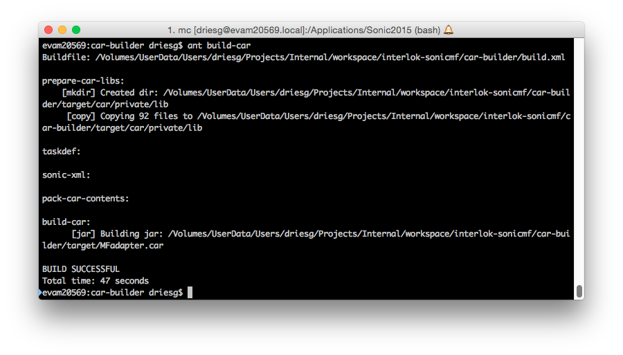
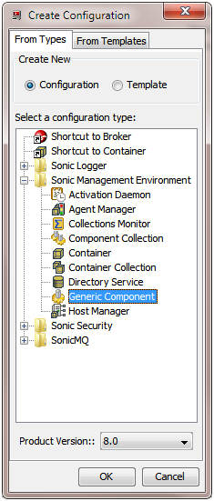
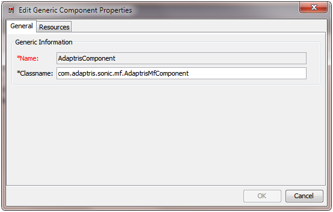
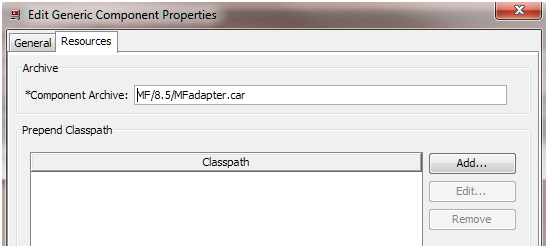
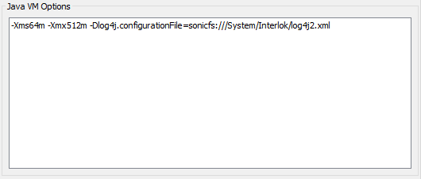




Interlok requires a minimum JVM version of 1.7. SonicMQ version 8.5 and earlier may be running with Java 1.6.  In this case you will need a separate install of Java 1.7 on the SonicMQ host machine. You can download the required files from either then [snapshot repository](https://nexus.adaptris.net/nexus/content/groups/adaptris-snapshots/com/adaptris/interlok-sonicmf/) or the [release repository](https://nexus.adaptris.net/nexus/content/groups/public/com/adaptris/interlok-sonicmf/).

----

## SonicMQ containers ##

SonicMQ provides a java container for which you may run your own programs. Adaptris has used this functionality to run instances of Interlok. SonicMQ requires a package called a CAR file which can deployed directly into a SonicMQ container. Component archive files (CAR) are essentially bundles much like jar files.  They contain the standard jar file manifest file as well as a Sonic descriptor file - similar to the OSGI bundle descriptor.

----

## Creating the CAR file ##

We have provided a utility program called the "CAR builder" to create a CAR file from your Interlok version 3.x installation.

### Pre-requisites for the CAR builder ###

The Adaptris CAR builder requires apache-ant version 1.8.3+ and optionally an installation of Interlok 3.x; since it uses ANT + ivy under the covers, you are able to modify the build.xml / ivy.xml for your purposes. The supplied configuration is illustrative and may not be suitable for your requirements.

### Configuring the CAR builder ###

Inside the directory containing the CAR builder tool, take a copy of the build.properties.template file and save it as build.properties.

This contains the minimum property declarations that you'll need to execute the tools script. The available properties are:

| Name            | Default value       | Description                         |
| --------------- | ------------------- | ----------------------------------- |
| interlok.version | 3.6.0               | The version of Interlok to download |
| interlok.lib     | target/interlok/lib | Where to find Interlok libraries. If downloading, libraries will be placed here |
| extra.lib        | car-lib           | Where to find extra jar files. __Place interlok-sonicmf.jar here and any other libraries you want to include in the CAR file that are not automatically downloaded__ (IBM MQ jars, for example) |
| car.name         | MFadapter.car       | The name of the CAR file. Useful if you need to have multiple CARs with different libraries included in the same Sonic domain |
| car.pack200      | true                | Whether to apply pack200 compression to reduce CAR file size. |

If you already have an Interlok installation you want to package, set the `interlok.lib` property to the `lib` directory in that installation. If you don't have Interlok yet there is no need to change anything other than `interlok.version` to download the version you want.

### Running the CAR builder tool ###

Open a new command line window and navigate to the root directory of the CAR builder tool. Run `ant -projecthelp` to get an overview of the available commands:

```
Main targets:

 build-car           Build the CAR file
 clean               Clean up build directories
 clean-all           Clean the target directory
 clean-car           Clean the car build directory
 download-and-build  Download interlok and build car
 download-interlok   Download Interlok libraries and dependencies
Default target: download-and-build
```

In order to download interlok and build the CAR file, run:
```
$ ant
```
or if you only want to build the car file (because you already have an Interlok installation to package):

```
$ ant build-car
```

Once the CAR builder has completed you will find a new CAR file in the 'target' directory of the CAR builder installation.



----

## Preparing SonicMQ for deployment ##

The Interlok CAR file can be quite large in size depending on the number and size of 3rd party libraries required to run your Interlok configuration.

SonicMQ can sometimes have problems installing large CAR files and although this problem is rare, the fix is straight forward; simply modify either SonicMQ script "startmc.bat" or "startmc.sh" (depending on whether your SonicMQ is installed on windows or linux) which can be found in your SonicMQ installation, to include increase the max memory for the JVM `-Xmx512M` at the point the JRE is executed (e.g. just after the `%MGMTCONSOLE_JRE%`)

Finally, we must also enable custom components within SonicMQ.  This feature essentially unlocks the ability to run Java programs inside the SonicMQ container. This involves modifying the same "startmc" file and enabling custom components by adding a system property

```
-Dsonicsw.ma.genericComponent=true
```

An example of a windows version of the modified "startmc" script will look like the following (not including the –Xmx switch, add this if needed);


----

## Install the Interlok CAR file ##

Login to your SonicMQ environment using the Sonic Management Console. On the "Configure" tab select the "Configured Objects" -> "Archives" -> "MF" -> "8.5" (this last directory will be named according to your version of SonicMQ), then simply right click on the right pane that already lists several Sonic CAR files and select "Import".  From the directory explorer window, select your Interlok CAR file.  This window should now look like this (example taken from SonicMQ v8.5);


### Interlok configuration ###

For Interlok to function, you will need to upload both the Interlok configuration file and the license file into the sonicfs. To do so is very simple.  With sonic management console, on the 'configure' tab, create a directory in the 'System' folder.  Then right click in the empty pane on the right hand side and import your configuration and license file.  We will be referring to them in the next section.

----

## Creating the SonicMQ container ##

Having enabled the generic components within the Sonic environment, you should now be able to add a new generic component;



The following configuration should be used for the container configuration page;





You will be able to add your newly created generic component to any standard Sonic container. The recommendation is that you create a new container for this component. There are a number of deployment parameters that can be used to control the runtime behaviour of Interlok running inside a container shown below:

| Deployment parameter     | Description | Since |
| ------------------------ | ----------- | ----- |
| bootstrap.properties.url | The URL (in SonicFS) of your bootstrap.properties file | 3.0.1 |
| jmxserviceurl            | The JMX Service URL | consider switching to bootstrap.properties.url |
| adapterxmlurl            | The URL for adapter.xml | consider switching to bootstrap.properties.url |
| licenseurl               | Where to find the license.properties file | consider switching to bootstrap.properties.url |
| log4jurl                 | The URL for your log4j configuration file | consider switching to bootstrap.properties.url |
| managementComponents     | The management components to enable | consider switching to bootstrap.properties.url |
| preProcessors            | Configuration preprocessors to apply | consider switching to bootstrap.properties.url |

You can specify either `bootstrap.properties.url` (since version 3.0.1) or you can specify the individual settings instead of their respective deployment properties. Please see the documentation about [bootstrap.properties](/pages/user-guide/adapter-bootstrap) for the meanings of these settings. Note that if you don't configure any management components, you won't get any management components enabled.

Should you choose to upload your bootstrap.properties into the sonicfs, you may also want to make sure the file resources within the bootstrap.properties also reference files in sonicfs.

The main reason for using the bootstrap.properties.url deployment parameter above the previous method would be to be able to have the full leverage of pre-processors and custom parameters within the bootstrap.properties.

Next, you need to make sure the SonicMQ container starts Interlok with the correct version of java. By default all container components will be executed with the version installed with SonicMQ.  You may need to specify a later version of Java. To do this, you can edit your custom container and make sure the path to your java 1.8+ installation is specified as shown here;


Finally, to configure the logging you may need to add the following switch (modify the path to your log4j configuration as needed) to the Java VM options in the container properties to force log4j configuration from a specific location.

```
-Dlog4j.configurationFile=sonicfs:///System/Interlok/log4j2.xml
```



## Container integrated logging ##

By default, Interlok will log to its own log4j context which is separately configured from the Sonic container log. If you want to integrate Interlok logging into the Sonic container logs (if you use Sonic centralized logging, for example), use the following configuration in `log4j2.xml`:

```
<Configuration>
  <Appenders>
    ...
    <ContainerLog name="ContainerLog">
      <PatternLayout>
        <Pattern>[%d{yy/MM/dd HH:mm:ss}] (%p{lowerCase=true}) [%t] [%c{1}] %m%n</Pattern>
      </PatternLayout>
    </ContainerLog>
    ...
  </Appenders>
  ...
</Configuration>
```

## JMX ##

By default, unless otherwise specified, JMX is disabled. In order to expose the standard Adapter JMX controls (e.g. starting / stopping individual channels); add jmxserviceurl as a deployment parameter (along with the appropriate setting e.g. `service:jmx:jmxmp://localhost:5555`) and `managementComponents=jmx` as a deployment parameter. This means that the same JMX controls will be exposed as when running as a standalone process. Once enabled you can connect to it via jconsole (if the jmxremote*.jars are in the classpath) with the specified jmx service url or via the Interlok Web UI.


## Deployment parameters variable substitution ##

To use Sonic deployment parameters for variable replacements in your adapter.xml, add the following configuration to your `bootstrap.properties`:

```
preProcessors=xinclude:variableSubstitution:systemProperties:environmentVariables:deploymentParameters
variable-substitution.properties.url=sonicfs:///Interlok/Adapters/environment.properties
deployment-parameters.impl=STRICT_WITH_LOGGING
```

This will allow variables in your adapter.xml to be resolved from xinclude, a file called environment.properties, Java system properties, environment variables and Sonic deployment parameters, in that order; _variableSubstitution,xinclude,systemProperties,environmentVariables_ will require additional jars, consult the [pre-processors documentation](/pages/advanced/advanced-configuration-pre-processors) for more information.

## Native Library support ##

Most native libraries may not work as expected while being bundled into a CAR file to then be installed into a sonic component/container.  Therefore we suggest you always make sure your third party native libraries be installed as instructed in their documentation outside of the Sonic container. You may then add these dependencies into the component or container through the sonic management consoles configuration.

### MSMQ ###

The Adaptris MSMQ component relies on a combination of files that cannot be put into directory services; you will need to define "jacozoom.dir" as a system property on the container that will host the Adapter and set it to your external Interlok installations lib directory; ${adapter_home}/lib

