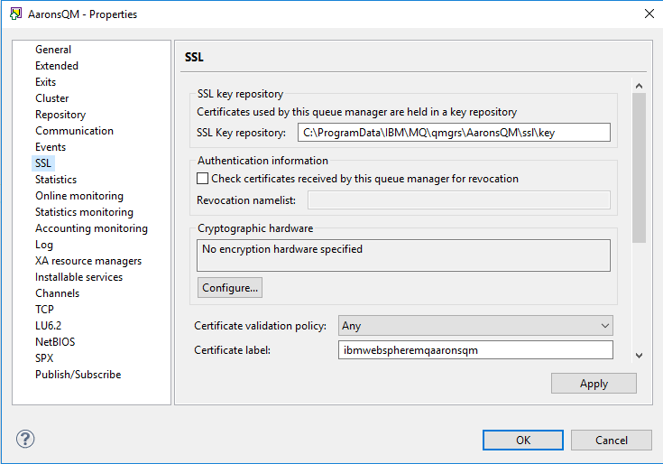
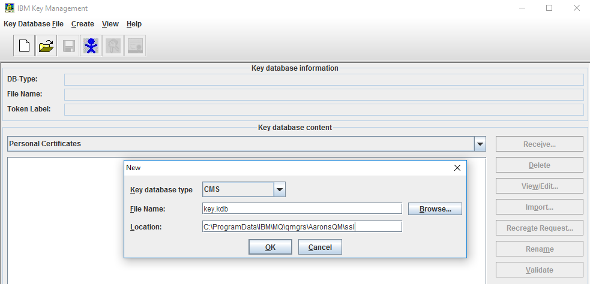
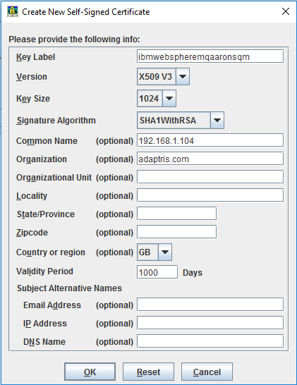
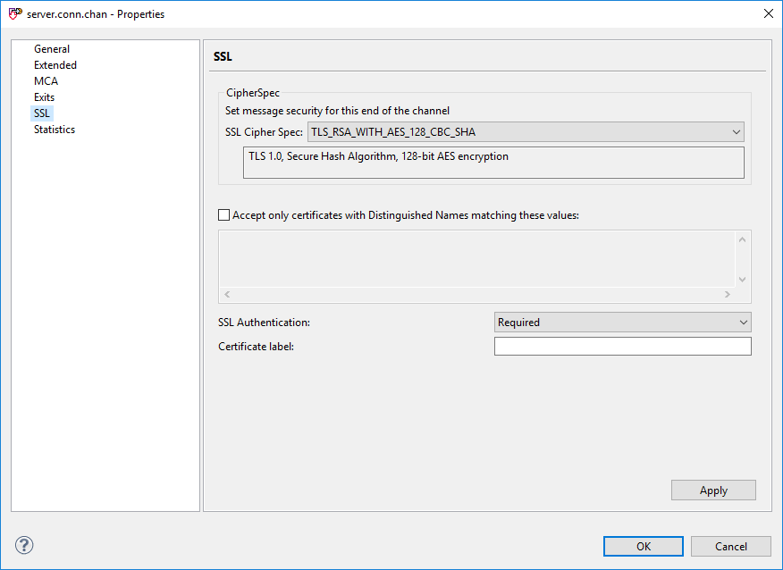
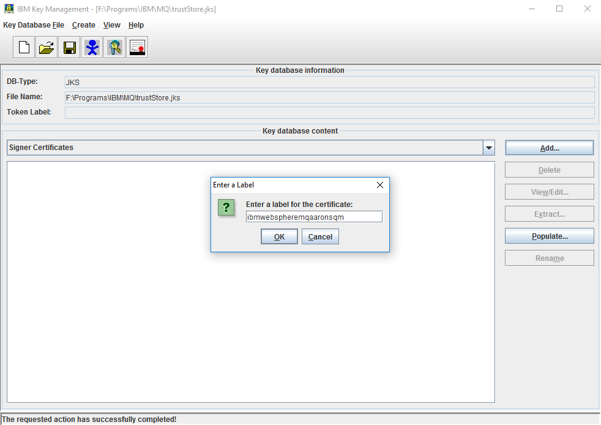

# Interlok SSL with WebsphereMQ

> **Summary:** This page describes how to configure Interlok and Websphere MQ for SSL communication.

## WebsphereMQ Server Side Configuration ##

The following will show you how to configure WebsphereMQ to initiate SSL on a channel that Interlok will use for it's connections.

Your WebsphereMQ administrators will probably have configured your server side already and may provide with the required queue manager certificate which will will use later, but for completeness here are the basic steps to get SSL up and running.

On the server side we will need a key repository and a self-signed certificate for the queue manager.  We will then create a trust store and another self-signed certificate on the client side.

Using the queue managers certificate we will import it into the trust store of the client, then we will import the clients certificate into the key repository on the server.

This setup allows for bi-directional SSL handshaking.

### Create the key repository ###

In the WebSphere MQ Explorer, right-click the queue manager (for example, MQQmgr), click Properties, and click SSL to determine the key repository.

By default, the repository is MQ_home\Qmgrs\qmgr_name\ssl\key (for example, C:\Program Files\IBM\WebSphere MQ\Qmgrs\MQQmgr\ssl\key.kdb).

This entry has two parts:

 - MQ_home\Qmgrs\qmgr_name\ssl is the location of the key database file.
 - key is the name of the file.
 
Note the location and key name for use in a later step.



In the WebSphere MQ Explorer, right-click IBM WebSphere MQ and click Manage SSL Certificates to open IBM Key Management (the ikeyman utility).

In IBM Key Management, click Key Database File > New to create a key store. In the Key database type field, select CMS. Click Browse and select the file name (for example, key.kdb) and location (for example, MQ_home\Qmgrs\qmgr_name\ssl) that you provided in step 3.a. When prompted, enter a password to secure the key store. Select Stash the password to a file, and click OK.



### Creating the Queue Manager Certificate ###

Still using the IBM Key Management tool, with your new server side key repository loaded, switch to Personal Certificates and click New Self-Signed. When prompted, enter ibmwebspheremq(your_qmgr_name") (for example ibmwebspheremqmqmqgr). It is important to follow this naming rule for the key label. For the other fields, enter anything you like. Click OK. You have created a personal certificate for your queue manager.



Click Extract Certificate. At the prompt, select "DER" as the type and enter a name for this certificate, saving it to any location. Click OK.

You have created and extracted the signer certificate for your queue manager which we will import into the clients trust store later.

### Configuring the WebsphereMQ Channel ###

In the MQ explorer select your Queue Manager and then the channels folder.  You can either use an existing server-connection-channel or create a new one.  In this guide we have created a new one called "server.conn.chan", by right clicking the channels folder and choosing "new".

In the prompt choose server-connection-channel and give it a name.

Then switch to the SSL tab and select a cipher spec to use.  Do note down the chosen cipher spec, because we will need the name of it when we come to configuring the client later.



It is important to note, that some of the cipher specs are not supported any longer; if you choose one of these the MQ explorer will give you an error.

It is also important to note that some of the cipher specs are not compatible with the standard Oracle JVM which Interlok runs on.  The cipher spec we have chosen above has proven to work without issue however.


## Configuring the client ##

### Creating the Trust Store ###

Here we will be creating the client trust store which Interlok will use to access the queue managers certificate.

As its name suggests, the trustStore holds the certificate of a signing CA for a Queue Manager you trust. What this means in terms of the Java/JMS client is that when a connection is made to a Queue Manager, it will send its certificate to us as part of the initial SSL handshake. The JSSE, which handles all SSL communication, will look in the trustStore to validate the certificate it has just been sent. If it cannot validate the certificate, the connection will be terminated.

To create a trustStore and import a certificate, you can use the IBM Key Management tool.

When IBM Key Management starts, click New and set the following values:

 - Key database type = "JKS"
 - File name = "trustStore"
 - Location = "Location of your choice"
 
Do make a note of the chose file location, we will be needing that for the Interlok configuration later.
 
You will now be prompted to enter a password of your choice. The password is required to open the trustStore only if you wish to add certificates to it, which we will be.

Click OK to continue. You should now have a trustStore in which you can import certificates of trusted CAs.

### Import the Queue Managers certificate ###

Select the drop-down box under the label Key database content.

Select Signer Certificates. 

Click Add. You will be prompted for the location of the certificate you wish to add. This certificate will be the Queue Managers certificate we extracted from the first step.

Enter the following data:

 - Data type = "Binary DER data"

 - Certificate file name = "name of Queue Manager certificate"

 - Location = "location of the certificate"

Click OK. You will be prompted for a label, which should be in the form ibmwebspheremq(qmname lowercase).

Click OK to add the certificate.



### Creating the client certificate ###

Follow the step above "Creating the Queue Manager Certificate" to create and extract a new client certificate, only this time you will have the client trust store loaded in the key management tool.

Also there are no restrictions on the label of the certificate as there were above.

### Importing the client certificate into the server key repository ###

Using the IBM Key Management tool, load the server key repository we created in the first step.

Switch to Signer Certificates in the Key database content list, and click Add.

Click Browse, select the signer certificate that you extracted in the previous step and click Open.

Click Browse to make sure that the file in the location is correct, and then click OK.

When you are prompted for the certificate label, enter a name (for example, ClientSignerCertificate) and click OK.

Close the IBM Key Management tool.

## Interlok configuration ##

Interlok's configuration is actually very simple, there are 2 steps; linking the trust store and configuring the cipher suite.

### Linking the trust store ###

You will need to add the following 3 JVM parameters to your Interlok start script.

 - -Djavax.net.ssl.trustStore=location of the client trust store above
 - -Djavax.net.ssl.keyStore=location of the client trust store above
 - -Djavax.net.ssl.keyStorePassword=MyKeyStorePassword 

Optionally, you can also add debugging to help figure out any errors during SSL communication;

 - -Djavax.net.debug=all
 
If you have your own Interlok start script simply add these parameters to the Java command that starts the process.  An example windows script below;

```
set CLASSPATH=.
set ADAPTRIS_HOME=C:\Adaptris\3.6.6
set JAVA_HOME=C:\Java\jdk1.8.0_144\bin

set CLASSPATH=%CLASSPATH%;%ADAPTRIS_HOME%\lib\*;%ADAPTRIS_HOME%\config

%JAVA_HOME%\java -cp %CLASSPATH% -Djavax.net.ssl.trustStore=F:\IBM\trustStore.jks -Djavax.net.ssl.keyStore=F:\IBM\trustStore.jks -Djavax.net.ssl.keyStorePassword=MyKeyStorePassword -Djavax.net.debug=all com.adaptris.core.management.StandardBootstrap
```
 
Alternatively, if you run interlok using the executable ("exe" or "sh"), then you will need to add these JVM properties to the adapter.lax file in the Interlok/bin directory;

```
#   LAX.NL.JAVA.OPTION.ADDITIONAL
#   -----------------------------
#   Additional properties to pass into the application.
#   Generally you would add specific system properties using the -Dkey=name syntax.

lax.nl.java.option.additional=-Dsun.net.inetaddr.ttl=3600 -server -XX:MaxPermSize=128m -Djavax.net.ssl.trustStore=F:\Programs\IBM\MQ\trustStore.jks -Djavax.net.ssl.keyStore=F:\Programs\IBM\MQ\trustStore.jks -Djavax.net.ssl.keyStorePassword=MyKeyStorePassword -Djavax.net.debug=all
```
 
### Configuring the Cipher Suite ###

In an earlier step you configured a new server-connection-channel that required you to choose a cipher spec.  You will now need to find the corresponding Java cipher suite using the below table;

|Server Channel Cipher Spec| Java Cipher Suite |
|----|----|
|NULL_MD5 | SSL_RSA_WITH_NULL_MD5|
|NULL_SHA | SSL_RSA_WITH_NULL_SHA|
|RC4_MD5_EXPORT | SSL_RSA_EXPORT_WITH_RC4_40_MD5|
|RC4_MD5_US | SSL_RSA_WITH_RC4_128_MD5|
|RC4_SHA_US | SSL_RSA_WITH_RC4_128_SHA|
|RC2_MD5_EXPORT | SSL_RSA_EXPORT_WITH_RC2_CBC_40_MD5|
|DES_SHA_EXPORT | SSL_RSA_WITH_DES_CBC_SHA|
|RC4_56_SHA_EXPORT1024 | SSL_RSA_EXPORT1024_WITH_RC4_56_SHA|
|DES_SHA_EXPORT1024 | SSL_RSA_EXPORT1024_WITH_DES_CBC_SHA|
|TRIPLE_DES_SHA_US | SSL_RSA_WITH_3DES_EDE_CBC_SHA|
|TLS_RSA_WITH_AES_128_CBC_SHA | SSL_RSA_WITH_AES_128_CBC_SHA|
|TLS_RSA_WITH_AES_256_CBC_SHA | SSL_RSA_WITH_AES_256_CBC_SHA|
|AES_SHA_US| |
|TLS_RSA_WITH_DES_CBC_SHA | SSL_RSA_WITH_DES_CBC_SHA|
|TLS_RSA_WITH_3DES_EDE_CBC_SHA | SSL_RSA_WITH_3DES_EDE_CBC_SHA|
|FIPS_WITH_DES_CBC_SHA | SSL_RSA_FIPS_WITH_DES_CBC_SHA|
|FIPS_WITH_3DES_EDE_CBC_SHA | SSL_RSA_FIPS_WITH_3DES_EDE_CBC_SHA|

Hopefully you have the corresponding Java Cipher Suite which we configure our WebsphereMQ connection with like so, paying attention to the SSLCipherSuite property;

```
<consume-connection class="jms-connection">
	<unique-id>my-wmq-ssl-connection</unique-id>
	<user-name>MyWmqUsername</user-name>
	<password>MyWmqPassword</password>
	<vendor-implementation class="advanced-mq-series-implementation">
		<connection-factory-properties>
			<key-value-pair>
				<key>Port</key>
				<value>1414</value>
			</key-value-pair>
			<key-value-pair>
				<key>Channel</key>
				<value>server.conn.chan</value>
			</key-value-pair>
			<key-value-pair>
				<key>SSLCipherSuite</key>
				<value>SSL_RSA_WITH_3DES_EDE_CBC_SHA</value>
			</key-value-pair>
			<key-value-pair>
				<key>TransportType</key>
				<value>MQJMS_TP_CLIENT_MQ_TCPIP</value>
			</key-value-pair>
			<key-value-pair>
				<key>HostName</key>
				<value>my.wmq.host.name</value>
			</key-value-pair>
			<key-value-pair>
				<key>QueueManager</key>
				<value>MyQueueManagersName</value>
			</key-value-pair>
		</connection-factory-properties>
		<session-properties/>
	</vendor-implementation>
</consume-connection>
```

If you now start up Interlok and if you have specified debugging as mentioned on the java parameters above you will see vast amounts of additional console logging detailing the SSL handshaking process between Interlok and WebsphereMQ.
