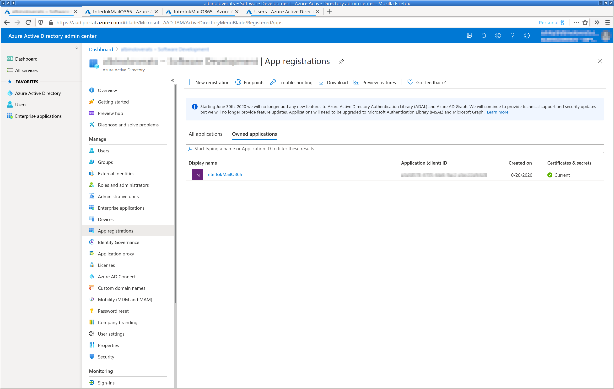
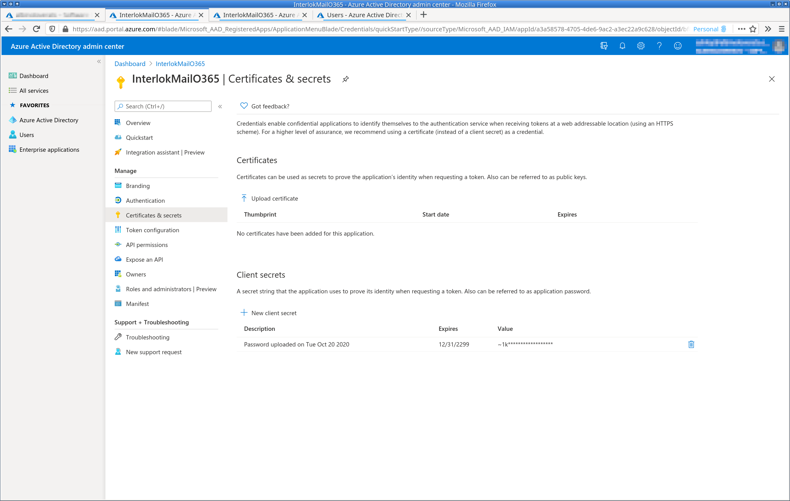
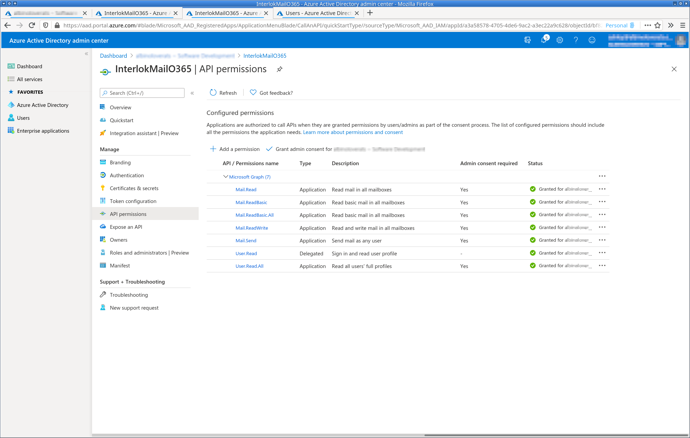
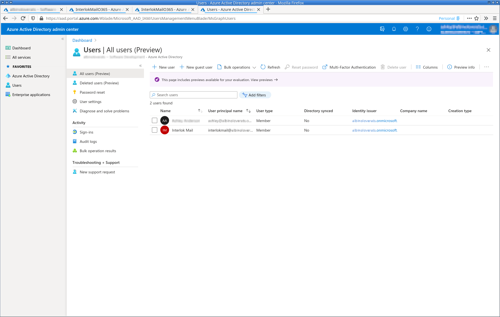

> **Summary:** interlok-azure-onedrive provides a way to use Interlok with OneDrive

The OneDrive component provides a consumer and producer, as well as the
following services: upload, download, transform. They enable the
reading/writing of files on a OneDrive, via Azure and the Graph API. The
transform service allows for files in one format to be downloaded in
another, although the list of currently supported formats is rather
small.

## Prerequisites

* Active Office365 subscription
* An Azure Active Directory application with application the following
  permissions, and with [Admin Consent][1] granted:
  - Files.Read.All
  - Files.ReadWrite.All
  - User.Read
  - User.Read.All
* A user with OneDrive access

The OneDrive consumer, producer, and services require the above because:
* Daemon applications can work only in Azure AD tenants
* As users cannot interact with daemon applications, incremental
  consent isn't possible
* Users require a OneDrive, and this requires an
  [Office365 subscription][2]

## Azure Application Setup

1. Register an application in the Azure Portal


2. Add a client secret so that the app can identify itself


3. Add the necessary permissions


4. Ensure there is a user with an Exchange mailbox


## Interlok-OneDrive Setup

The application ID, tenant ID, client secret and username are all
required and should match those given in the Azure portal.

### Downloading Files

For the consumer to be able to retrieve messages it requires several key
bits of information, in addition to what is necessary for a polling
consumer:

* Application ID; the unique ID given to the Azure application
* Tenant ID; the unique ID of the tenant that the application is
  associated with
* Client secret; essentially the password the application uses to
  authenticate with Azure
* Username; the user whose OneDrive to download files

NB The consumer is currently limited to polling the root of the
OneDrive. At some point it may be worth investigating whether
conventional paths work.

#### Consumer Configuration Example

```xml
    <standalone-consumer>
     <unique-id>ab7ca830-11ba-4b91-b450-70a59064550c</unique-id>
     <connection class="null-connection"/>
     <consumer class="azure-one-drive-mail-consumer">
      <message-factory class="multi-payload-message-factory">
       <default-char-encoding>UTF-8</default-char-encoding>
       <default-payload-id>default-payload</default-payload-id>
      </message-factory>
      <poller class="quartz-cron-poller">
       <cron-expression>0 */5 * * * ?</cron-expression>
      </poller>
      <application-id>47ea49b0-670a-47c1-9303-0b45ffb766ec</application-id>
      <tenant-id>cbf4a38d-3117-48cd-b54b-861480ee93cd</tenant-id>
      <client-secret>NGMyYjY0MTEtOTU0Ny00NTg0LWE3MzQtODg2ZDAzZGVmZmY1Cg==</client-secret>
      <username>user@example.com</username>
     </consumer>
    </standalone-consumer>
```

#### Services Configuration Example

```xml
    <azure-one-drive-document-download-service>
     <unique-id>39f0f131-7ea2-45d8-8895-7bf8af004780</unique-id>
     <connection class="shared-connection">
      <lookup-name>shared-connection-id</lookup-name>
     </connection>
     <username>user@example.com</username>
     <filename>filename</filename>
    </azure-one-drive-document-download-service>
```

```xml
    <azure-one-drive-document-transform-service>
     <unique-id>c3494322-8e4b-45d3-8b88-134398370cb2</unique-id>
     <connection class="shared-connection">
      <lookup-name>shared-connection-id</lookup-name>
     </connection>
     <username>one@drive.com</username>
     <filename>filename</filename>
     <format>JPG</format>
    </azure-one-drive-document-transform-service>
```

### Uploading Files

The producer needs much of the same configuration as the consumer:
application ID, tenant ID, client secret, username, and a file name.


#### Producer Configuration Example

```xml
    <standalone-producer>
     <unique-id>f7daa8c3-15fc-4fbd-a2a1-c0028c52fa12</unique-id>
     <connection class="null-connection"/>
     <producer class="azure-one-drive-producer">
      <unique-id>742b895d-ba01-4092-b5fa-f486d5488e56</unique-id>
      <username>user@example.com</username>
      <filename>filename</filename>
     </producer>
    </standalone-producer>
```

#### Upload Service Configuration Example

```xml
    <azure-one-drive-document-upload-service>
     <unique-id>24b548e8-c593-4588-9e89-fe6781eeca0b</unique-id>
      <connection class="shared-connection">
       <lookup-name>shared-connection-id</lookup-name>
      </connection>
      <username>user@example.com</username>
      <filename>filename</filename>
     </azure-one-drive-document-upload-service>
    <azure-one-drive-document-download-service>
```

[1]: https://docs.microsoft.com/en-us/azure/active-directory/develop/scenario-daemon-overview
[2]: https://docs.microsoft.com/en-us/microsoft-365/enterprise/azure-integration?view=o365-worldwide

[8]: https://developer.microsoft.com/en-us/graph/graph-explorer
[9]: https://github.com/Azure-Samples/active-directory-java-native-headless-v2
