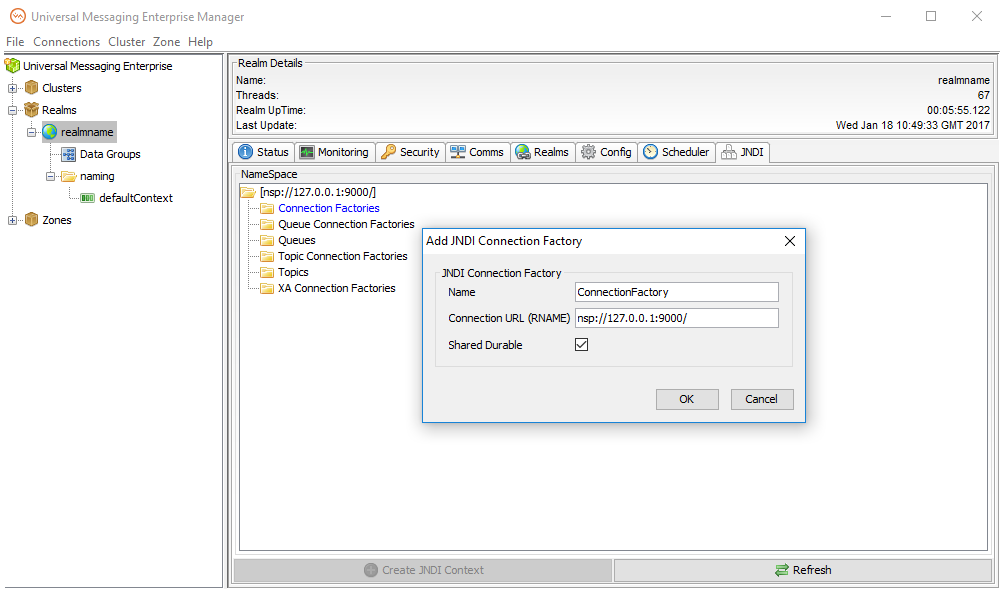
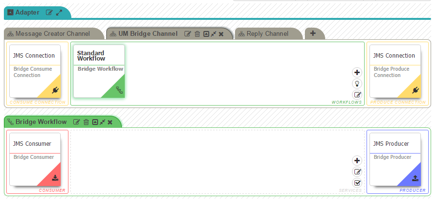
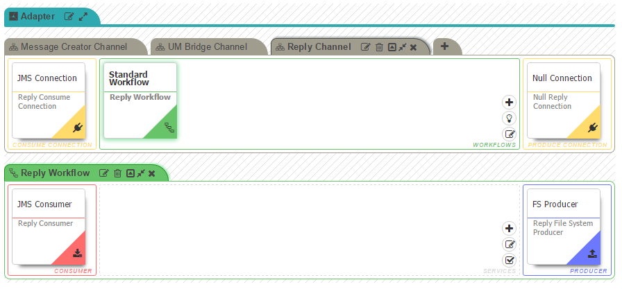
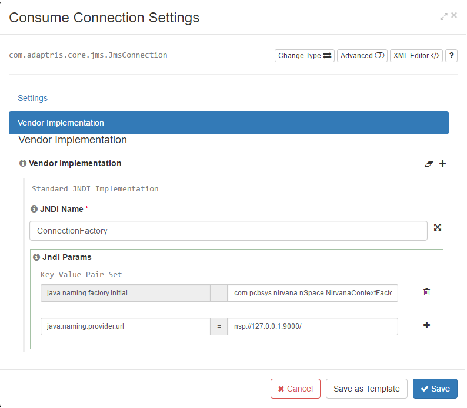
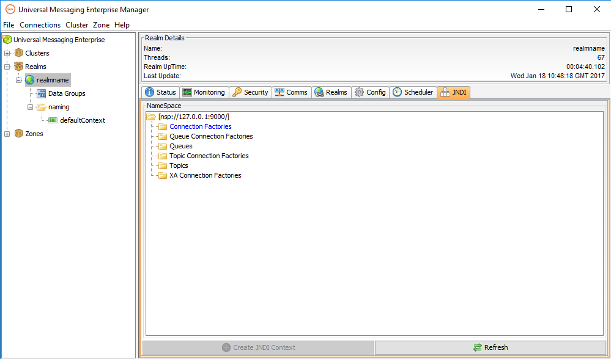
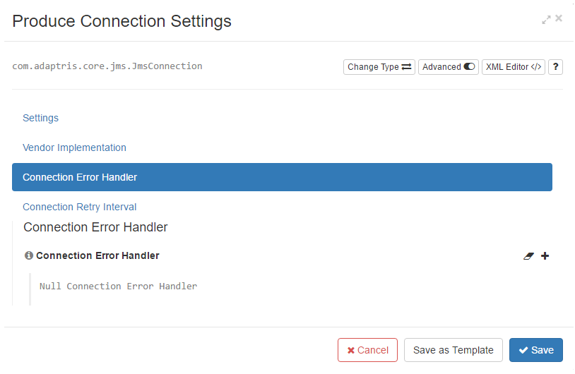

# Integrating with Terracotta Universal Messaging

> **Summary:** This document gives a quick start guide to bridging messages to and from Terracotta Universal Messaging system.

## Getting Started ##

### Interlok Pre-requisites ###

Before you can start an Interlok instance that is able to consume or produce from or to a Terracotta Universal Messaging system, you must first copy 2 java libraries from the Terracotta install to the "lib" directory at the root of your Interlok install;

- nJMS.jar
- nClient.jar

### Terracotta Universal Messaging ###

The following assumes a stock install of Universal Messaging.

As part of the JMS and JNDI standards only a connection factory and endpoints are required configuration for Interlok connections to be enabled.

With universal messaging you don't necessarily need to create your queues before Interlok starts up; any endpoints configured in your consumers or producers will remotely create the queues for you.

You will however have to configure the access rights on each of your endpoints to allow consumers to pop and producers to push messages.


We will be configuring Interlok to use JNDI for each of it's connections therefore ConnectionFactories must be created on the server side.

You will either need to create a QueueConnectionFactory/TopicConnectionFactory or the more generic ConnectionFactory, which we will be using in this quick start guide.

Each configured Interlok connection will simply re-use the same connection factory, therefore we only need to create that single connection factory on the server side, simply named "ConnectionFactory".



This concludes all required Universal Messaging configuration.

----

## Interlok Configuration ##

For this quick start guide we're going to create 3 channels;

1) Read messages from the file system and send to Universal Messaging queue named SampleQ1.

2) Simple bridge channel, consumes messages from SampleQ1 and send to SampleQ2.

3) Reply channel which consumes from SampleQ2 and dumps the messages back to the file system.






Assuming a stock install of Universal Messaging, means that our JNDI configuration for our connections are very simple, we only need two properties;

- java.naming.factory.initial = com.pcbsys.nirvana.nSpace.NirvanaContextFactory

- java.naming.provider.url = nsp://127.0.0.1:9000/



Your provider URL will match the url seen in the Universal Messaging manager under the JNDI tab;



Finally, in the Bridge channel (channel 2), we have not configured any connection error handlers, therefore default connection error handlers will be assigned.

This can cause a problem if you are not using shared connections, but instead configure the connections at the channel level, which we have done in this example.

Both connections for the second channel will be assigned a default connection error handler, which will cause a conflict.

Therefore we need to set the produce connection error handler to a NullConnectionErrorHandler;



This concludes all required Interlok configuration.

## Running the example ##

Once Interlok is running, you can simply drop a text file into the "messages-in" directory at the root of your Interlok installation, which will trigger each channel in turn.

Finally, once the text file has been consumed and sent to SampleQ1 and then picked up by channel 2 which will bridge the message to SampleQ2, your final channel will consume this message and finally return the message contents to the "messages-out" directory, also at the root of your Interlok installation.

Sample TRACE logging from this simple quick start test is shown below.


The full Interlok XML configuration;

```xml

  <adapter>
  <unique-id>MyInterlokInstance</unique-id>
  <start-up-event-imp>com.adaptris.core.event.StandardAdapterStartUpEvent</start-up-event-imp>
  <heartbeat-event-imp>com.adaptris.core.HeartbeatEvent</heartbeat-event-imp>
  <log-handler class="null-log-handler"/>
  <shared-components>
    <connections/>
  </shared-components>
  <event-handler class="default-event-handler">
    <unique-id>DefaultEventHandler</unique-id>
    <connection class="null-connection">
      <unique-id>NullConnection-303006</unique-id>
    </connection>
    <producer class="null-message-producer">
      <unique-id>NullMessageProducer-7125582</unique-id>
    </producer>
  </event-handler>
  <heartbeat-event-interval>
    <unit>MINUTES</unit>
    <interval>60</interval>
  </heartbeat-event-interval>
  <message-error-handler class="null-processing-exception-handler">
    <unique-id>NullProcessingExceptionHandler-1444969</unique-id>
  </message-error-handler>
  <failed-message-retrier class="no-retries"/>
  <channel-list>
    <channel>
      <consume-connection class="null-connection">
        <unique-id>NullConnection</unique-id>
      </consume-connection>
      <produce-connection class="jms-connection">
        <unique-id>UM-ProducerConnection</unique-id>
        <user-name></user-name>
        <vendor-implementation class="standard-jndi-implementation">
          <jndi-params>
            <key-value-pair>
              <key>java.naming.factory.initial</key>
              <value>com.pcbsys.nirvana.nSpace.NirvanaContextFactory</value>
            </key-value-pair>
            <key-value-pair>
              <key>java.naming.provider.url</key>
              <value>nsp://127.0.0.1:9000/</value>
            </key-value-pair>
          </jndi-params>
          <jndi-name>ConnectionFactory</jndi-name>
          <extra-factory-configuration class="no-op-jndi-factory-configuration"/>
        </vendor-implementation>
      </produce-connection>
      <workflow-list>
        <standard-workflow>
          <consumer class="fs-consumer">
            <unique-id>FileSystemConsumer</unique-id>
            <destination class="configured-consume-destination">
              <destination>messages-in</destination>
            </destination>
            <poller class="fixed-interval-poller">
              <poll-interval>
                <unit>SECONDS</unit>
                <interval>10</interval>
              </poll-interval>
            </poller>
            <create-dirs>true</create-dirs>
            <file-sorter class="fs-sort-none"/>
            <wip-suffix>.wip</wip-suffix>
          </consumer>
          <service-collection class="service-list">
            <unique-id>ServiceList-8629475</unique-id>
            <services/>
          </service-collection>
          <producer class="jms-producer">
            <unique-id>MessageCreatorProducer</unique-id>
            <destination class="configured-produce-destination">
              <destination>jms:queue:SampleQ1</destination>
            </destination>
            <acknowledge-mode>CLIENT_ACKNOWLEDGE</acknowledge-mode>
            <message-translator class="text-message-translator"/>
            <correlation-id-source class="null-correlation-id-source"/>
            <delivery-mode>PERSISTENT</delivery-mode>
            <session-factory class="jms-default-producer-session"/>
          </producer>
          <produce-exception-handler class="null-produce-exception-handler"/>
          <unique-id>StandardWorkflow-7020963</unique-id>
          <message-metrics-interceptor>
            <unique-id>StandardWorkflow-7020963</unique-id>
            <timeslice-duration>
              <unit>MINUTES</unit>
              <interval>5</interval>
            </timeslice-duration>
            <timeslice-history-count>12</timeslice-history-count>
          </message-metrics-interceptor>
          <in-flight-workflow-interceptor>
            <unique-id>StandardWorkflow-7020963</unique-id>
          </in-flight-workflow-interceptor>
        </standard-workflow>
      </workflow-list>
      <unique-id>MessageCreatorChannel</unique-id>
    </channel>
    <channel>
      <consume-connection class="jms-connection">
        <connection-error-handler class="jms-connection-error-handler"/>
        <unique-id>BridgeConsumeConnection</unique-id>
        <user-name>admin</user-name>
        <password>admin</password>
        <vendor-implementation class="standard-jndi-implementation">
          <jndi-params>
            <key-value-pair>
              <key>java.naming.factory.initial</key>
              <value>com.pcbsys.nirvana.nSpace.NirvanaContextFactory</value>
            </key-value-pair>
            <key-value-pair>
              <key>java.naming.provider.url</key>
              <value>nsp://127.0.0.1:9000/</value>
            </key-value-pair>
          </jndi-params>
          <jndi-name>ConnectionFactory</jndi-name>
          <extra-factory-configuration class="no-op-jndi-factory-configuration"/>
        </vendor-implementation>
      </consume-connection>
      <produce-connection class="jms-connection">
        <connection-error-handler class="null-connection-error-handler"/>
        <unique-id>BridgeProduceConnection</unique-id>
        <user-name>admin</user-name>
        <password>admin</password>
        <vendor-implementation class="standard-jndi-implementation">
          <jndi-params>
            <key-value-pair>
              <key>java.naming.factory.initial</key>
              <value>com.pcbsys.nirvana.nSpace.NirvanaContextFactory</value>
            </key-value-pair>
            <key-value-pair>
              <key>java.naming.provider.url</key>
              <value>nsp://127.0.0.1:9000/</value>
            </key-value-pair>
          </jndi-params>
          <jndi-name>ConnectionFactory</jndi-name>
          <extra-factory-configuration class="no-op-jndi-factory-configuration"/>
        </vendor-implementation>
      </produce-connection>
      <workflow-list>
        <standard-workflow>
          <consumer class="jms-consumer">
            <unique-id>BridgeConsumer</unique-id>
            <destination class="configured-consume-destination">
              <destination>jms:queue:SampleQ1</destination>
            </destination>
            <acknowledge-mode>CLIENT_ACKNOWLEDGE</acknowledge-mode>
            <message-translator class="auto-convert-message-translator">
              <jms-output-type>Text</jms-output-type>
            </message-translator>
            <correlation-id-source class="null-correlation-id-source"/>
          </consumer>
          <service-collection class="service-list">
            <unique-id>ServiceList-9604378</unique-id>
            <services/>
          </service-collection>
          <producer class="jms-producer">
            <unique-id>BridgeProducer</unique-id>
            <destination class="configured-produce-destination">
              <destination>jms:queue:SampleQ2</destination>
            </destination>
            <acknowledge-mode>CLIENT_ACKNOWLEDGE</acknowledge-mode>
            <message-translator class="text-message-translator"/>
            <correlation-id-source class="null-correlation-id-source"/>
            <delivery-mode>PERSISTENT</delivery-mode>
            <session-factory class="jms-default-producer-session"/>
          </producer>
          <produce-exception-handler class="null-produce-exception-handler"/>
          <unique-id>BridgeWorkflow</unique-id>
          <message-metrics-interceptor>
            <unique-id>BridgeWorkflow</unique-id>
            <timeslice-duration>
              <unit>MINUTES</unit>
              <interval>5</interval>
            </timeslice-duration>
            <timeslice-history-count>12</timeslice-history-count>
          </message-metrics-interceptor>
          <in-flight-workflow-interceptor>
            <unique-id>BridgeWorkflow</unique-id>
          </in-flight-workflow-interceptor>
        </standard-workflow>
      </workflow-list>
      <unique-id>UM-BridgeChannel</unique-id>
    </channel>
    <channel>
      <consume-connection class="jms-connection">
        <unique-id>ReplyConsumeConnection</unique-id>
        <user-name></user-name>
        <vendor-implementation class="standard-jndi-implementation">
          <jndi-params>
            <key-value-pair>
              <key>java.naming.factory.initial</key>
              <value>com.pcbsys.nirvana.nSpace.NirvanaContextFactory</value>
            </key-value-pair>
            <key-value-pair>
              <key>java.naming.provider.url</key>
              <value>nsp://127.0.0.1:9000/</value>
            </key-value-pair>
          </jndi-params>
          <jndi-name>ConnectionFactory</jndi-name>
          <extra-factory-configuration class="no-op-jndi-factory-configuration"/>
        </vendor-implementation>
      </consume-connection>
      <produce-connection class="null-connection">
        <unique-id>NullReplyConnection</unique-id>
      </produce-connection>
      <workflow-list>
        <standard-workflow>
          <consumer class="jms-consumer">
            <unique-id>ReplyConsumer</unique-id>
            <destination class="configured-consume-destination">
              <destination>jms:queue:SampleQ2</destination>
            </destination>
            <acknowledge-mode>CLIENT_ACKNOWLEDGE</acknowledge-mode>
            <message-translator class="auto-convert-message-translator">
              <jms-output-type>Text</jms-output-type>
            </message-translator>
            <correlation-id-source class="null-correlation-id-source"/>
          </consumer>
          <service-collection class="service-list">
            <unique-id>ServiceList-2617395</unique-id>
            <services/>
          </service-collection>
          <producer class="fs-producer">
            <unique-id>ReplyFileSystemProducer</unique-id>
            <destination class="configured-produce-destination">
              <destination>messages-out</destination>
            </destination>
			<create-dirs>true</create-dirs>
            <fs-worker class="fs-nio-worker"/>
            <filename-creator class="formatted-filename-creator">
              <filename-format>%1$s</filename-format>
            </filename-creator>
          </producer>
          <produce-exception-handler class="null-produce-exception-handler"/>
          <unique-id>ReplyWorkflow</unique-id>
          <message-metrics-interceptor>
            <unique-id>ReplyWorkflow</unique-id>
            <timeslice-duration>
              <unit>MINUTES</unit>
              <interval>5</interval>
            </timeslice-duration>
            <timeslice-history-count>12</timeslice-history-count>
          </message-metrics-interceptor>
          <in-flight-workflow-interceptor>
            <unique-id>ReplyWorkflow</unique-id>
          </in-flight-workflow-interceptor>
        </standard-workflow>
      </workflow-list>
      <unique-id>ReplyChannel</unique-id>
    </channel>
  </channel-list>
  <message-error-digester class="standard-message-error-digester">
    <digest-max-size>100</digest-max-size>
    <unique-id>ErrorDigest</unique-id>
  </message-error-digester>
</adapter>


```

