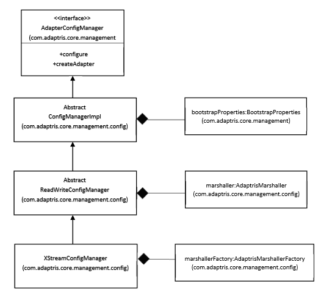
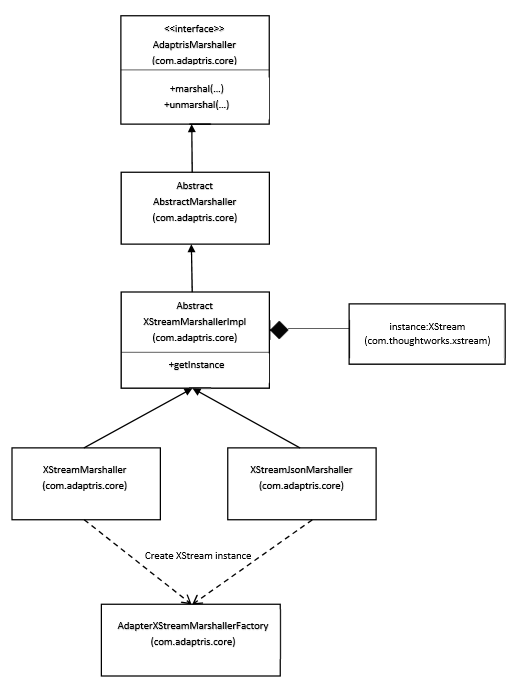

# Marshalling Configuration and Architecture

Marshalling refers to the process by which Interlok will read the main XML configuration file and create a running instance of Interlok from that configuration file.

This document describes the Interlok Marshalling configuration and Architecture.

The control of marshalling is configured in a file called: bootstrap.properties.
This contains a number of properties, the keys of which are defined in the following class: [com.adaptris.core.management.Constants](https://nexus.adaptris.net/nexus/content/sites/javadocs/com/adaptris/interlok-core/3.11-SNAPSHOT/com/adaptris/core/management/Constants.html "com.adaptris.core.management.Constants")

We will be focusing of the following settings which relate to the marshalling functionality:

- **marshallerOutputType**: Can be `XML` or `JSON` as specified in the enum com.adaptris.core.AdapterMarshallerFactory.MarshallingOutput
- **beautifyXStreamOutput**: true or false
- **configManager**: defaults to [XStreamConfigManager][] if not specified

As you can probably discern from the above settings, Interlok uses the library: [XStream][] for all marshalling based operations, and we can use XML or JSON formats.

Additionally there is a beautify option. The beautify option changes the format of the XML document in that the concrete class type is used for the xml element names instead of the variable names with the class name specified in an attribute. For JSON files, the beautify options adds white space: padding and new lines to make the output more readable.

At present there is only one config manager: [XStreamConfigManager][], but potentially we could specify another library to handle the marshalling.

## Managers ##

The diagram shows the hierarchy of the XStreamConfigManager. This class takes in the bootstrap properties and creates the marshallerFactory and from that creates the marshaller that performs the work of marshalling an object to a file.
The created marshaller is stored in a singleton for easy access across the system (see sequence diagram below).

## Factory Classes ##

There is a lot of configuration required to get the marshalling just the way we would like it, this is all taken care of within the factory class: [AdapterXStreanMarshallerFactory](https://nexus.adaptris.net/nexus/content/sites/javadocs/com/adaptris/interlok-core/3.11-SNAPSHOT/com/adaptris/core/AdapterXStreamMarshallerFactory.html "AdapterXStreamMarshallerFactory"). The private methods give a hint to the various configuration files read in.

## Marshallers ##

This diagram details the two marshaller implementations we have: XML & JSON and how they create and reference the XStream instance.

## Sequence Diagram ##

This diagram puts all the classes together in time instantiation order.

## Tests ##

The following unit tests are relevant to this functionality:

- junit.test.classes=com/adaptris/core/XStream*Test.java
- junit.test.classes=com/adaptris/core/marshaller/xstream/*.java

[XStreamConfigManager]: https://nexus.adaptris.net/nexus/content/sites/javadocs/com/adaptris/interlok-core/3.11-SNAPSHOT/com/adaptris/core/management/config/XStreamConfigManager.html
[XStream]: https://x-stream.github.io/