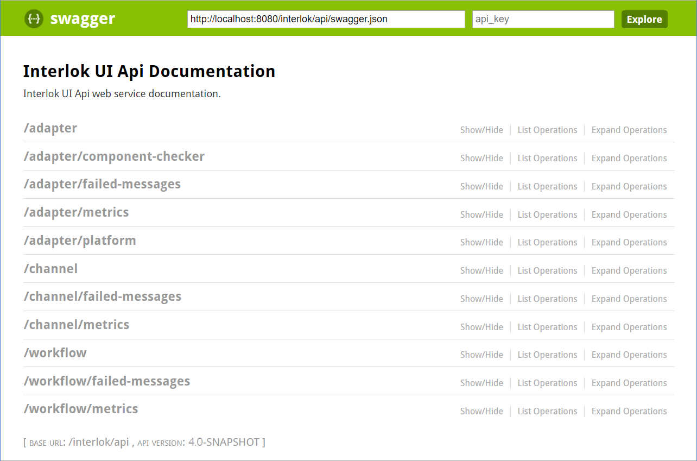
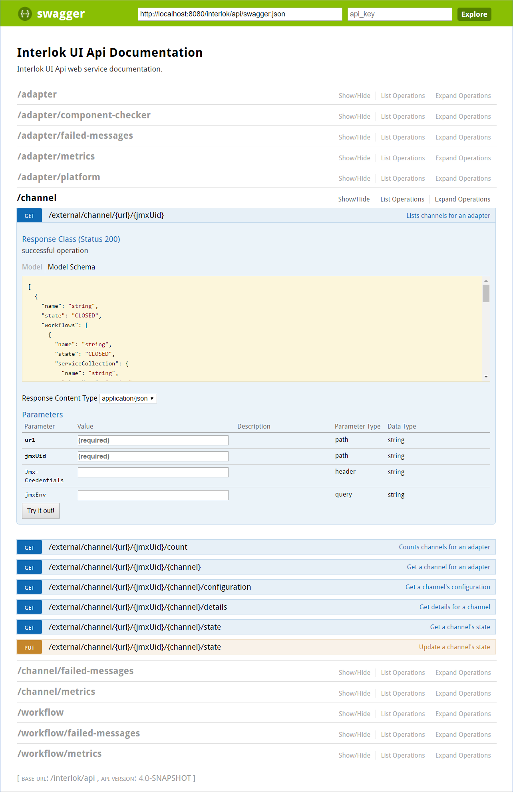
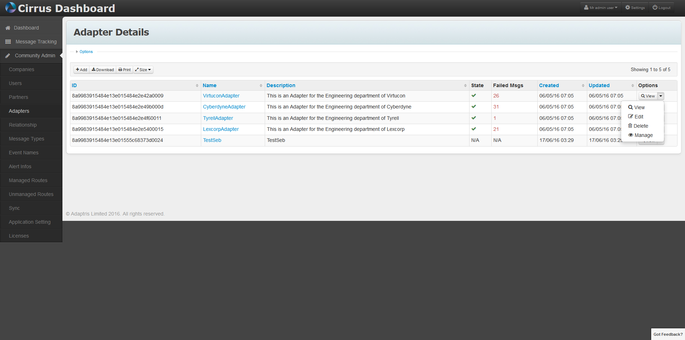
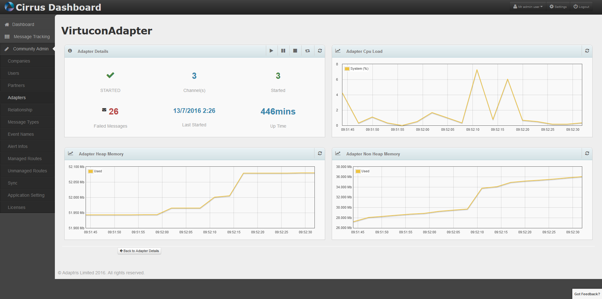
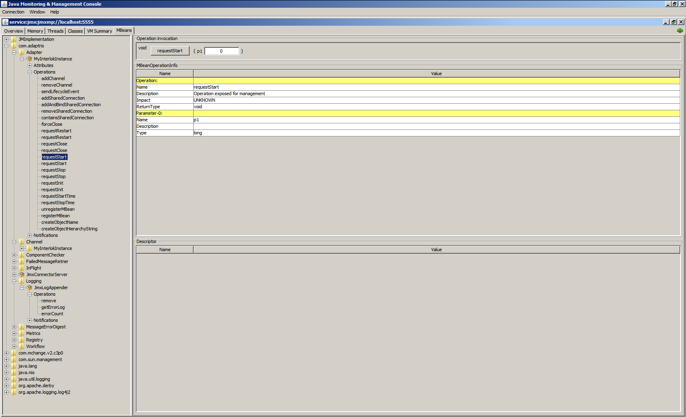

> **Summary:** The UI has its own API. This can be used to do some simple operations, if you want to create your own simple dashboard, instead of using our awesome spectacular UI.

## Interlok UI API Swagger Documentation ##

For a complete descriptions of all the possible operation with the API please have a look at:

* [UI API Swagger Documentation](/pages/developer/developer-ui-api-swagger-doc) for Interlok 3.10.2+.

## Swagger Goodness ##

The Interlok UI API is accessible via restful web services. The best way to learn how to use the Interlok UI API is to use Swagger UI. You can see all the available operations by using it.

Learn more about [Swagger](http://swagger.io/) and [Swagger UI](http://swagger.io/swagger-ui/).

## Interlok UI 3.10.2+ ##

From 3.10.2+ the Interlok UI API is using Swagger V3 Open API.

Once you've downloaded Swagger UI you should copy it into the `adapter/webapp` folder.
You should be able to access it via [http://localhost:8080/swagger-ui/dist/index.html](http://localhost:8080/swagger-ui/dist/index.html) (where /swagger-ui/dist/ is the name of the folder you copied into `adapter/webapp`).

The default API url in Swagger UI is a pet store example.
Replace it with it the Interlok UI API url [http://localhost:8080/interlok/api/openapi.json](http://localhost:8080/interlok/api/openapi.json).

If you access this url directly you will see the json Swagger definition for the Interlok UI API with a list of all the operations which looks something like: 

```json
{
  "openapi" : "3.0.1",
  "info" : {
    "title" : "Interlok UI Api Documentation",
    "description" : "Interlok UI Api web service documentation.",
    "version" : "4.1.0-RELEASE"
  },
  "servers" : [ {
    "url" : "/interlok/api"
  } ],
  "tags" : [ {
    "name" : "/adapter"
  }, {
    "name" : "/adapter/failed-messages"
  }, {
    "name" : "/adapter/metrics"
  }, {
    "name" : "/adapter/platform"
  }, {
    "name" : "/channel"
  }, {
    "name" : "/channel/failed-messages"
  }, {
    "name" : "/channel/metrics"
  }, {
    "name" : "/adapter/component-checker"
  }, {
    "name" : "/workflow"
  }, {
    "name" : "/workflow/failed-messages"
  }, {
    "name" : "/workflow/metrics"
  }, {
    "name" : "deprecated"
  } ],
    "/external/adapter" : {
      "get" : {
        "tags" : [ "/adapter" ],
        "description" : "List all register adapters in the Interlok UI",
        "operationId" : "list",
        "parameters" : [ {
          "name" : "pageSize",
          "in" : "query",
          "schema" : {
            "type" : "integer",
            "format" : "int32",
            "default" : -1
          }
        }, {
          "name" : "page",
          "in" : "query",
          "schema" : {
            "type" : "integer",
            "format" : "int32",
            "default" : -1
          }
        } ],
        "responses" : {
          "default" : {
            "description" : "default response",
            "content" : {
              "application/json" : {
                "schema" : {
                  "type" : "array",
                  "items" : {
                    "$ref" : "#/components/schemas/AdapterJmxInterlokDetails"
                  }
                }
              },
              "application/xml" : {
                "schema" : {
                  "type" : "array",
                  "items" : {
                    "$ref" : "#/components/schemas/AdapterJmxInterlokDetails"
                  }
                }
              }
            }
          }
        }
      },
      "post" : {
        "tags" : [ "/adapter" ],
        "description" : "Add an adapter in the Interlok UI",
        "operationId" : "save_1",
        "requestBody" : {
          "content" : {
            "application/json" : {
              "schema" : {
                "$ref" : "#/components/schemas/AdapterJmxInterlokDetails"
              }
            },
            "application/xml" : {
              "schema" : {
                "$ref" : "#/components/schemas/AdapterJmxInterlokDetails"
              }
            }
          }
        },
        "responses" : {
          "default" : {
            "description" : "default response",
            "content" : {
              "application/json" : {
                "schema" : {
                  "$ref" : "#/components/schemas/AdapterJmxInterlokDetails"
                }
              },
              "application/xml" : {
                "schema" : {
                  "$ref" : "#/components/schemas/AdapterJmxInterlokDetails"
                }
              }
            }
          }
        }
      }
    },
...
```

Back to the Swagger UI, you should get a list of all the Interlok UI API operations (The page may slightly look different depending on which version of Swagger UI you are using.) e.g.



You can then use this page to test the api against your own Interlok UI API:



## Deprecated ##

Deprecated endpoints uses the deprecated tag so are easy to find the openapi definition.

## Api Parameters ##

This section aims to help understanding the most used api parameters.

- **adapter:** Path parameter corresponding to the Adapter database id. You can also use 'local' to work with the UI local adapter.
- **url:** Path Path parameter corresponding to the JMX URL used to connect to an Adapter. i.e. service:jmx:jmxmp://localhost:5555. Use with the **jmxUid** parameter
- **jmxUid:** Path Path parameter corresponding to the unique identifier used in the Adapter configuration XML. Used with the **url** parameter.
- **Jmx-Credentials:** Header parameter corresponding to the Adapter JMX credentials. Only use this if the jmx connection has been configured to use credentials.
- **jmxEnv:** Query parameters corresponding to the Adapter JMX environment parameters.
- **channel:** Path Path parameter corresponding to the Channel unique id.
- **workflow:** Path Path parameter corresponding to the Workflow unique id.

## Real World Example ##

There is a working example of the UI API in action within the cm-dashboard project (the Cirrus UI).

The cirrus ui lists the Interlok containers within it's given community:


by selecting the manage operation for a given Interlok container:



you can view the manage Interlok container page:



This manage Interlok container page is using the interlok ui api to obtain data & perform functions on this selected Interlok container. All the Interlok containers in this community are registered with one ui Interlok container, which is having the ui api accessed by this webapp. In essence, this page is its own Interlok container ui.

## Yeah, but... ##

Of course, you can use Interloks own MBeans to gain data and operate functions.

[https://docs.oracle.com/javase/tutorial/jmx/mbeans/](https://docs.oracle.com/javase/tutorial/jmx/mbeans/)




OR, if you just want users to see metric data and not config or be able to use start/stop operations, you can setup a read only user in the ui : [Interlok UI Security](/pages/ui/ui-security)
