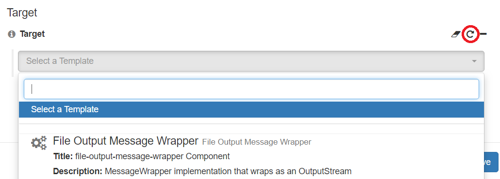

> **Summary:** This document is aimed at system developers who wish to create new or custom Interlok components and for those components to be fully integrated into the Interlok framework.



## Multiple inheritances with generics

There is a known issue with the UI and classes with multiple inheritances with generics.
The UI has a limited support for inheritance with generics when a class extends a parent class with generics and/or implements multiple interfaces with generics.

It only supports the first found parents with generics.

For instance, if we consider the following example:

```java
@AdapterComponent
public class MyComponent implements MyFirstInterface<String>, MySecondInterface<InputStream> {

  ...
  
}

@AdapterComponent
public class MyService extends ServiceImp {

  private MyFirstInterface<String> myFirstInterfaceMember;
  
  private MySecondInterface<InputStream> mySecondInterfaceMember;
  
}
```

When trying to load implementations of *myFirstInterfaceMember* the UI will find *MyComponent*.
However when trying to find implementations of *mySecondInterfaceMember* the UI will not find anything. Only the first interface (*MyFirstInterface&lt;String&gt;*) is taken into account.

The UI has a workaround for this which is to use the reload button of the dropdown to remove generic support.



The drawback of this is that all implementations of the given interface will be displayed disregarding any generics, meaning that we will get back more results than necessary.

For instance, if we keep following our example above and also have a class *MyComponentInteger* implementing *MyFirstInterface&lt;Integer&gt;*.
When trying to load implementations of *myFirstInterfaceMember* the UI will also return *MyComponentInteger*.

## Double Generics

There is also a known issue with the UI and multiple generics declaration. The UI will not find members with multiple generics.

For instance, if we consider the following example:

```java
@AdapterComponent
public class MyComponent implements MyMultipleGenericsInterface<String, String> {

  ...
  
}

@AdapterComponent
public class MyService extends ServiceImp {

  private MyMultipleGenericsInterface<String, String> myMultipleGenericsInterfaceMember;
    
}
```

When trying to load implementations of *myMultipleGenericsInterfaceMember* the UI will not find any component.

We can get around this issue by using an intermediate interface with no generic, which implements the interface with generics.

For instance:

```java
public interface MyNoGenericInterface implements MyMultipleGenericsInterface<String, String> {

  ...
  
}

@AdapterComponent
public class MyComponent implements MyNoGenericInterface {

  ...
  
}

@AdapterComponent
public class MyService extends ServiceImp {

  private MyNoGenericInterface myMultipleGenericsInterfaceMember;
    
}
```


