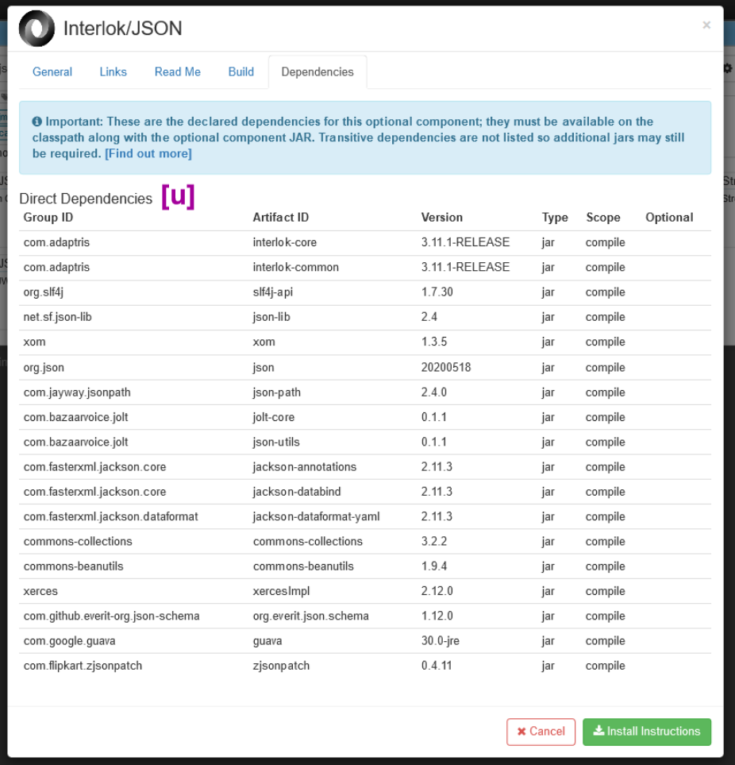

# Fully integrating Optional Components in the UI

> **Summary:** Interlok 3.5.0 introduced the [Optional Component Discovery Page](/pages/ui/ui-optional-component-discovery) which is build dynamically from data obtained from the [Adaptris Nexus Instance](https://nexus.adaptris.net/nexus) and the optional projects individual pom.xml files. This documentation page is for component developers who want to fully integrate their optional components with the UI.

?> The details on this page are correct for Interlok version 3.11.1-RELEASE/3.12-SNAPSHOT

## The Optional Components List ##

?> The UI [Optional Component Discovery Page](/pages/ui/ui-optional-component-discovery) will not work if you have [Disabled External Resources](/pages/ui/ui-system-preferences)

During the UI startup, where Interloks built-in jetty starts the ui and executes our initialisation servlets, the optional components list and details are loaded and cached. 

This is all done by querying a nexus API. It is executed during startup as it can sometimes be slow, as it is an external callout, and we cache the results so the optional page is usable immediately.

The default nexus instance that the UI uses is: https://nexus.adaptris.net/nexus

The initial list of optional components is loaded by using the following query:

```
${nexus-base}/service/local/lucene/search?repositoryId=${repository}&g=com.adaptris&v=${artifact-version}&p=jar
```

The variables explained:
* ${nexus-base} This is the URL to the Nexus instance that we want to query, i.e. https://nexus.adaptris.net/nexus
* ${repository} In Nexus there are many repositories, for example 'releases' or 'snapshots', so we need to specify which one we are querying
* ${artifact-version} Which versions are we attempting to list, i.e. 3.12-SNAPSHOT, 3.11.1-RELEASE, 3.10.0B1-RELEASE etc.

The UI version will dictate the initial values for the initial list to be loaded.

For example, if you started a Interlok 3.11.1 release, the UI would query:
```
https://nexus.adaptris.net/nexus/service/local/lucene/search?repositoryId=releases&g=com.adaptris&v=3.11.1-RELEASE&p=jar
```

But if you started a Interlok 3.12 snapshot, the UI would query:
```
https://nexus.adaptris.net/nexus/service/local/lucene/search?repositoryId=snapshots&g=com.adaptris&v=3.12-SNAPSHOT&p=jar
```

This query returns XML, such as:
```xml
<searchNGResponse>
    <repoDetails>
        <NexusNGRepositoryDetail>
            <repositoryId>releases</repositoryId>
            <repositoryName>Adaptris Public Releases</repositoryName>
        </NexusNGRepositoryDetail>
    </repoDetails>
    <data>
        <artifact>
            <groupId>com.adaptris</groupId>
            <artifactId>interlok-fx-installer</artifactId>
            <version>3.11.1-RELEASE</version>
            <latestRelease>3.11.1-RELEASE</latestRelease>
            <latestReleaseRepositoryId>releases</latestReleaseRepositoryId>
        </artifact>  
        <!-- a whole load of these artifact elements, one per optional component, current count is 115 -->
    </data>
</searchNGResponse>
```

And parsing this XML response, the UI knows what optional components it needs to load and display.
The Xpath used:
```
/searchNGResponse/data/artifact/artifactId/text()
```

?> **NOTE** On the 'Optional Component Discovery Page' you can edit the list query variables and reload the components by clicking the page settings, via the 'cog' icon and editting the default settings. This way you can browse component lists from previous/future release/snapshot versions without changing your current UI version. 

The 'Optional Component Discovery Page' settings button:


The 'Optional Component Discovery Page' settings modal:


## Log4j ##

If you need to see the log statements for the UI optional component loading, you can add this to your log4j configuration:
```xml
    <Logger name="com.adaptris.adaptergui.initialisation.impl.InitOptionalComponentServiceImpl" level="TRACE"/>
    <Logger name="com.adaptris.adaptergui.service.impl.OptionalComponentServiceImpl" level="TRACE"/>
    <Logger name="com.adaptris.adaptergui.util.OptionalComponentCache" level="TRACE"/>
```

## The Optional Components Details ##

Now that the UI has a list of which optional components to display, it must load their details. This again involves a Nexus query, but this time the UI is after the components project POM xml file which should provide the information to display.

### Getting the Optional Component pom.xml ###

The components pom.xml is loaded by using the following query:

```
${nexus-base}/service/local/artifact/maven?r=${repository}&g=com.adaptris&v=${artifact-version}&a=${artifact-id}
```

The variables explained:
* ${nexus-base} This is the URL to the Nexus instance that we want to query, i.e. https://nexus.adaptris.net/nexus
* ${repository} In Nexus there are many repositories, for example 'releases' or 'snapshots', so we need to specify which one we are querying
* ${artifact-version} Which versions are we attempting to load, i.e. 3.12-SNAPSHOT, 3.11.1-RELEASE, 3.10.0B1-RELEASE etc.
* ${artifact-id} Which component we attempting to load, i.e. interlok-json, interlok-azure-core, interlok-jsr107-cache etc.

The UI 'Optional Component Discovery Page' settings (explained above) will dictate the values to these variables.

So, if the UI were attempting to load the pom.xml for the 3.11.1-RELEASE version of 'interlok-json', then it would query:
```
https://nexus.adaptris.net/nexus/service/local/artifact/maven?r=releases&g=com.adaptris&v=3.11.1-RELEASE&a=interlok-json
```

And, if the UI were attempting to load the pom.xml for the 3.12-SNAPSHOT version of 'interlok-json', then it would query:
```
https://nexus.adaptris.net/nexus/service/local/artifact/maven?r=snapshots&g=com.adaptris&v=3.12-SNAPSHOT&a=interlok-json
```

### The Optional Component Details general tab ###

Now that we have the pom.xml for the optional component, lets see how it is used to display data in the UI:

The 'Optional Component Detail Modal' general tab:


The annotations explained:
* **[a]** A short description of what the optional component is about
* **[b]** Some additonal notes that might be important for the user to know before downloading/using
* **[c]** This is the Interlok version that the component was developed for
* **[d]** These are the nexus details for this component, used for querying nexus, or building  gradle, ivy or maven build files
* **[e]** Component Tags are primarily used in the search features on the listings page, so it's a good idea to use the same tags in similar projects, i.e. add 'json' to every json related optional component
* **[f]** Here is a link to the components jars including all of the dependencies jars
* **[g]** This is the link to just the component jar without any of the dependencies jars
* **[h]** The Name of the project (bet you're thinking, hey why's this last in this list, it's as if the author forgot all about it and had to remake the annotated image!)

And where do all these values come from:
* **[a]** pom.xml xpath: `/project/description`
* **[b]** pom.xml xpath: `/project/properties/notes or /project/properties/property[@name='notes']/@value`
* **[c]** pom.xml xpath: `/project/properties/target or /project/properties/property[@name='target']/@value`
* **[d]** The UI has these values when it queried for the pom.xml, so it uses these
* **[e]** pom.xml xpath: `/project/properties/tags` or `/project/properties/property[@name='tags']/@value` (value should be a comma separated string)
* **[f]** This url is dynamically created by the UI and points to an internally (so it's only available for Proagrica users) hosted [interlok-artifact-downloader](https://github.com/adaptris/interlok-artifact-downloader) instance. This helper application cleverly packages the jars from the nexus server and offers them in a zip file to the user
* **[g]** This is calculated by the UI using the pages settings and the nexus details for this component. It is another nexus query, the actual URL to the component jar will depend on if we are after a release jar or a snapshot jar. e.g. the release url would be *${nexus-base}/service/local/repositories/releases/content/com/adaptris/interlok-json/3.11.1-RELEASE/interlok-json-3.11.1-RELEASE.jar* and the snapshot url would look like *${nexus-base}/service/local/artifact/maven/redirect?r=snapshots&g=com.adaptris&v=3.12-SNAPSHOT&a=interlok-json*
* **[h]** pom.xml xpath: `/project/name`

This is a cut down version of the pom.xml, showing examples of what we've detailed so far:
```xml
<project>
    <properties>
        <property name="tags" value="json,transform,jdbc"/> <!-- [e] -->
        <property name="notes" value="Requires additional jars not automatically delivered"/> <!-- [b] -->
        <property name="target" value="3.8.0+"/> <!-- [c] -->
    </properties>
    <name>Interlok/JSON</name> <!-- [h] -->
    <description>Everything JSON related; transformations, schemas, json-path (xpath-alike), splitting</description> <!-- [a] -->
</project>
```

### The Optional Component Details links tab ###

The 'Optional Component Detail Modal' links tab:


The annotations explained:
* **[i]** Warn the user that this component requires an Interlok license
* **[j]** Warn the user that this component is deprecated and suggest an alternative
* **[k]** Inform the user that this component is a stub or development only component, used for writing custom code against 
* **[l]** A link to where the main documentation for this component is
* **[m]** A link to the nexus folder that contains this component
* **[n]** A link to the project's nexus pom.xml, the same one used to generate the information on display here
* **[o]** A link to the maven metadata file that contains a lot of versioning data for this optional component
* **[p]** A link to further documentation that the developer of the component thinks would be useful for the user
* **[q]** The javadocs location for this component
* **[r]** The location of where the user can checkout the source code for the component
* **[s]** Just a UI link, goes to the component search feature, and will populate the search with details from this component

And where do all these values come from:
* **[i]** pom.xml xpath: `/project/properties/license` or `/project/properties/property[@name='license']/@value` (value should be true or false)
* **[j]** pom.xml xpath: `/project/properties/deprecated` or `/project/properties/property[@name='deprecated']/@value` (value should be the deprecated text that should be shown to the user)
* **[k]** pom.xml xpath: `/project/properties/developerOnly` or `/project/properties/property[@name='developerOnly']/@value` (value should be true or false)
* **[l]** pom.xml xpath: `/project/url` or `/project/properties/url` or `/project/properties/property[@name='url']/@value`
* **[m]** dynamically created by the UI
* **[n]** dynamically created by the UI
* **[o]** dynamically created by the UI
* **[p]** pom.xml xpath: `/project/properties/externalUrl` or `/project/properties/property[@name='externalUrl']/@value`
* **[q]** dynamically created by the UI
* **[r]** pom.xml xpath: `/project/properties/repository` or `/project/properties/property[@name='repository']/@value`
* **[s]** dynamically created by the UI

This is a cut down version of the pom.xml, showing examples of what we've detailed in this section:
```xml
<project>
    <properties>
        <property name="license" value="true"/> <!-- [i] -->
        <property name="deprecated" value="This component has been deprecated from 3.10.0 and you should use interlok-new-thing instead"/> <!-- [j] -->
        <property name="developerOnly" value="true"/> <!-- [k] -->
        <property name="externalUrl" value="http://www.json.org/"/> <!-- [p] -->
        <property name="repository" value="https://github.com/adaptris/interlok-json"/> <!-- [r] -->
    </properties>
    <url>https://interlok.adaptris.net/interlok-docs/#/pages/cookbook/cookbook-json-transform</url> <!-- [l] -->
</project>
```

### The Optional Component Details Read Me tab ###

The 'Optional Component Detail Modal' Read Me tab:


The annotations explained:
* **[t]** Well the whole content in this tab is loaded from the projects markdown readme file url.

And where do all these values come from:
* **[t]** pom.xml xpath: `/project/properties/readme` or `/project/properties/property[@name='readme']/@value`

This is a cut down version of the pom.xml, showing examples of what we've detailed in this section:
```xml
<project>
    <properties>
        <property name="readme" value="https://github.com/adaptris/interlok-aws/raw/develop/README.md"/> <!-- [t] -->
    </properties>
</project>
```

### The Optional Component Details Build tab ###

The 'Optional Component Detail Modal' Build tab:


The entire content on this tab is dynamically generated by the UI using the nexus details of the component.

### The Optional Component Details Dependencies tab ###

The 'Optional Component Detail Modal' Dependencies tab:



The annotations explained:
* **[u]** This is a list of the projects dependencies

And where do all these values come from:
* **[u]** pom.xml xpath: `/project/dependencies/org.apache.maven.model.Dependency`
  * Group ID xpath: `./groupId 	`
  * Artifact ID xpath: `./artifactId`
  * Version xpath: `./version`
  * Type xpath: `./type`
  * Scope xpath: `./scope`
  * Optional xpath: `./optional`

This is a cut down version of the pom.xml, showing examples of what we've detailed in this section:
```xml
<project>
    <dependencies> <!-- u -->
        <org.apache.maven.model.Dependency>
            <groupId>com.adaptris</groupId>
            <artifactId>interlok-core</artifactId>
            <version>3.11.1-RELEASE</version>
            <type>jar</type>
            <scope>compile</scope>
        </org.apache.maven.model.Dependency>
        <org.apache.maven.model.Dependency>
            <groupId>com.adaptris</groupId>
            <artifactId>interlok-core-apt</artifactId>
            <version>3.11.1-RELEASE</version>
            <type>jar</type>
            <scope>compile</scope>
        </org.apache.maven.model.Dependency>
        <org.apache.maven.model.Dependency>
            <groupId>org.slf4j</groupId>
            <artifactId>slf4j-api</artifactId>
            <version>1.7.30</version>
            <type>jar</type>
            <scope>compile</scope>
        </org.apache.maven.model.Dependency>
        <org.apache.maven.model.Dependency>
            <groupId>org.slf4j</groupId>
            <artifactId>jcl-over-slf4j</artifactId>
            <version>1.7.30</version>
            <type>jar</type>
            <scope>compile</scope>
            <optional>true</optional>
        </org.apache.maven.model.Dependency>
    </dependencies>        
</project>
```

### The Optional Component Logo ###
 
 A special mention for the component logo shown on the UI. 

 Basically, the UI war file contains logos named after the artifactId. These are found in <interlok.war>\img\optional\<artifactId>.png

 If a logo isn't found for a given artifact id, then the default Adaptris logo is used.

 ### TLDR; just show me the POM XML! ###

So here it is, all the above examples put together (not shown are elements such as artifactId, groupId, etc):

```xml
<project>
    <name>Interlok/JSON</name> <!-- [h] -->
    <description>Everything JSON related; transformations, schemas, json-path (xpath-alike), splitting</description> <!-- [a] -->
    <url>https://interlok.adaptris.net/interlok-docs/#/pages/cookbook/cookbook-json-transform</url> <!-- [l] -->

    <properties>
        <property name="tags" value="json,transform,jdbc"/> <!-- [e] -->
        <property name="notes" value="Requires additional jars not automatically delivered"/> <!-- [b] -->
        <property name="target" value="3.8.0+"/> <!-- [c] -->
        <property name="license" value="false"/> <!-- [i] -->
        <property name="deprecated" value="This component has been deprecated from 3.10.0 and you should use interlok-new-thing instead"/> <!-- [j] -->
        <property name="developerOnly" value="false"/> <!-- [k] -->
        <property name="externalUrl" value="http://www.json.org/"/> <!-- [p] -->
        <property name="repository" value="https://github.com/adaptris/interlok-json"/> <!-- [r] -->
        <property name="readme" value="https://github.com/adaptris/interlok-json/raw/develop/README.md"/> <!-- [t] -->
    </properties>
    
    <dependencies> <!-- u -->
        <org.apache.maven.model.Dependency>
            <groupId>com.adaptris</groupId>
            <artifactId>interlok-core</artifactId>
            <version>3.11.1-RELEASE</version>
            <type>jar</type>
            <scope>compile</scope>
        </org.apache.maven.model.Dependency>
        <org.apache.maven.model.Dependency>
            <groupId>com.adaptris</groupId>
            <artifactId>interlok-core-apt</artifactId>
            <version>3.11.1-RELEASE</version>
            <type>jar</type>
            <scope>compile</scope>
        </org.apache.maven.model.Dependency>
        <!-- etc -->
    </dependencies>  
</project>
```

### What if I'm using gradle and not maven? ###

Sure, all of the above explains what needs to go into the pom.xml file but what if you're not using maven (!)
This section will cover what to put in your gradle file so that the POM is generated correctly.

Basically, you need to utilise the [Maven Publish Plugin](https://docs.gradle.org/current/userguide/publishing_maven.html).

Lets look at a real example, inside the interlok-json project [build.gradle](https://github.com/adaptris/interlok-json/raw/develop/interlok-json/build.gradle) file, is the publishing action, that is used to publish the build artifacts to our Nexus repository:
```groovy
publishing {
  publications {
    mavenJava(MavenPublication) {
      from components.java

      artifact javadocJar { classifier "javadoc" }
      artifact examplesJar { classifier "examples" }
      artifact sourcesJar { classifier "sources" }

      pom.withXml {
        asNode().appendNode("name", componentName)
        asNode().appendNode("description", "Everything JSON related; transformations, schemas, json-path (xpath-alike), splitting")
        asNode().appendNode("url", "https://interlok.adaptris.net/interlok-docs/cookbook-json-transform.html")
        def properties = asNode().appendNode("properties")
        properties.appendNode("target", "3.8.0+")
        properties.appendNode("tags", "json,transform,jdbc")
        properties.appendNode("license", "false")
        properties.appendNode("externalUrl", "http://www.json.org/")
        properties.appendNode("readme", "https://raw.githubusercontent.com/adaptris/interlok-json/develop/interlok-json/README.md")
        properties.appendNode("repository", "https://github.com/adaptris/interlok-json")
      }
    }
  }
  repositories {
    maven {
      credentials {
        username repoUsername
        password repoPassword
      }
      url mavenPublishUrl
    }
  }
}
```

Above in the interlok-json project build.gradle, after adding the artifacts to the publication, there is [pom.withXml](https://docs.gradle.org/current/dsl/org.gradle.api.publish.maven.MavenPom.html#org.gradle.api.publish.maven.MavenPom:withXml(org.gradle.api.Action)) action and it's this action that allows configuration of the POM.

Here is a full example of a pom.withXml displaying all the example elements and values that we've gone through on this page:

```groovy
pom.withXml {
    asNode().appendNode("name", "Interlok/JSON") /* [h] */
    asNode().appendNode("description", "Everything JSON related; transformations, schemas, json-path (xpath-alike), splitting") /* [a] */
    asNode().appendNode("url", "https://interlok.adaptris.net/interlok-docs/cookbook-json-transform.html") /* [l] */

    def properties = asNode().appendNode("properties")
    properties.appendNode("target", "3.8.0+") /* [c] */
    properties.appendNode("tags", "json,transform,jdbc") /* [e] */
    properties.appendNode("license", "false") /* [i] */
    properties.appendNode("externalUrl", "http://www.json.org/") /* [p] */
    properties.appendNode("readme", "https://github.com/adaptris/interlok-json/raw/develop/README.md") /* [t] */
    properties.appendNode("repository", "https://github.com/adaptris/interlok-json") /* [r] */
    properties.appendNode("notes", "Requires additional jars not automatically delivered") /* [b] */
    properties.appendNode("deprecated", "This component has been deprecated from 3.10.0 and you should use interlok-new-thing instead") /* [j] */
    properties.appendNode("developerOnly", "false") /* [k] */
}
```

Another real example from the deprecated [interlok-shell](https://github.com/adaptris/interlok-shell/raw/develop/build.gradle) project where you can see an example of deprecation:
```groovy
pom.withXml {
      pom.withXml {
        asNode().appendNode("name", componentName)
        asNode().appendNode("description", "SSH/Telnet to a running Interlok instance via Crashub")
        asNode().appendNode("url", "http://interlok.adaptris.net/interlok-docs/advanced-shell.html")
        def properties = asNode().appendNode("properties")
        properties.appendNode("target", "3.4.1+")
        properties.appendNode("tags", "management,ssh,telnet")
        properties.appendNode("license", "false")
        properties.appendNode("externalUrl", "http://www.crashub.org")
        properties.appendNode("deprecated", "Removed in Interlok 4.0 since crashub itself is 'unloved' and Java 11 is unsupported")
      }
}
```

And another real example from the [interlok-jmx-jms-stubs](https://github.com/adaptris/interlok-jmx-jms/raw/develop/interlok-jmx-jms-stubs/build.gradle) project where you can see an example of adding the 'Developer Only' flag.
This project also adds the 'url' field to the properties node, rather than at the root:
```groovy
pom.withXml {
      pom.withXml {
        asNode().appendNode("name", componentName)
        asNode().appendNode("description", "Test scaffolding for JMX/JMS Tests; of no use at Interlok runtime")
        def properties = asNode().appendNode("properties")
        properties.appendNode("url", "http://interlok.adaptris.net/interlok-docs/advanced-jmx-jms.html")
        properties.appendNode("target", "3.10.0+")
        properties.appendNode("tags", "jmx,jms")
        properties.appendNode("license", "false")
        properties.appendNode("developerOnly", "true")
      }
}
```

More examples can be found in the build.gradle files in the many Adaptris [GitHub](https://github.com/search?q=org%3Aadaptris+pom.withXml&type=code) projects.
