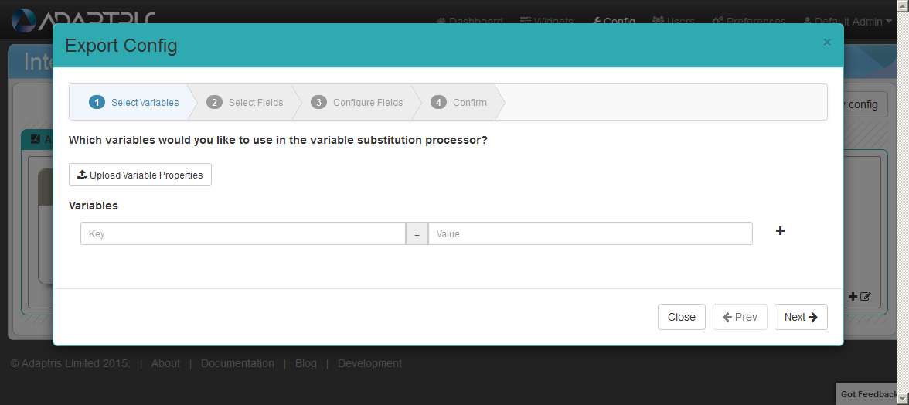
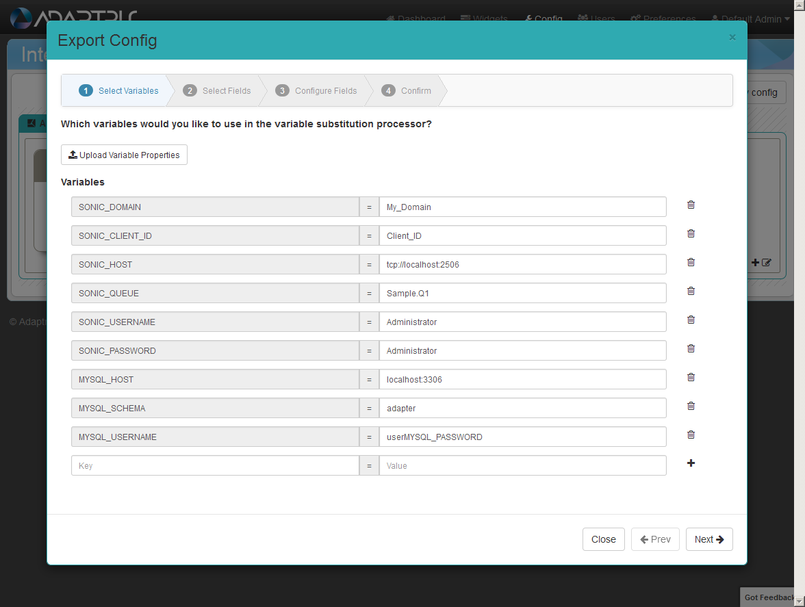
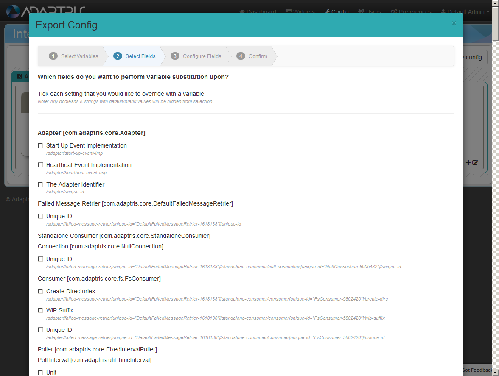
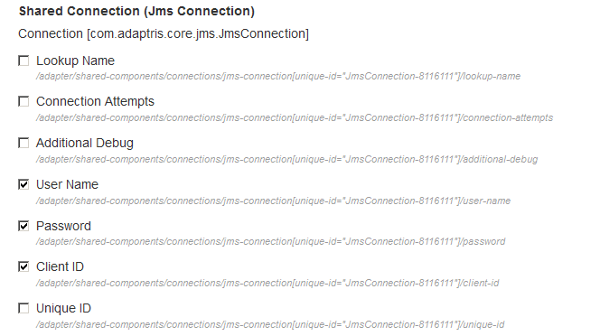
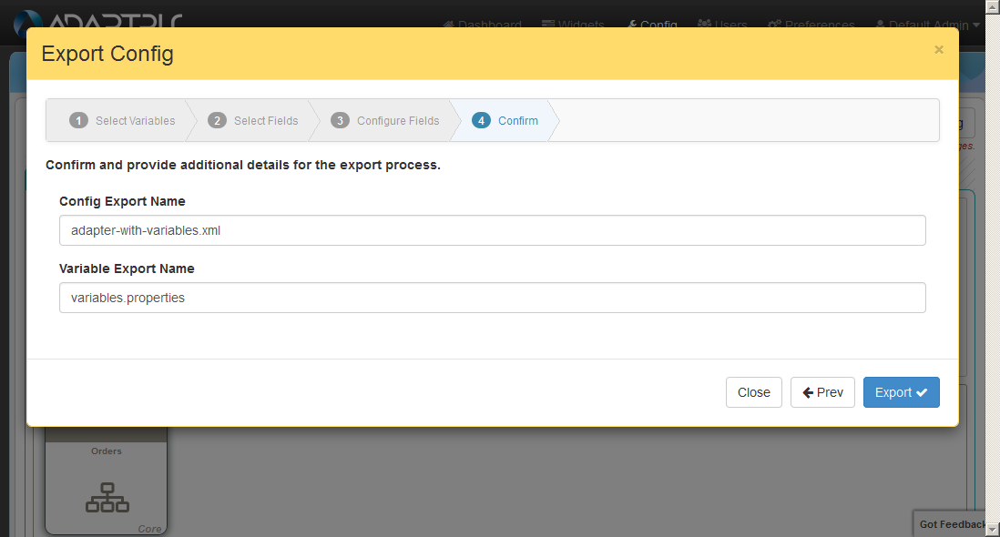
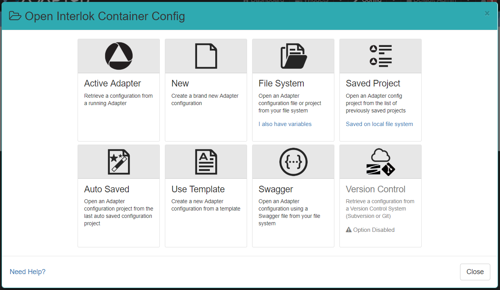
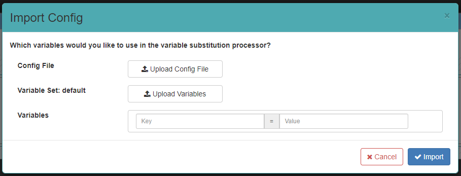
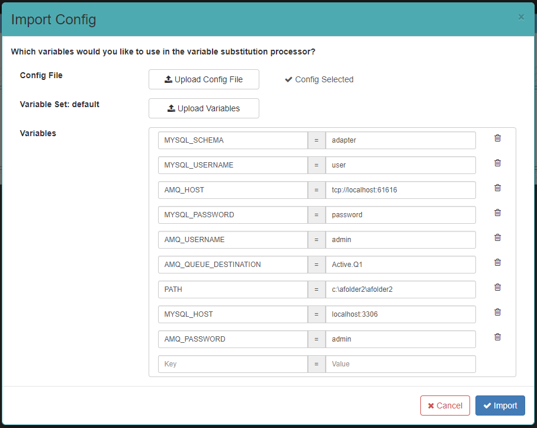

## Config Export ##

The export function allows you to save your configuration file with place-holders which can then be swapped out with values configured in a separate property file. This function is a ui accompaniment for the [variable substitution](/pages/advanced/advanced-configuration-pre-processors#variable-substitution) pre-processor.



### Getting Started ###

To navigate to the export wizard, you use the export button from the config navigation bar.

The config navigation bar:


### Export Step One - Variables ###

The first step in the export wizard is to define the variables that you want to use as place-holders in the to-be exported configuration.

The select varables step:


You can press the upload button and specify an exisiting property file to define your variables.

Once you defined the variables and the default values for the place-holders, the page would look something like:


### Export Step Two - Fields ###

The second step in the export wizard is to define the fields that you wish to have the place-holders for.



You should check the tick box against each field that you want to have replaced by a placeholder:


### Export Step Three - Map Variables To Fields ###

The third step in the export wizard is to map which variables should be used as place-holders for your selected fields.

You should use the drop down selected to define which variables are to be used for the given fields, like so:


### Export Step Four - Filenames ###

The forth and last step in the export wizard is to define the filename for the exported files (the configuration xml file and the properties file).

You can define what filenames to save your to-be exported config to:


### Export Output ###

Having pressed export in the final step of the export wizard, you will find a folder named 'config-export' in your Interlok/ui-resources directory and it will contain the two files that this function creates.

Example variables.properties output:

```
#Exported by Interlok UI
SONIC_CLIENT_ID=Client_ID
SONIC_DOMAIN=My_Domain
SONIC_HOST=tcp\://localhost\:2506
MYSQL_SCHEMA=adapter
SONIC_USERNAME=Administrator
MYSQL_USERNAME=userMYSQL_PASSWORD
SONIC_PASSWORD=Administrator
SONIC_QUEUE=Sample.Q1
MYSQL_HOST=localhost\:3306
```

The outputted configuration xml will now contain place-holders to where you defined them to be, here is a snippet example of the output:

```xml
<?xml version="1.0" encoding="UTF-8"?>
<adapter>
  <shared-components>
    <connections>
      <jms-connection>
        <lookup-name>the-jms-connection</lookup-name>
        <unique-id>JmsConnection</unique-id>
        <connection-attempts>-1</connection-attempts>
        <user-name>${SONIC_USERNAME}</user-name>
        <password>${SONIC_PASSWORD}</password>
        <client-id>${SONIC_CLIENT_ID}</client-id>
      </jms-connection>
    </connections>
  </shared-components>
ETC...
```

Now that you have the exported files, you can use these with the  [variable substitution](/pages/advanced/advanced-configuration-pre-processors#variable-substitution) pre-processor or you can use the UI Import function, defined below.

## Config Import ##

The import function allows you to open a configuration file with place-holders which can be swapped out with values configured in a separate property file.

To navigate to the import wizard, you use the import button from the open config modal window.

The config import launcher:



Once you click on the **I also have variables** link of the File System card you will be asked to supply 2 files, the config file and the properties file with the place-holders.

The config import modal window:



Once you specify the two files the import modal would look something like this:



You can of course edit the variable values or manually add them without uploading a properties file.

Once you press the Import button, you will be returned to the config page, with your selected configuration open, but with the placeholders being replaced by the variable values.

This import function is the only way the UI will process a config file with place-holders, alternatively you can use the  [variable substitution](/pages/advanced/advanced-configuration-pre-processors#variable-substitution) pre-processor.
