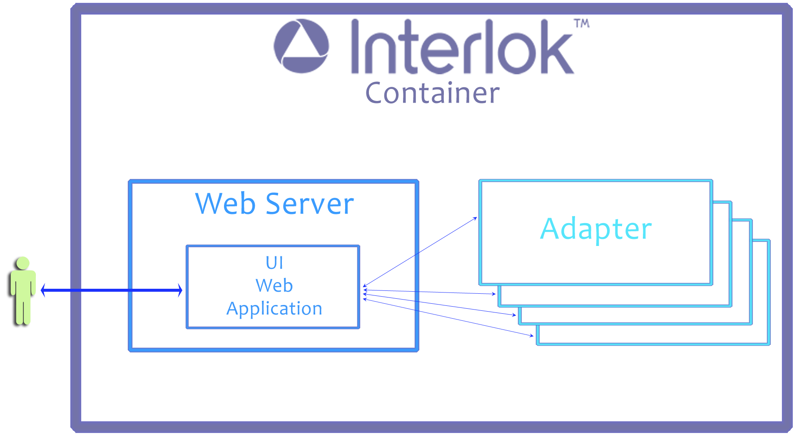
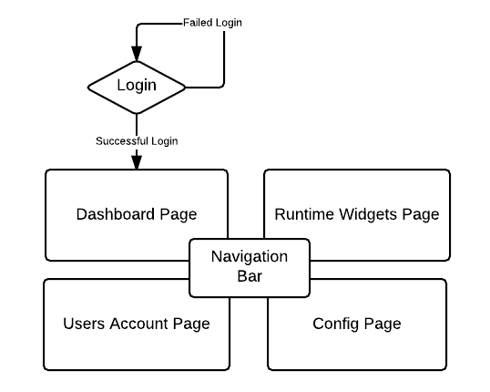

> **Summary:** The Interlok GUI is an easy-to-use and comprehensive tool intended to facilitate Adapter management, monitoring and configuration.

Throughout the documentation there will be references to the Interlok Container, the Adapter and the UI Web application and it's important to have an understanding of how these components fit together.

## Interlok Quick UI Overview ##

Quick Container Overview :

- An Interlok container may have multiple Adapter instances within it
- The Interlok container has an embedded web server
- The embedded web server has the GUI web application installed (as part of the default Interlok install process)
- The GUI app communicates to the Adapter (currently using Java MBeans, using JMX)
- A single GUI instance can be setup to control multiple Adapters. The figure shows 4 local instances, but these could be remote instances (Adapters in a different Interlok Container).
- The GUI auto detects the default initial local Adapter instance, but it will not auto-detect all local instances; these would need to be added to the UI manually.
- Potentially, the Interlok container may have other elements installed within it, such as its own broker.

## Web Application Quick Overview ##

The UI web application is basically divided in four sections:

- Dashboard: The Dashboard page lists all the registered Adapters (auto-discovered and manually added); giving some near-real-time updates about their status and also allows users to control (start/stop) Adapters, Channels and Workflows.
- Runtime: The Runtime page allows the user to configure widgets to monitor various statistics and logs for the Adapters, Channels and Workflows.
- Config: The Config page is intended to amend the local Adapter configuration. Channels, Workflows and other components can be added/removed/modified.
- User: The User Accounts page permits admin users to create other accounts with different privileges, allowing them to login to the web application UI.
