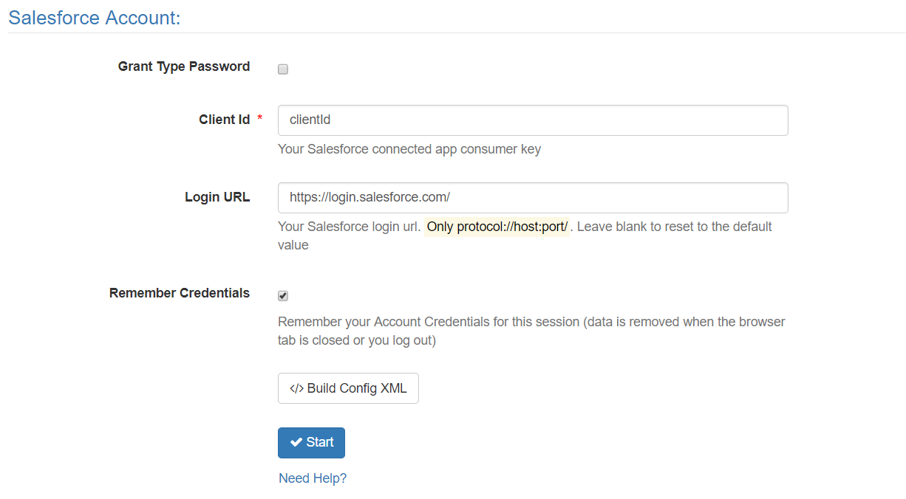
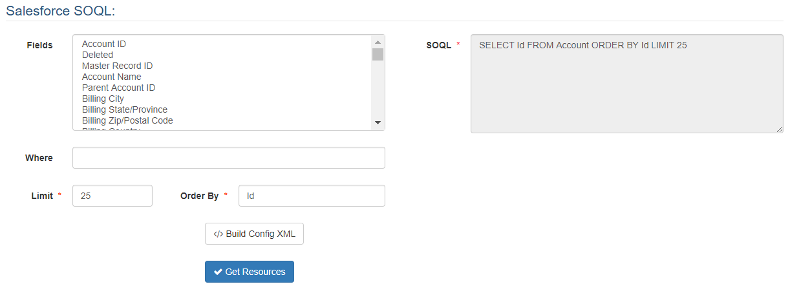
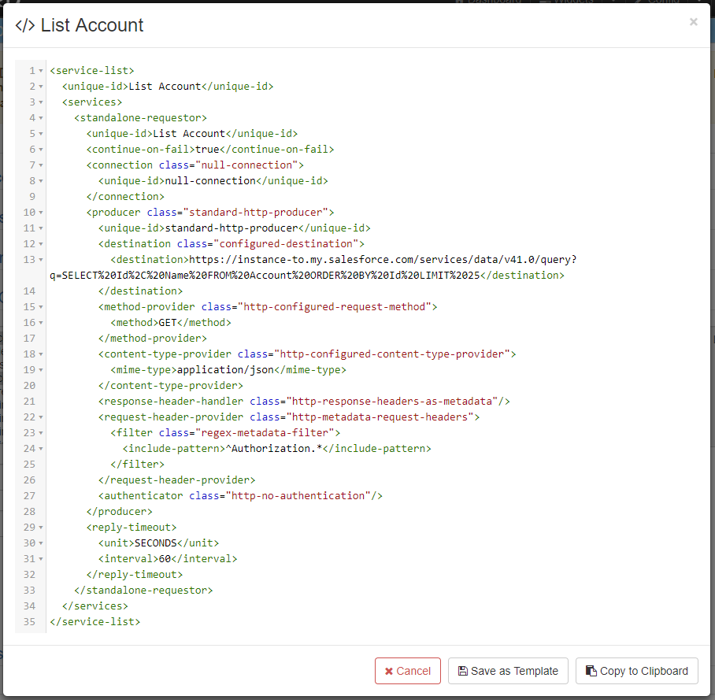

> **Summary:** The Salesforce Config page help you to generate some config xml to interact with Salesforce api. (Since 3.6.5)

## Prerequisite ##

To be able to generate salesforce xml templates or copy the xml config to the Config page clipboard you need to have the required **interlok-apache-http** and **interlok-oauth-salesforce** [optional component installed](/pages/adapter/adapter-optional-components) into `${adapter.home}/lib` directory.
If you are not using those two optional components you will still be able to use the page but you will get a warning message. 

You also need to create a **Connected App** in your Salesforce account. More help on Salesforce developers site [here](https://developer.salesforce.com/docs/atlas.en-us.api_rest.meta/api_rest/intro_defining_remote_access_applications.htm) and [here](https://developer.salesforce.com/page/Connected_Apps) and [here](https://developer.salesforce.com/page/Digging_Deeper_into_OAuth_2.0_on_Force.com).

## Getting Started ##

<iframe width="560" height="315" src="https://www.youtube.com/embed/kPNPLQbpSKg" frameborder="0" allowfullscreen></iframe>

To access the Salesforce config page, you should use the Salesforce button on the header navigation bar. The page is only accessible by admin and user roles.

The header navigation bar:

 

## Salesforce Config ##

### Authentication ###

The first thing you will need to do in the Salesforce Config page is to authenticate your account. There are two ways to do it.

- The easiest and fastest way is **Authorization Code Grant**. You need to enter your **Connected App** **Client Id** (consumer key) and Salesforce web page will prompt your for your Salesforce account credentials. Once authenticated the Salesforce popup will close and you will be able to use the page.

 

- The second way is **Password Grant**. More information is required but the authentication will all be done within the UI page. You can also use this grant type to generated an oauth service xml to use in the UI Config page.
  - **Client Id:** Salesforce consumer key
  - **Client Secret:** Salesforce consumer secret
  - **Username:** Salesforce account username
  - **Password:** Salesforce account password + the security token. You can read more about security token on [Salesforce help site](https://help.salesforce.com/articleView?id=user_security_token.htm&type=0).

 

You can remember the Salesforce credentials for the current session by keeping the checkbox ticked (Since 3.6.6).
?> **NOTE** The credentials are stored in the browser session storage and will be cleared on log out or when the browser tab or window is closed.

The Salesforce Account panel also provide a **Build Config XML** button to generate an adapter service xml to use in the UI Config page.

### Api Version ###

When successfully authenticated the page will show you the salesforce organization URL you are using and will ask you to select the **Api Version** to use. You can read more about api version on [Salesforce developer site](https://developer.salesforce.com/blogs/developer-relations/2013/10/api-versions-and-the-salesforce-metadata-api.html).

### Standard Objects ###

Standard objects (SObjects) represent the database tables that contain the information of your organization.
You can select which standard object type you want to work within the dropdown and either build a SOQL or get a list of objects.

### SOQL ###

You can use Salesforce Object Query Language (SOQL) to search data into your organisation. SOQL is similar to SQL but specific to Salesforce. Read more about [SOQL](https://developer.salesforce.com/docs/atlas.en-us.soql_sosl.meta/soql_sosl/sforce_api_calls_soql.htm).
The UI Salesforce config page helps building a SOQL for a SObject type. You can select the fields you want to query, add some were clauses, limit and order the list of returned SObjects.
The SOQL panel also provide a **Build Config XML** button to generate an adapter service xml to use in the UI Config page. The service will query SObjects using the SOQL you've provided.

### Resources ###

The Resource panel lists all the SObjects retrieve using the provided SOQL. From this panel you can add, edit and delete SObjects.
For each actions you can generate a service xml to use in the UI Config page with the **Build Config XML** buttons.

### Build Config XML ###

All the **Build Config XML** modal (authentication, resource listing, fetching, editing, creating or deleting) have a **Copy to Clipboard** and a **Save as Template** button.

The **Copy to Clipboard** button will copy the displayed xml into a service component in the UI Clipboard and be can used by dragging it from the [Sidebar Clipboard in the Config page](/pages/ui/ui-config-sidebar#clipboard-sidebar) (Since 3.6.6).

The **Save as Template** button will save the displayed xml into a service template usable in the Config page.
?> **NOTE** If the config contains some password they will be encoded in the template.

