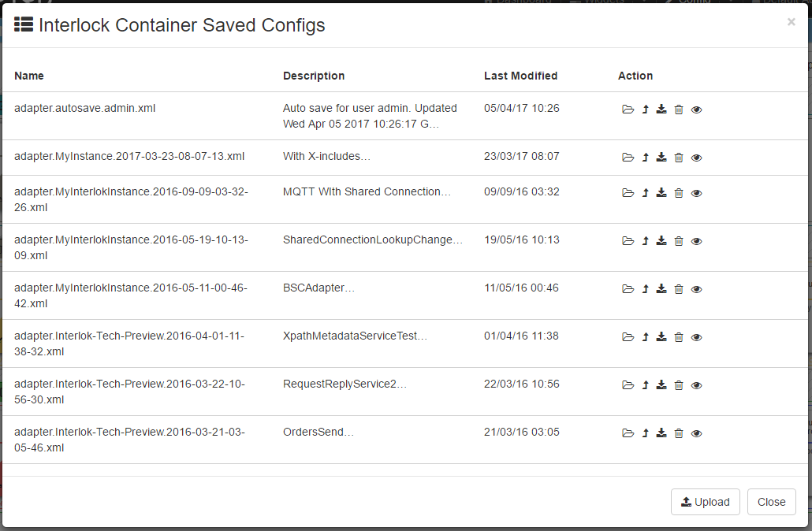
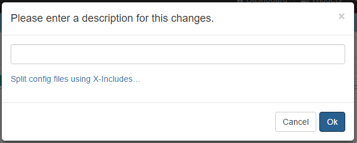
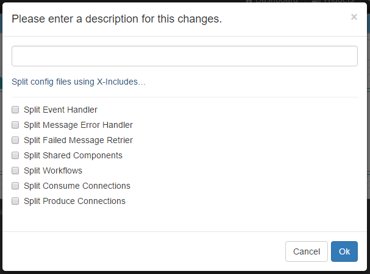



## Getting Started ##

To navigate to the saved config modal, you use the Saved Config button from the top navigation bar.

The config action bar:

## Saved Configs Modal ##

You can manage a previously saved config in the modal:

For each config you can do the following actions:

- **Open Config:** This will open the selected config in the config page.
- **Apply Config:** This will directly apply the selected config. If more than one adapter is configured in the webapp you will be prompted to select one.
- **Download Config:** Download your config as an XML file. From 3.6.1 if the config uses x-include a zip file with all the config files will be downloaded.
- **Delete Config:** This will deleted permanently the config from the webapp.
- **Select config to compare with:** This will open a new modal that shows the differences between the current config loaded in the page and the selected config.

You can also upload a config file in the webapp using the upload button at the bottom of the modal.

## Save a Config ##

You can save the current config in the page using the 'Save Config' button in the config page action bar.
Clicking on the 'Save Config' button will prompt you for a small description to store with the config so you can remember what it is about.

From 3.6.1 you can chose whether or not you want to split the config using X-Includes by clicking on the 'Split config files using X-Includes…' link and selecting which sub component you want to split.

