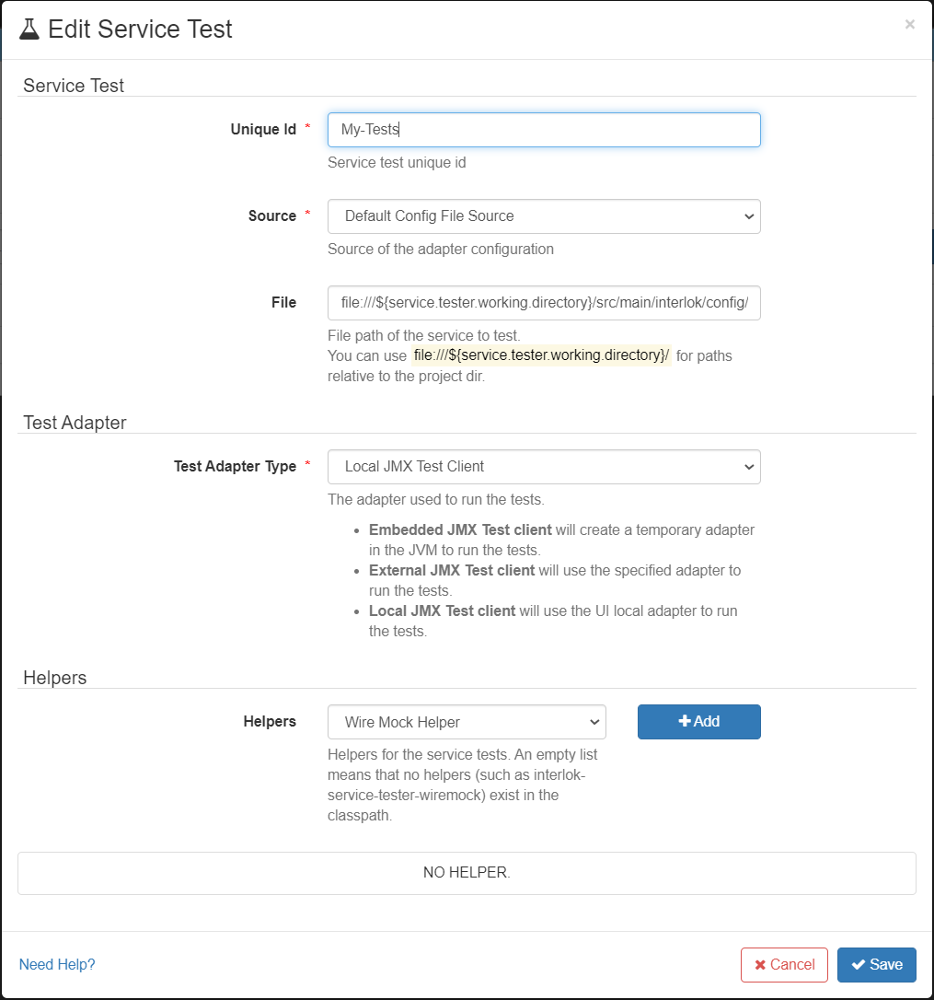
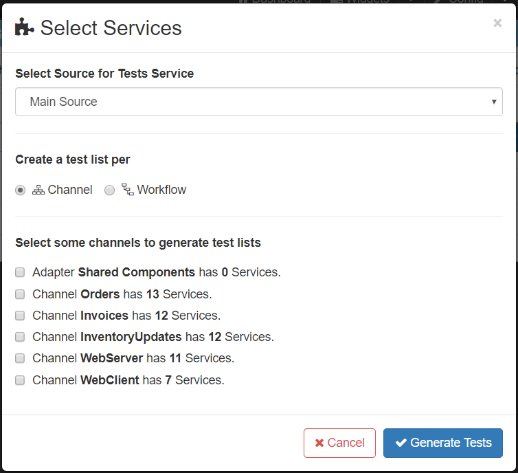
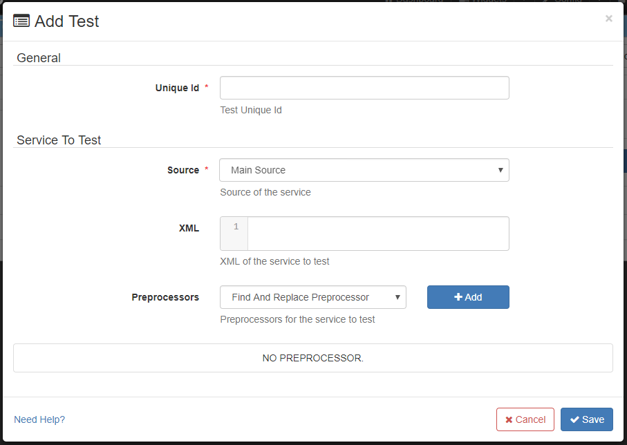
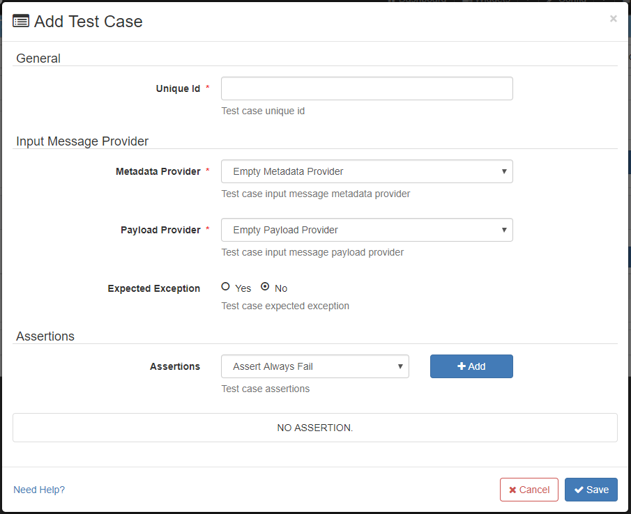
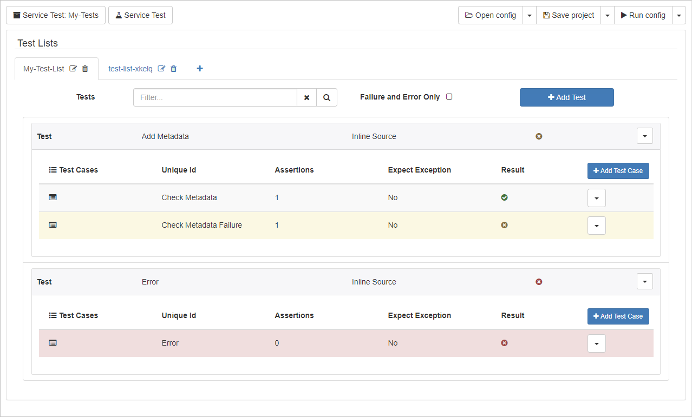

## Prerequisite ##

To be able to use the Service Tester page you need to have the required **interlok-service-tester** [optional component installed](/pages/adapter/adapter-optional-components) into `${adapter.home}/lib` directory.

If you are not using this optional component you will get a warning message. 

More help on the Service Tester [here](/pages/service-tester/service-tester-introduction).

## Getting Started ##

To access the Service Tester page, you should use the Service Tester button on the header navigation bar. The page is only accessible by admin and user roles.

The header navigation bar:

 
 
 When you open the page a service tester config with one test list is automatically loaded.

### Action Bar ###

The action bar id located on the top right corner of the page.

The actions are as follows:

Button | Action | Meaning
------------ | ------------- | ------------
 | New Config | Reset the page with a new config
 | Open from saved projects | Open a config from a saved config project. Since 3.8.1
 | Open from saved on local file system | Open a config from a config project saved your local file system. Only available when the UI is accessed via localhost. Since 3.8.1
 | Upload Config | Upload an XML config into the page
 | Load Services From Adapter Config | Load in the page context all the services from an Adapter XML config so they can be used in the Tests Source (File or Inline)
 | Generate Services From Adapter Config | Generate tests for all selected services from an Adapter XML config. The Tests can either have a File or an Inline Source
 | Save Config | Save the current config into a config project (existing, new or on the local file system)
 | Download Config | Download the current config into an XML file
 | Run Config | Run the current config tests
 | Clear Results | Run the current config tests results

## Service Test ##

You can edit the Service Test details using the Service Test button on the top left corner of the page 

In the Edit Service Test modal you can change the service test unique id and select the adapter used to run the tests.

The Service Test form inputs explained:

- **Unique Id:** This provide an easy way to name the service test.
- **Test Adapter Type:** Adapter to run the tests. There are three kind of test client you can use. By default the **Local JMX test Client** is used to run the tests.
   - **Embedded JMX Test client:** Create a temporary adapter in the local JVM to run the tests.
   - **External JMX Test client:** Use the specified JMX URL to find the adapter to run the tests.
   - **Local JMX Test client:** Use the local adapter to run the tests. This means the adapter running the UI will run the tests.

## Looding/Generating Tests From Adapter Config ##

Since 3.7.3 The Service Tester page allows to load services from an Adapter config to be able to use them as source (File or Inline) when creating a test.
For that you will need to click on the **Load Services From Adapter Config** button in the page menu.

A modal will open to select an Adapter config from diverse sources.

- **Active Adapter:** Retrieve a configuration from a running Adapter configured in the application.
- **File System:** Open an Adapter configuration file from your file system. It can be an adapter.xml file or a zip file. Click on the **I also have variables** link to [Import an Adapter Configuration](/pages/ui/ui-export-import#config-import) with variable properties.
- **Saved Config:** Open an Adapter configuration from the list of previously [saved configurations](/pages/ui/ui-saved-configs).
- **Auto Saved:** Open an Adapter configuration from the last auto saved configuration.
- **Version Control:** Retrieve a configuration from a Version Control System (Subversion or Git). For this option to be enabled [VCS](/pages/advanced/advanced-version-control) needs to be configured and you need at least one VCS Profile.

You can also use the **Generate Services From Adapter Config** menu item to automatically generate one test per service.
You will also be prompted to chose an Adapter config.
Then you will have to select the Test Source type (File or Inline) and select the Channels or Workflows with the services you want to generate tests for.

## Test ##

A Test contains a service to test and a list of test cases to run against the service.

Additionally some preprocessors can be applied on the service xml before running the tests. More help on pre-processors [here](/pages/advanced/advanced-configuration-pre-processors).

You can add a test by clicking on the Add Test button. This will open a modal where you can fill the test details.
 

The Test form inputs explained:

- **Unique Id:** This provide an easy way to differentiate tests in the service tester configuration.
- **Source:** This is the service to be tested.
    - **File Source:** Path to a file with the service xml configuration. **Note:** this will only work if the file is accessible by the adapter running the tests.
    - **Inline Source:** Service xml configuration.
- **Preprocessors:** A list of preprocessors to apply on the service xml before running the tests.

If some services have been loaded in the page context a dropdown with the list of services will be displayed.

- In the case of a File Source, selecting a service will create an XPath Preprocessor with the XPath of the selected service.
- In the case of an Inline Source, selecting a service will add the service XML into the XML textarea.

## Test Case ##

A Test Case is the specification of the input message and expected results or failures with which a tester will determine whether a service works correctly.

You can add a test case by clicking on the Add Test Case button. This will open a modal where you can fill the test case details.
 

The Test Case form inputs explained:

- **Unique Id:** This provide an easy way to differentiate test cases in the service tester configuration.
- **Metadata Provider:** This is the metadata of the input message that will be used for this test cases to test a service.
    - **Empty Metadata Provider:** No metadata
    - **Inline Metadata Provider:** List of metadata key value pairs.
- **Payload Provider:** This is the payload of the input message that will be used for this test cases to test a service.
    - **Empty Payload Provider:** No payload
    - **File Payload Provider:** Path to a file with the payload content. **Note:** this will only work if the file is accessible by the adapter running the tests.
    - **Inline Payload Provider:** Payload content.
- **Expected Exception:** Whether or not the test case expect the service to throw an exception when run with the provided input message.
- **Assertions:** A list of assertions to verify that the service works correctly with the provided input message.

## Running tests ##

To run the full config, click on the Run Config button on the page action bar 
This will run all test cases in all tests and display the results.

To run a single test case, click on the Run button on the test case dropdown.

To run all the test cases for a test, click on the Run button on the test dropdown.

Once the tests have run the results will be displayed on each test cases.

The test cases with errors will be highlighted in red and the test cases with failures will be highlighted in yellow.

You can hover/click on the result icons to get more information of the test case result.
	