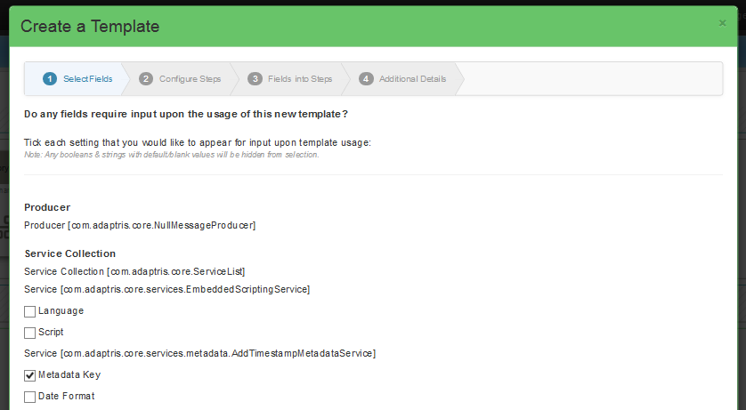
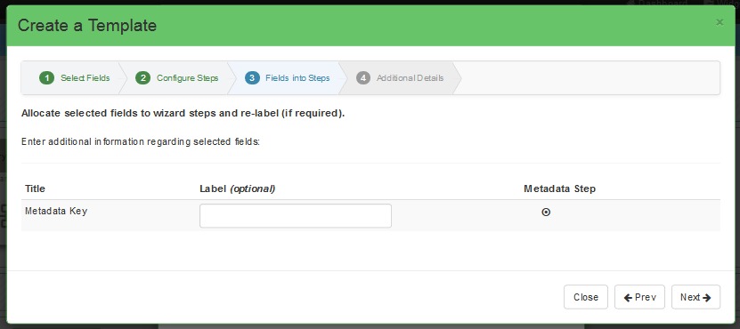
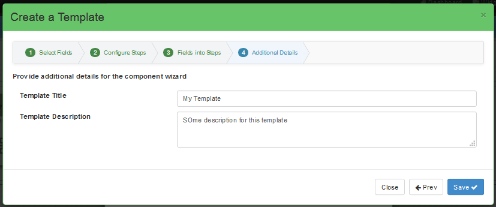
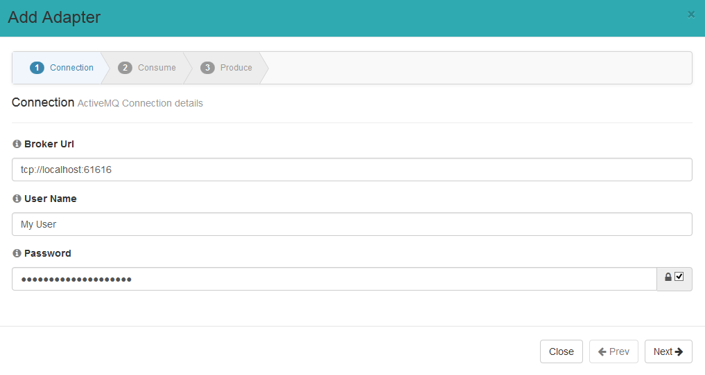
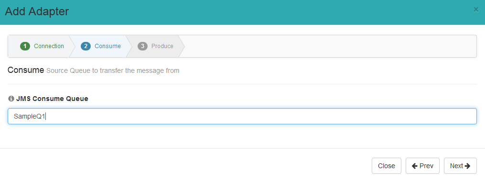
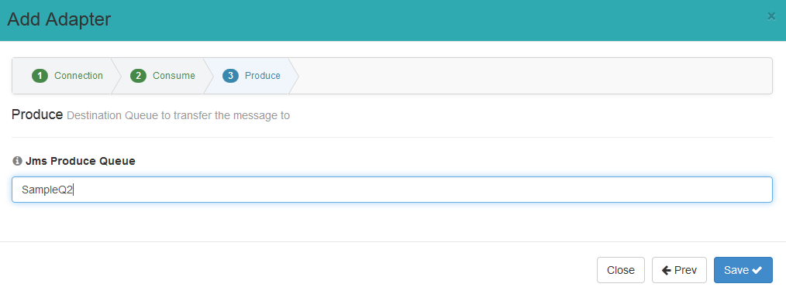
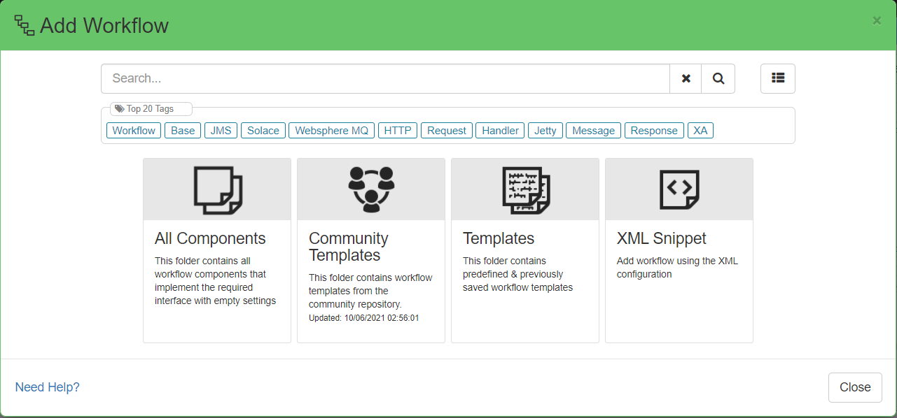
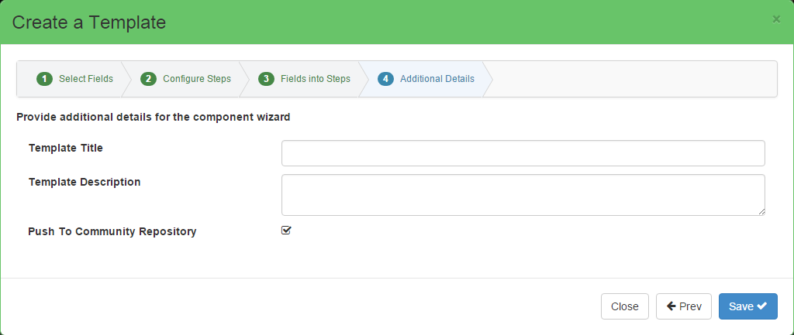

> **Summary:** Templated configuration is a powerful way to standardise your configuration; it is designed for so that you can build up familiar patterns and use-cases for your business, and easily insert them into new adapter configs. A template can be made from any standard component within Interlok. Each template can be presented via a wizard screen directing you through configuration for the specific environment.

## Format of a template ##

The format of a template is still essentially the XML that you would use to configure the component. There are types of template, simple and wizard.

- Simple templates are used as-is with no replacement of values; and are useful if you have common components that are basically duplicated in each workflow (e.g. A Transformation Service that always has the same transform URL).
- A Wizard template is one that allows to substitute certain key values before it is inserted into configuration.

Both types of template should have additional attributes inserted into the XML to describe the template. An additional attribute (`tmp-wizard="true"`) controls whether a wizard style screen is presented.

## Where they live ##

Templates generally live in the directory `${adapter.home}/ui-resources/config-templates` and by default organised on a hierarchical basis based on their component type e.g. services would go into `${adapter.home}/ui-resources/config-templates/services`. This does not need to be the case as each template will have an additional attribute that defines the type of template they are.

## Example ##

An example template for an entire adapter might be:

```xml
<adapter tmpl-desc="SimpleActiveMQ:transfer from one queue to another queue"
         tmpl-name="SimpleActiveMQ"
         tmpl-type="adapter"
		 tmpl-created="01-Jan-2015 12:00:00"
		 tmpl-author="John Doe"
		 tmpl-wizard="true"
         wizard-connection-order="0" wizard-connection-desc="ActiveMQ Connection details"
         wizard-consume-order="1" wizard-consume-desc="Source Queue to transfer the message from"
         wizard-produce-order="2" wizard-produce-desc="Destination Queue to transfer the message to">
  <unique-id>ActiveMQQueueTransfer</unique-id>
  <shared-components>
    <connections>
      <jms-connection>
        <unique-id>jms-connection</unique-id>
        <vendor-implementation class="basic-active-mq-implementation">
          <broker-url wizard-key="brokerUrl" wizard-label="Broker Url"
                      wizard-desc="Active MQ Broker URL (usually tcp://localhost:61616)"
                      wizard-type="String"
                      wizard-step="connection">tcp://localhost:61616</broker-url>
        </vendor-implementation>
        <user-name wizard-key="userName"
                   wizard-desc="The username to connect to the broker"
                   wizard-step="connection"></user-name>
        <password wizard-key="password"
                  wizard-desc="The password to connect to the broker"
                  wizard-step="connection"
                  wizard-type="Password"></password>
      </jms-connection>
    </connections>
  </shared-components>
  <channel-list>
    <channel>
      <consume-connection class="shared-connection">
        <lookup-name>jms-connection</lookup-name>
      </consume-connection>
      <produce-connection class="shared-connection">
        <lookup-name>jms-connection</lookup-name>
      </produce-connection>
      <unique-id>ActiveMqChannel</unique-id>
      <workflow-list>
        <standard-workflow>
          <unique-id>JmsWorkflow</unique-id>
          <consumer class="jms-queue-consumer">
            <unique-id>JmsQueueConsumer</unique-id>
            <destination class="configured-consume-destination">
              <destination wizard-key="consumeQ"
                           wizard-label="JMS Consume Queue"
                           wizard-desc="Active MQ JMS Consume Queue"
                           wizard-type="String"
                           wizard-step="consume"></destination>
            </destination>
            <acknowledge-mode>CLIENT_ACKNOWLEDGE</acknowledge-mode>
            <message-translator class="auto-convert-message-translator"/>
          </consumer>
          <service-collection class="service-list">
            <services>
              <add-metadata-service>
                <unique-id>AddTransferredFromMetadata</unique-id>
               <metadata-element>
                <key>TRANSFERRED_FROM</key>
                <value wizard-key="consumeQ" wizard-step="consume"></value>
               </metadata-element>
              </add-metadata-service>
            </services>
          </service-collection>
          <producer class="jms-queue-producer">
            <destination class="configured-produce-destination">
              <destination wizard-key="produceQ"
                           wizard-label="Jms Produce Queue"
                           wizard-desc="Active MQ Jms Produce Queue"
                           wizard-type="String" wizard-step="produce"></destination>
            </destination>
          </producer>
        </standard-workflow>
      </workflow-list>
    </channel>
  </channel-list>
</adapter>
```

The template is divided into various processing steps.

1. The template name and description as defined by the attributes `tmpl-desc`, `tmpl-name`
1. The type of template `tmpl-type` which controls where the template is presented
1. The creation date of the template `tmpl-created`.
1. The author of the template `tmpl-author`.
1. `tmpl-wizard=true` which means that we want to enable additional wizard processing.

## Wizard Templates ##

The example above defines 3 wizard steps to be presented as 3 separate screens: connnection, consume and produce which will be presented in that order. Elements in the XML can now refer to an individual wizard step, which causes it to be presented on that particular screen only. The name of each wizard step is derived from `wizard-(.*)-order`; so for `wizard-connection-order`, the wizard-step is _connection_.

?> **NOTE** We can define a wizard-(step)-label attribute which will formally name the step. In this case we haven't so the wizard step name is inferred from the other attributes.

### Wizard Steps ###

From the example above:

```xml
<vendor-implementation class="basic-active-mq-implementation">
  <broker-url wizard-key="brokerUrl" wizard-label="Broker Url"
              wizard-desc="Active MQ Broker URL (usually tcp://localhost:61616)"
              wizard-type="String"
              wizard-step="connection">tcp://localhost:61616</broker-url>
</vendor-implementation>
<user-name wizard-key="userName"
           wizard-desc="The username to connect to the broker"
           wizard-step="connection"></user-name>
<password wizard-key="password"
          wizard-desc="The password to connect to the broker"
          wizard-step="connection"
          wizard-type="Password"></password>
```

- We define the `wizard-key`, and `wizard-label` which is used to build the label presented on the screen.
- We define a `wizard-desc` which will be shown when you hover over the info icon.
- We define the `wizard-type`, which can be one of String, Boolean, Password (which can optionally encrypt the password), Number.
- We define the step that the configuration belongs to; in this case the _connection_ step.
- For the `broker-url` we have defined a default value __tcp://localhost:61616__ which will be pre-populated in the field.

The other steps for `consume` and `produce` are defined similarly.

?> **NOTE** You can see from the example that the `add-metadata-service` re-uses a key `consumeQ` that has already been defined. The value associated with that key will be inserted into the service.

### Save Template ###

#### Manually ####

You can manually save a template files into `${adapter.home}/ui-resources/config-templates/${type}` where `${type}` is the type of template such as adapters, channels, workflows...
if they are configured correctly they will appear in the UI.

#### Using the UI ####

You can also use the Adapetr UI to do it. Simply open a component (Adapter, Channel, Workflow...) and click on the "Save as Template" button.

A wizard modal will open and prompt you to select all the component settings you want to appear in the template wizard. You don't need to select anything if you want the component to be used as it is.



Then you will have to configure how many step you will want, by default one step will be used.


Steps allows you to group settings together. The next step will allow you to select which settings you want in which steps.



In the last part of teh wizard you will be able to set a wizard template and some description. It makes it easier for user to select templates.



### Open Template ###

Save the template into the `templates/adapter` folder and from the config screen navigate to `Open Config -> Use Template -> Templates ->  Simple Active MQ`; once selected you will see the wizard screens, which you can step through and fill in the appropriate information. Once you have completed all the steps; then a new adapter is created.







The full XML that is created will look similar to the below

```xml
<adapter>
  <unique-id>ActiveMQQueueTransfer</unique-id>
  <start-up-event-imp>com.adaptris.core.event.StandardAdapterStartUpEvent</start-up-event-imp>
  <heartbeat-event-imp>com.adaptris.core.HeartbeatEvent</heartbeat-event-imp>
  <shared-components>
    <connections>
      <jms-connection>
        <unique-id>jms-connection</unique-id>
        <user-name>My User</user-name>
        <password>PW:AAAAEGK2YVYv2DL5GhZZ1ygxg8MAAAAQOt8hK/nNL0+UgiwPlyZvcQAAACBzCCz5xKHFRYfwuBoyeXXGiJfq53nNJHNf+aFTar3AyQ==</password>
        <vendor-implementation class="basic-active-mq-implementation">
          <broker-url>tcp://localhost:61616</broker-url>
        </vendor-implementation>
      </jms-connection>
    </connections>
  </shared-components>
  <event-handler class="default-event-handler">
    <unique-id>DefaultEventHandler</unique-id>
    <connection class="null-connection">
      <unique-id>NullConnection-4998014</unique-id>
    </connection>
    <producer class="null-message-producer">
      <unique-id>NullMessageProducer-8552729</unique-id>
    </producer>
  </event-handler>
  <message-error-handler class="null-processing-exception-handler">
    <unique-id>NullProcessingExceptionHandler-4699862</unique-id>
  </message-error-handler>
  <failed-message-retrier class="no-retries"/>
  <channel-list>
    <channel>
      <consume-connection class="shared-connection">
        <lookup-name>jms-connection</lookup-name>
      </consume-connection>
      <produce-connection class="shared-connection">
        <lookup-name>jms-connection</lookup-name>
      </produce-connection>
      <unique-id>ActiveMqChannel</unique-id>
      <workflow-list>
        <standard-workflow>
          <consumer class="jms-queue-consumer">
            <unique-id>JmsQueueConsumer</unique-id>
            <queue>SampleQ1</queue>
            <acknowledge-mode>CLIENT_ACKNOWLEDGE</acknowledge-mode>
            <message-translator class="auto-convert-message-translator">
              <jms-output-type>Text</jms-output-type>
            </message-translator>
            <correlation-id-source class="null-correlation-id-source"/>
          </consumer>
          <service-collection class="service-list">
            <unique-id>ServiceList-2866161</unique-id>
            <services>
              <add-metadata-service>
                <unique-id>AddTransferredFromMetadata</unique-id>
                <metadata-element>
                  <key>TRANSFERRED_FROM</key>
                  <value>SampleQ1</value>
                </metadata-element>
              </add-metadata-service>
            </services>
          </service-collection>
          <producer class="jms-queue-producer">
            <unique-id>PtpProducer-2133069</unique-id>
            <queue>SampleQ2</queue>
            <acknowledge-mode>CLIENT_ACKNOWLEDGE</acknowledge-mode>
            <message-translator class="text-message-translator"/>
            <correlation-id-source class="null-correlation-id-source"/>
            <delivery-mode>PERSISTENT</delivery-mode>
            <priority>4</priority>
            <ttl>0</ttl>
            <per-message-properties>false</per-message-properties>
            <session-factory class="jms-default-producer-session"/>
          </producer>
          <produce-exception-handler class="null-produce-exception-handler"/>
          <unique-id>JmsWorkflow</unique-id>
        </standard-workflow>
      </workflow-list>
    </channel>
  </channel-list>
  <message-error-digester class="null-message-error-digester"/>
</adapter>
```

- The connection details have been updated.
    - The password has been encrypted because we selected the checkbox.
- The JMS Queue to read from, and the add metadata service have been updated with `SampleQ1`
- The JMS Queue to send to has been updated with `SampleQ2`
- Although we have not defined them in the template, additional elements have been inserted as a full XML marshalling round-trip occurs so various defaults will have been added.

## Community Templates ##

To facilitate re-usability of templates you can use the community templates remote repository. All the templates available in the community repository will also be accessible via the Adapter UI.
In order to use this you will have to enable Version Control in the adapter. Please check [version control with subversion](/pages/advanced/advanced-vcs-svn#installation) for more details on how to do it.

Once enabled users will be able to create a new template [vcs profile](/pages/ui/ui-version-control) with the community repository details. A new folder will be visible in the add component modal when adding a new component (adapter, channel, workflow...).



Users can open the folder and select a community template for the chosen component.

A user will also be able to push templates to a community repository when saving a template by checking the "Push To Community Repository" checkbox and providing his community password if needed.



There is a community template remote repository located at <https://subversion.assembla.com/svn/interlok-templates/trunk/>. You will need an account to push templates to it.

Note: You can modify the community repository url in the bootstrap.properties file (See Adapter documentation) with the property `adapterGuiCommunityTemplatesRemoteUrl`.
