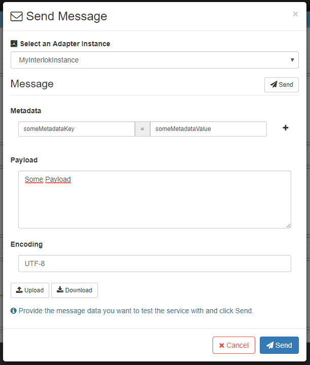
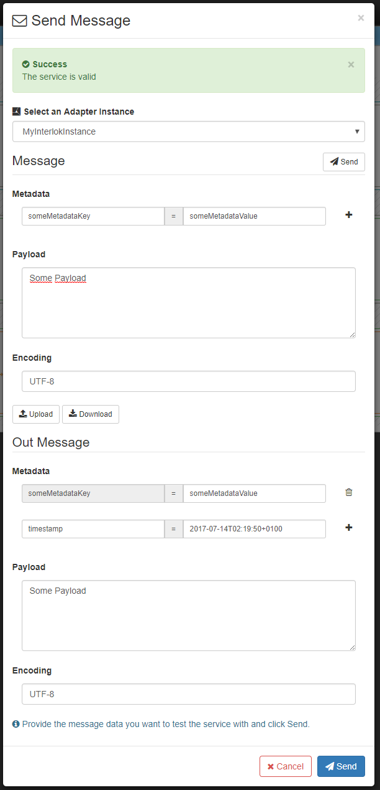
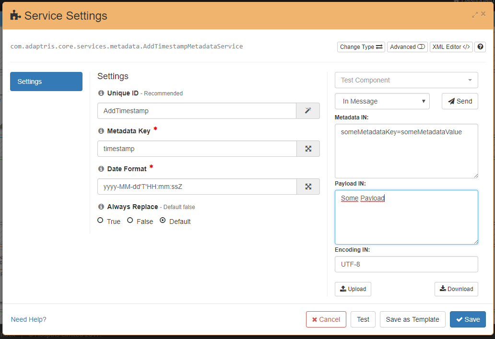
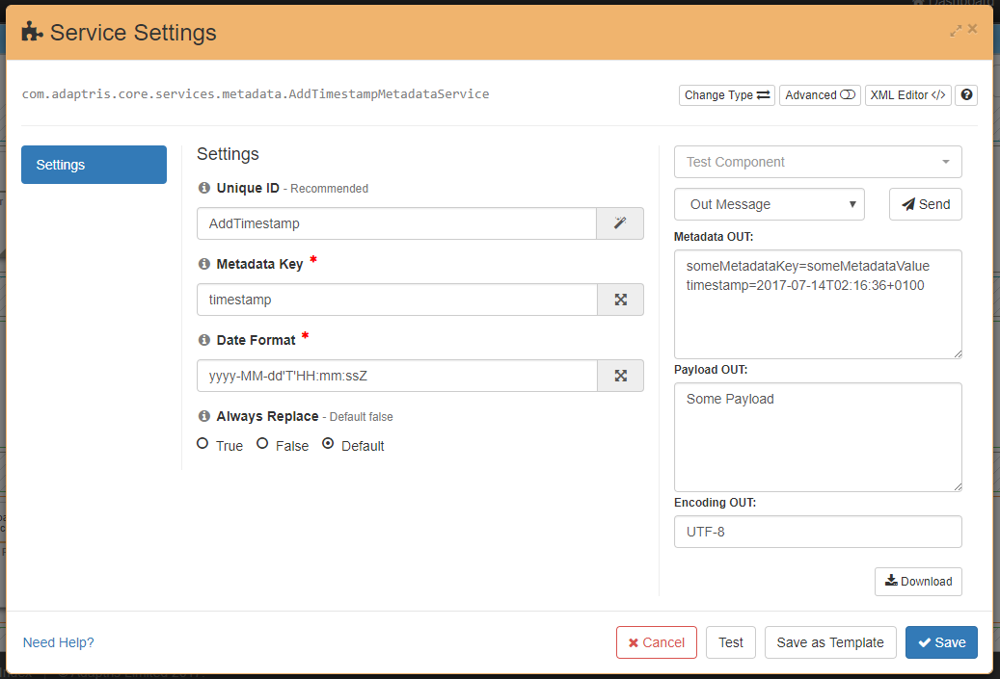
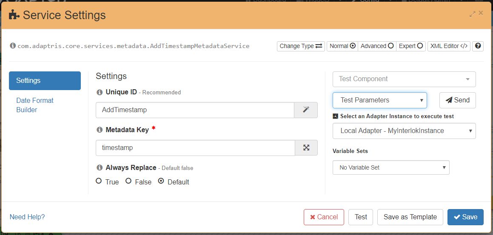
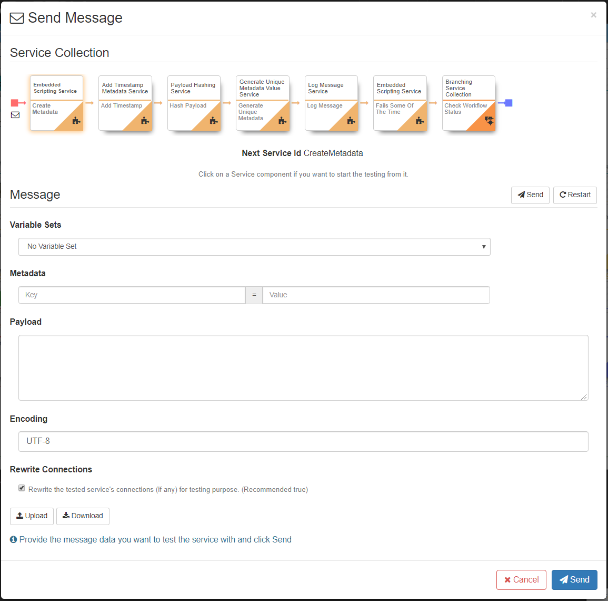

## Testing service ##

To test any services in the config page you have to click on .

This will open a modal that let you select the adapter you want to test the service against, add a message metadata and payload.

Once all the data have been provided you can click on the send button and a response message will be displayed.

The download button  in the service testing modal allows a user to download the current message to be able to re-use it later.

The upload button  allows to quickly use a message which have been saved before to test a service.

## Testing service in the settings modal ##

To make it easier to test a service while configuring it, you can also test a service using the settings modal side bar by clicking on the question mark button .

Then by selecting 'Test Component'.

You will have to select 'In Message' to enter data to send and 'Out Message' to see the response message.

You can select the adapter you want to test the service against by selecting 'Test Parameters'.

You can also select some variable sets if you want to test the service with variable replacement.

The rest will work the same way as the test service modal.

## Testing service collections ##

To test a service collection you also have to click on  but on a service collection.

The displayed modal is a bit different and shows the list of nested services.

Clicking on the send button will test step by step all the nested services instead of testing the full service collection at once.

Clicking on a service component will start (or fast forward) the testing from that service. All the services before that will not be ran.

The rest will work the same way as the test service modal.

You can also use the download button  to download the current message to be able to re-use it later.

And the upload button  to quickly use a message which have been saved before to test a service collection.



You can test a service collection and step through each service and verify it's output, as seen in this video:

<iframe width="560" height="315" src="https://www.youtube.com/embed/7LNN38jnvcg" frameborder="0" allowfullscreen></iframe>
