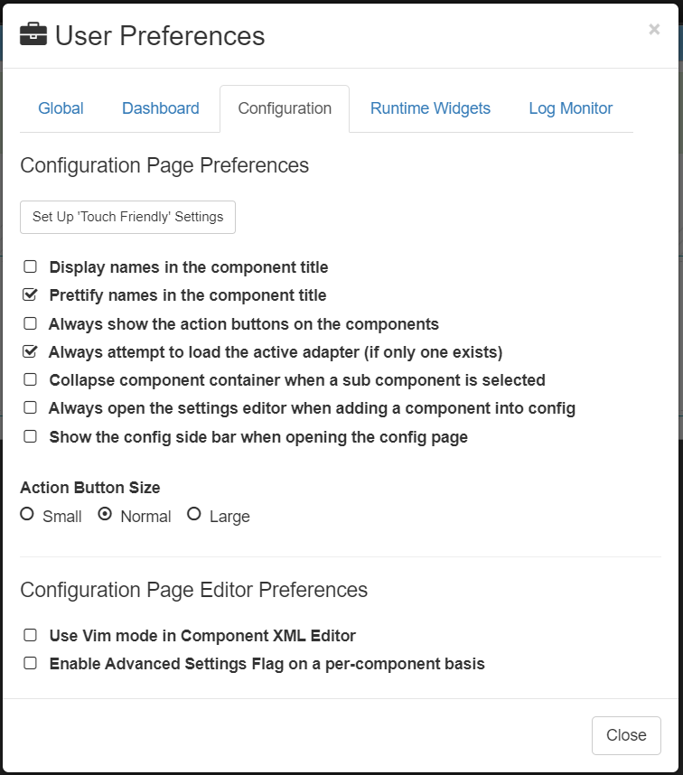
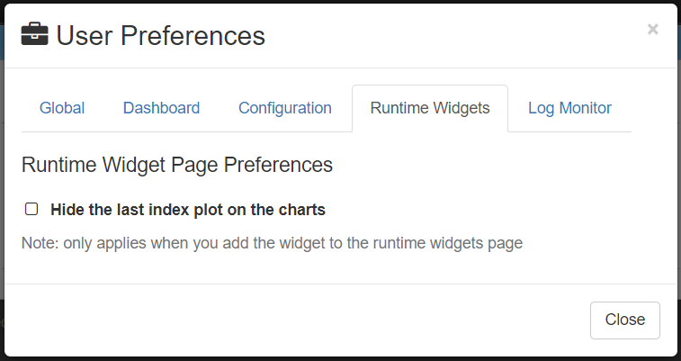

The GUI web application allows to configure some user properties to change the way a user interact with the ui:

You can access the User Preferences modal by clicking on the down arrow next to your user name and on the User Preferences item.

The preferences are:

## Global Preferences ##

 - **Disable the remove component confirm dialog:** Before deleting components in the config page the application will prompt the user for confirmation. The prompt can be disabled, very useful when a lot of components need to be deleted. The default value is true. (Since 3.2)
 
## Failed Messages Preferences ##

 - **Also delete message file on the adapter file system when ignoring a failed message:** When ignoring a failed message the associated message file in the file system will be deleted. The default value is false.
  
## Dashboard Page Preferences ##

 - **Timeout (ms) for adapter command operations:** The timeout for the adapter commands such as Start Adapter, Stop Adapter, Start Channel ... The default value is 120000 ms (2 mins).
 - **Switch the dashboard page to table mode:** This option toggle how the adapters are displayed in the dashboard page (Widget or Table). The option is also updated when the toggle button is used in the dashboard page. (Since 3.7.3)

## Configuration Page Preferences ##

 - **Display names in the component title:** Whether to display the component name in the component title or in the body. The default value is false.
 - **Prettify names in the component title:** The ui can display the component type and uid nicely (remove hyphen, underscore and split camel case uid). The default value is true.
 - **Always attempt to load the active adapter (if only one exists):** Decides when opening the config page if the application should automatically load the running adapter config or prompt the user for choices. (Since 3.2). The default value is false. (Since 3.10)
 - **Collapse component container when a sub component is selected:** The Adapter and Channel component container will collapse automatically if a child Channel or Workflow is selected. The default value is false. (Since 3.6)
 - **Always show the action buttons on the components:** The component action buttons are normally displayed on component hover. This options allows to always display the action buttons. This may be easier to use with touch screen. (Since 3.6.1)
 - **Action Button Size:** Change some icons size in the config page if you find them too big or too small.

## Configuration Page Editor Preferences ##

 - **Use Vim mode in Component XML Editor:** Use Vim mode when editing component in the xml view. The default value is false. (Since 3.6)
 
## Runtime Widget Page Preferences ##

 - **Hide the last index plot on the charts:** Whether or not charts should hide the last index. The default value is false.

## Log Monitor Preferences ##

 - **Reverse the order that the log lines are shown:** The newst log lines will be display at the top of log panel. (Since 3.6.2)
