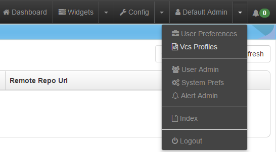
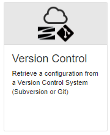

## Prerequisite ##

The adapter gui will detect which version control system (Subversion, Git) are available upon start-up. If none available the option will be disabled in the configuration page.
You can enable the Subversion and git VCS by adding the required libraries into the adapter lib folder.
Check [version control with subversion](/pages/advanced/advanced-vcs-svn.html#installation) or [version control with git](advanced-vcs-git#installation) for more details on how to do it.

__Note:__ This is highly recommended to use SSL/TLS (https) when using VCS in the Interlok UI web application.

## Creating a VCS profile ##

In order to use version control in the adapter web gui you will have to create one or more VCS profiles. To do so you will have to go to the VCS Profile page from the top navigation menu, clicking on the down arrow next to your user name and on the Vcs Profiles item.


Add one or more profile using the add button and filling the details to connect to the remote repository.

- **Name:** A user friendly name that will allow you to recognise which profile to use in the config page.
- **Scope:** The scope of the profile. Whether it is used for adapter config or for community templates. Note: You can only have one template Vcs Profile.
- **Type:** The version control system provider. Only providers added in the classpath will be selectable.
- **Auth Impl:** The type of authentication to use:
    - **Username & Password**
        - **Username:** The username/login to connect to the remote repository.
        - **Password:** The password to connect to the remote repository. The password is not mandatory, you will be prompted when necessary.
    - **SSH** (Since 3.5.0)
        - **SSH Private Key:** The SSH private key to connect to the remote repository. The key should be password protected and only use for this single purpose. OpenSSH and PuTTY private keys are accepted.
        - **SSH Passphrase:** The SSH key passphrase to connect to the remote repository. The passphrase is not mandatory, you will be prompted when necessary.
- **Working Copy URL:** The location on the file system where the repository will be checked out. This is relative to the adapter-home/vcs-repos/directory. A default location is generated using your username, the vcs type and a timestamp.
- **Remote Repo URL:** The URL for the remote repository.
- **Revision:** (Since 3.6.5) The revision the remote repository. A revision can be a branch name, a revision number or a commit checksum depending on which VCS provider you are using. If left empty, the last checked out revision or the default revision will be used.
- **Config File Name:** The name of the adapter xml configuration file. If not filled the default adapter.xml will be used. (Only used with config vcs profile and only when a config-project.json file does not exist)
- **Properties File Name:** The name of the adapter variable substitutions properties file. If not filled no variable substitutions will be done when loading a config. (Only used with config vcs profile and only when a config-project.json file does not exist). Check [pre processors variable substitution](/pages/advanced/advanced-configuration-pre-processors#variable-substitution) for more details about variable substitutions.

## Opening config from VCS ##

You can open a configuration from a remote version control system using the open config modal in the gui config page.
The option "Version Control" will be enabled if at least Subversion or Git libraries have been added to the adapter classpath.
You will then be asked to select a profile to load an adapter config. You will also have to provide the password if you didn't save it before.



## Publish config to VCS ##

To publish a config to a version control system repository you will have to click on the Publish Config button under the Save Config button. The button will be will be enabled if at least Subversion or Git libraries have been added to the adapter classpath.
A modal will open where you can select the profile you want to publish your config to.
You will also have to add a commit message and provide your password if not saved before.


## Git User Information ##

Since 3.8.1, when using a Git VCS Profile the UI add some user information (only if it doesn't already exist) into the `/repo/.git/config file`:

```
[user]
	name = UI User Name
	email = VCS Profile username (ideally an email)
```

This is so people can easily determine who made the commit. This is mainly useful when the UI is installed on a server configured with a global git config file.

You can remove or edit this user information if you wish. You can read more about [Customizing Git Configuration](https://git-scm.com/book/en/v2/Customizing-Git-Git-Configuration).

## Troubleshooting ##

The adapter gui doesn't support version control conflicts and merging. If some conflicts are found, an error message will be display and will ask you to download a zip file containing the working copy repository.
You will be able to do the merging ourself using a third party tool such as [TortoiseSVN](http://tortoisesvn.net) or [TortoiseGit](http://tortoisegit.org).
Once you've downloaded the working copy zip file you should reset the working directory to be able to work on it again.


