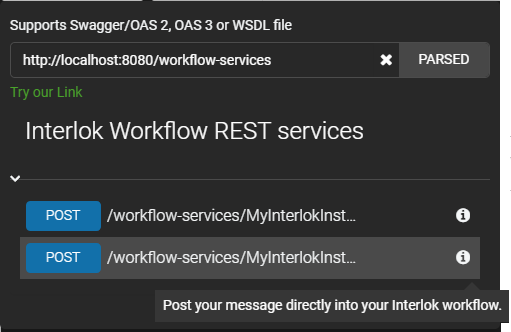
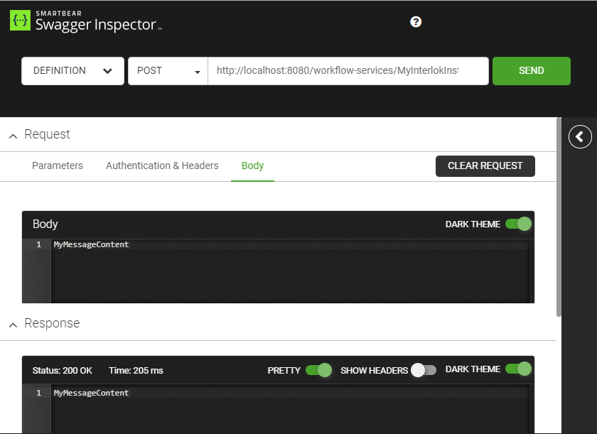






Generally, if you are using Interlok as an HTTP endpoint, then you would just use one of the standard HTTP consumers as part of a normal workflow ([Servicing HTTP requests](/pages/cookbook/cookbook-http-server)); however, in certain situations it can be useful to expose an arbitrary workflow (e.g. a JMS bridge) so that you can inject messages into the workflow without doing additional configuration. This requires that you enable the built-in jetty instance, and the new "rest" management component.

## Enabling the built-in Webserver and REST components ##

With a factory installation of Interlok, the embedded web server should already be enabled by default.  This can be checked in the bootstrap.properties for the "managementComponents" property.

All enabled management components are listed, separated by colon's as the value to the "managementComponents" property;

```
managementComponents=jetty:jmx:rest
```

As shown above "jetty", the embedded web server is enabled along with the "rest" component.

# Installing the Restful Services Component #

You will need three extra java archive (jar) files which will be dropped into your base Interlok installations "lib" directory;

- interlok-restful-workflow-services.jar
- interlok-client.jar
- interlok-jmx-client.jar

You can obtain these jars either by;

- building from source from our public github; [AdaptrisGitHub][]
- downloading from our public nexus; [AdaptrisNexus][]
- contacting our support team

# Starting the restful services #

Assuming you have the correct jar files and configuration in place as detailed above, you will see the following at debug level in the Interlok log files upon startup;

 

The final line above shows the restful services component has completed it's initialization, you're now ready to fire your requests.

# Standard Interlok Restful Services #

## The API definition ##

There is a single http GET API endpoint that will return an OpenApi 3.0.1 API definition.

You can reach this definition with a HTTP GET to the root url of ;
`http://<host>:<port>/workflow-services/`

The definition is dynamically built in OpenApi 3.0.1 yaml format to include all of your Interlok workflows; a brief example;

```yaml
openapi: 3.0.1
info:
  title: Interlok Workflow REST services
  description: A REST entry point into your Interlok workflows.
  version: "1.0"
servers:
  - url: 'http://yourhost:yourport'
  /workflow-services/myAdapterId/myChannelId/myWorkflowId:
    post:
      description: Post your message directly into your Interlok workflow.
      requestBody:
        content:
          text/plain:
            schema:
              type: string
            examples:
              '0':
                value: MyMessageContent
      responses:
        '200':
          description: The response content after your workflow has processed the incoming message.
          content:
            text/plain:
              schema:
                type: string
              examples:
                '0':
                  value: MyMessageResponseContent
      servers:
        - url: 'http://yourhost:yourport'
    servers:
      - url: 'http://yourhost:yourport'
```

By pointing an OpenApi 3.0.1 tool to the definition url you can visualize the full API available for this instance of Interlok.

Shown below is an example of using Swagger as the OpenApi tool;

 

Swagger, interprets the API definition and provides instant access to each workflow, via a http POST.

## Injecting your messages into your Interlok workflows ##

In true restful style you will POST to the base url with all of the Interlok instance id, channel id and workflow id built into the full url;

`http://<host>:<port>/workflow-services/myInterlokId/myChannelId/myWorkflowId`

The Interlok message content will be drawn from the body of your POST request.

Any http headers will be converted into Interlok message metadata.

Again using Swagger, we can test POST'ing a simple message directly into one of our workflows;

 

If your message was successfully submitted to the workflow then you will get a http status 200 code response with the updated content as the body of the response.

Should your request fail or cause an error, you will receive a http status 400 code along with details of the error in the body of the response.

[AdaptrisGitHub]: https://github.com/adaptris/
[AdaptrisNexus]: https://nexus.adaptris.net/nexus/content/repositories/releases/